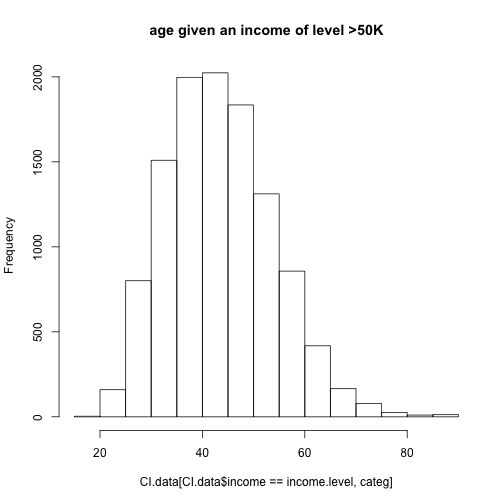

# Preface

For the final exam/project we will develop classification models using several approaches and compare their performance on a new dataset -- so-called "Census Income" from UCI ML.  It is available at UCI ML web site, but so that we are not at the mercy of UCI ML availability, there is also a local copy of it in our website in Canvas as a zip-archive of all associated files.  Among other things, the description for this dataset also presents performance (prediction accuracy) observed by the dataset providers using variety of modeling techniques -- this supplies a context for the errors of the models we will develop here.

Please note that the original data has been split up into training and test subsets, but there doesn't seem to be anything particular about that split, so we might want to pool those two datasets together and split them into training and test as necessary ourselves. As you do that, please check that the attribute levels are consistent between those two files.  For instance, the categorized income levels are indicated using slightly different notation in their training and test data.   By now it should be quite straightforward for you to correct that when you pool them together.

Also, please note that there is non-negligible number of rows with missing values that for most analyses cannot be included without modification in the computation.  Please decide how you want to handle them and proceed accordingly.  The simplest and perfectly acceptable approach would be to exclude those observations from the rest of the analyses, but if you have time and inclination to investigate the impact of imputing them by various means, you are welcome to try.

Attribute called "final weight" in the dataset description represents demographic weighting of these observations.  Please disregard it for the purposes of this assignment.

Additionally, several attributes in this dataset are categorical variables with more than two levels (e.g. native country, occupation, etc.).  Please make sure to translate them into corresponding sets of dummy indicator variables for the methods that require such conversion (e.g. PCA) -- R function `model.matrix` can be convenient for this, instead of generating those 0/1 indicators for each level of the factor manually (which is still perfectly fine).  Some of those multi-level factors contain very sparsely populated categories -- e.g. occupation "Armed-Forces" or work class "Never-worked" -- it is your call whether you want to keep those observations in the data or exclude also on the basis that there is not enough data to adequately capture the impact of those categories. Feel free to experiment away!

Among the multi-level categorical attributes, native country attribute has the largest number of levels -- several folds higher than any other attribute in this dataset -- some of which have relatively few observations.  This associated increase in dimensionality of the data may not be accompanied by a corresponding gain of resolution -- e.g. would we expect this data to support the *difference* in income between descendants from Peru and Nicaragua, for example, or from Cambodia and Laos?  Please feel free to evaluate the impact of inclusion and/or omission of this attribute in/from the model and/or discretizing it differently (e.g. US/non-US, etc.).

Lastly, the size of this dataset can make some of the modeling techniques run slower than what we were typically encountering in this class.  You may find it helpful to do some of the exploration and model tuning on multiple random samples of smaller size as you decide on useful ranges of parameters/modeling choices, and then only perform a final run of fully debugged and working code on the full dataset.

# Problem 1: univariate and unsupervised analysis (20 points)

Download and read "Census Income" data into R and prepare graphical and numerical summaries of it: e.g. histograms of continuous attributes, contingency tables of categorical variables, scatterplots of continuous attributes with some of the categorical variables indicated by color/symbol shape, etc.  Perform principal components analysis of this data (do you need to scale it prior to that? how would you represent multilevel categorical attributes to be used as inputs for PCA?) and plot observations in the space of the first few principal components with subjects' gender and/or categorized income indicated by color/shape of the symbol.  Perform univariate assessment of associations between outcome we will be modeling and each of the attributes (e.g. t-test or logistic regression for continuous attributes, contingency tables/Fisher exact test/$\chi^2$ test for categorical attributes).  Summarize your observations from these assessments: does it appear that there is association between outcome and predictors? Which predictors seem to be more/less relevant?


```r
CI.training.data <- read.table("adult.data", sep = ",")
CI.test.data <- read.table("adult.test", sep = ",", skip = 1)

#  The following can be done in the beginning because all the columns are in the same order and levels are the same 

CI.data <- rbind(CI.training.data, CI.test.data)


names(CI.data) <- c("age", "work.class", "delete.me", "education", "education.num", "marital.status", "occupation", "relationship", "race", "sex", "capital.gain", "capital.loss", "hours.per.week", "native.country", "income")

# eliminates delete.me

CI.data$delete.me <- NULL

# Gets rid of initial whitespace in factors

for(categ in names(CI.data)) {
        if(class(CI.data[[categ]]) == "factor") {
                levels(CI.data[[categ]]) <- trimws(levels(CI.data[[categ]]))
        }
}


# Changes above levels by removing trailing period

levels(CI.data$income) <- c("<=50K", ">50K", "<=50K", ">50K")

## Removes rows with the factor value "?"

for(categ in names(CI.data)) {
        if(class(CI.data[[categ]]) == "factor") {
                CI.data <- CI.data[(CI.data[[categ]] != "?"),]
        }
}
```


Education number is very hard to interpret numerically, as the effect on income is likely not linear in the way presented, and moreover, the same information is also presented as a categorical variable in the dataset.

Capital gain and capital loss are also very hard to interpret numerically, as there are so many zero values that whether there is capital gain/loss or not is more relevant than the actual quantity.

In addition, native country had some very sparsely populated countries, and these were not caught by the chunk following the following chunk, so I removed the entire categorical variable.


```r
CI.data$education.num <- NULL
CI.data$capital.gain <- NULL
CI.data$capital.loss <- NULL
CI.data$native.country <- NULL
```


```r
CI.data.MM <- model.matrix(income ~ ., CI.data)


sparse.threshold <- 0.02
sparse.column.indices <- numeric()

for(i in 1:ncol(CI.data.MM)) {
        sparsity <- colSums(CI.data.MM)[i]/nrow(CI.data.MM)
        if(sparsity < sparse.threshold || (1 - sparse.threshold < sparsity && sparsity <= 1)) {
                sparse.column.indices <- c(sparse.column.indices, i)
        }
}
CI.data.MM <- CI.data.MM[,-sparse.column.indices]

print(paste("Removed", length(sparse.column.indices), "sparsely populated columns"))
```

```
## [1] "Removed 16 sparsely populated columns"
```


In the below, red indicates an income <=50K, and green indicates an income >50K.  For sex, 1 is female and 2 is male.  For races, 1 to 5 are respectively Native American, Asian, Black, Other, and White.


```r
for(i in 1:4){
        sample.x <- sample(1:nrow(CI.data), 100)
        plot(CI.data[sample.x, "age"], CI.data[sample.x, "sex"], col = as.numeric(CI.data[sample.x, "income"]) + 1, main = "Age and Sex to Income")
}
```


```r
for(i in 1:4){
        sample.x <- sample(1:nrow(CI.data), 400)
        plot(CI.data[sample.x, "hours.per.week"], CI.data[sample.x, "race"], col = as.numeric(CI.data[sample.x, "income"]) + 1, main = "Hours Per Week and Race to Income")
}
```


As can be seen above, older men tend to have higher incomes than younger women, and white people who work more hours per week have higher incomes than black people who work fewer hours.


```r
for(categ in names(CI.data)) {
        if(categ == "income") {next}
        print("")
        print("")
        print(paste("Assocication of", categ, "With Income"))
        if(class(CI.data[[categ]]) == "factor") {
                print(table(CI.data$income, CI.data[[categ]]))
        } else {
                for(income.level in levels(CI.data$income)) {
                        print(hist(CI.data[CI.data$income == income.level, categ], main = paste(categ, "given an income of level", income.level)))
                }
        }
}
```

```
## [1] ""
## [1] ""
## [1] "Assocication of age With Income"
```


```
## $breaks
##  [1] 15 20 25 30 35 40 45 50 55 60 65 70 75 80 85 90
## 
## $counts
##  [1] 2965 5313 5018 4746 4039 3412 2719 2070 1594 1086  542  289  130   50
## [15]   41
## 
## $density
##  [1] 0.0174339978 0.0312400776 0.0295054977 0.0279061563 0.0237490445
##  [6] 0.0200623273 0.0159875345 0.0121714588 0.0093726113 0.0063856059
## [11] 0.0031869230 0.0016993003 0.0007643911 0.0002939966 0.0002410772
## 
## $mids
##  [1] 17.5 22.5 27.5 32.5 37.5 42.5 47.5 52.5 57.5 62.5 67.5 72.5 77.5 82.5
## [15] 87.5
## 
## $xname
## [1] "CI.data[CI.data$income == income.level, categ]"
## 
## $equidist
## [1] TRUE
## 
## attr(,"class")
## [1] "histogram"
```



```
## $breaks
##  [1] 15 20 25 30 35 40 45 50 55 60 65 70 75 80 85 90
## 
## $counts
##  [1]    3  160  801 1509 1997 2024 1835 1312  857  418  166   78   25   10
## [15]   13
## 
## $density
##  [1] 5.353319e-05 2.855103e-03 1.429336e-02 2.692719e-02 3.563526e-02
##  [6] 3.611706e-02 3.274447e-02 2.341185e-02 1.529265e-02 7.458958e-03
## [11] 2.962170e-03 1.391863e-03 4.461099e-04 1.784440e-04 2.319772e-04
## 
## $mids
##  [1] 17.5 22.5 27.5 32.5 37.5 42.5 47.5 52.5 57.5 62.5 67.5 72.5 77.5 82.5
## [15] 87.5
## 
## $xname
## [1] "CI.data[CI.data$income == income.level, categ]"
## 
## $equidist
## [1] TRUE
## 
## attr(,"class")
## [1] "histogram"
## [1] ""
## [1] ""
## [1] "Assocication of work.class With Income"
##        
##             ? Federal-gov Local-gov Never-worked Private Self-emp-inc
##   <=50K     0         857      2185            0   26056          734
##   >50K      0         549       915            0    7251          912
##        
##         Self-emp-not-inc State-gov Without-pay
##   <=50K             2737      1426          19
##   >50K              1059       520           2
## [1] ""
## [1] ""
## [1] "Assocication of education With Income"
##        
##          10th  11th  12th 1st-4th 5th-6th 7th-8th   9th Assoc-acdm
##   <=50K  1141  1530   534     214     427     768   638       1109
##   >50K     82    89    43       8      22      55    38        398
##        
##         Assoc-voc Bachelors Doctorate HS-grad Masters Preschool
##   <=50K      1455      4392       145   12367    1121        71
##   >50K        504      3178       399    2416    1393         1
##        
##         Prof-school Some-college
##   <=50K         193         7909
##   >50K          592         1990
## [1] ""
## [1] ""
## [1] "Assocication of marital.status With Income"
##        
##         Divorced Married-AF-spouse Married-civ-spouse
##   <=50K     5642                18              11491
##   >50K       655                14               9564
##        
##         Married-spouse-absent Never-married Separated Widowed
##   <=50K                   498         13897      1312    1156
##   >50K                     54           701        99     121
## [1] ""
## [1] ""
## [1] "Assocication of occupation With Income"
##        
##            ? Adm-clerical Armed-Forces Craft-repair Exec-managerial
##   <=50K    0         4784           10         4665            3117
##   >50K     0          756            4         1355            2867
##        
##         Farming-fishing Handlers-cleaners Machine-op-inspct Other-service
##   <=50K            1308              1911              2605          4612
##   >50K              172               135               365           196
##        
##         Priv-house-serv Prof-specialty Protective-serv Sales Tech-support
##   <=50K             229           3304             669  3953         1009
##   >50K                3           2704             307  1455          411
##        
##         Transport-moving
##   <=50K             1838
##   >50K               478
## [1] ""
## [1] ""
## [1] "Assocication of relationship With Income"
##        
##         Husband Not-in-family Other-relative Own-child Unmarried  Wife
##   <=50K   10159         10474           1299      6521      4486  1075
##   >50K     8507          1228             50       105       302  1016
## [1] ""
## [1] ""
## [1] "Assocication of race With Income"
##        
##         Amer-Indian-Eskimo Asian-Pac-Islander Black Other White
##   <=50K                382                934  3694   308 28696
##   >50K                  53                369   534    45 10207
## [1] ""
## [1] ""
## [1] "Assocication of sex With Income"
##        
##         Female  Male
##   <=50K  13026 20988
##   >50K    1669  9539
## [1] ""
## [1] ""
## [1] "Assocication of hours.per.week With Income"
```


```
## $breaks
##  [1]   0   5  10  15  20  25  30  35  40  45  50  55  60  65  70  75  80
## [18]  85  90  95 100
## 
## $counts
##  [1]   158   553   758  1904  1170  1562  1946 17755  2247  2915   756
## [12]  1282   249   297   130   134    56    32     7   103
## 
## $density
##  [1] 9.290292e-04 3.251602e-03 4.456988e-03 1.119539e-02 6.879520e-03
##  [6] 9.184453e-03 1.144235e-02 1.043982e-01 1.321221e-02 1.714000e-02
## [11] 4.445228e-03 7.538073e-03 1.464103e-03 1.746340e-03 7.643911e-04
## [16] 7.879109e-04 3.292762e-04 1.881578e-04 4.115952e-05 6.056330e-04
## 
## $mids
##  [1]  2.5  7.5 12.5 17.5 22.5 27.5 32.5 37.5 42.5 47.5 52.5 57.5 62.5 67.5
## [15] 72.5 77.5 82.5 87.5 92.5 97.5
## 
## $xname
## [1] "CI.data[CI.data$income == income.level, categ]"
## 
## $equidist
## [1] TRUE
## 
## attr(,"class")
## [1] "histogram"
```


```
## $breaks
##  [1]   0   5  10  15  20  25  30  35  40  45  50  55  60  65  70  75  80
## [18]  85  90  95 100
## 
## $counts
##  [1]   20   46   41  122   85  116  319 4890 1257 2157  576  998  162  166
## [15]   73   82   30   21    2   45
## 
## $density
##  [1] 3.568879e-04 8.208423e-04 7.316203e-04 2.177016e-03 1.516774e-03
##  [6] 2.069950e-03 5.692363e-03 8.725910e-02 2.243041e-02 3.849036e-02
## [11] 1.027837e-02 1.780871e-02 2.890792e-03 2.962170e-03 1.302641e-03
## [16] 1.463241e-03 5.353319e-04 3.747323e-04 3.568879e-05 8.029979e-04
## 
## $mids
##  [1]  2.5  7.5 12.5 17.5 22.5 27.5 32.5 37.5 42.5 47.5 52.5 57.5 62.5 67.5
## [15] 72.5 77.5 82.5 87.5 92.5 97.5
## 
## $xname
## [1] "CI.data[CI.data$income == income.level, categ]"
## 
## $equidist
## [1] TRUE
## 
## attr(,"class")
## [1] "histogram"
```


```r
# The variables are scaled because the units for numeric varables are completely different and there are dummy variables

px <- prcomp(CI.data.MM, scale = TRUE)

biplot(px, xlabs=rep(".", nrow(CI.data.MM)))
```


This biplot is too involved, so below are four biplots of only 400 sampled points and the arrows removed.


```r
for(i in 1:4){
        sample.x <- sample(1:nrow(px$x), 400)
        plot(px$x[sample.x,1],px$x[sample.x,2], col = as.numeric(CI.data$income) + 1)
}
```


As shown above, the first two principal components do not seem to differentiate by income.  In the above plots, red indicates an income of less than or equal to `$50K` and green an income of greater than `$50K`.


```r
continuous.var.names <- character()

for(categ in names(CI.data)) {
        if(categ != "income" && class(CI.data[[categ]]) != "factor") {
                print(categ)
                categ.lm <- glm(CI.data$income ~ CI.data[[categ]], family = "binomial")
                print(summary(categ.lm))
        }
}
```

```
## [1] "age"
## 
## Call:
## glm(formula = CI.data$income ~ CI.data[[categ]], family = "binomial")
## 
## Deviance Residuals: 
##     Min       1Q   Median       3Q      Max  
## -1.5932  -0.7651  -0.6140  -0.4882   2.0560  
## 
## Coefficients:
##                    Estimate Std. Error z value Pr(>|z|)    
## (Intercept)      -2.7671800  0.0370061  -74.78   <2e-16 ***
## CI.data[[categ]]  0.0411805  0.0008448   48.74   <2e-16 ***
## ---
## Signif. codes:  0 '***' 0.001 '**' 0.01 '*' 0.05 '.' 0.1 ' ' 1
## 
## (Dispersion parameter for binomial family taken to be 1)
## 
##     Null deviance: 50644  on 45221  degrees of freedom
## Residual deviance: 48146  on 45220  degrees of freedom
## AIC: 48150
## 
## Number of Fisher Scoring iterations: 4
## 
## [1] "hours.per.week"
## 
## Call:
## glm(formula = CI.data$income ~ CI.data[[categ]], family = "binomial")
## 
## Deviance Residuals: 
##     Min       1Q   Median       3Q      Max  
## -1.8491  -0.7193  -0.7193  -0.3296   2.4787  
## 
## Coefficients:
##                   Estimate Std. Error z value Pr(>|z|)    
## (Intercept)      -3.070903   0.045398  -67.64   <2e-16 ***
## CI.data[[categ]]  0.046271   0.001013   45.70   <2e-16 ***
## ---
## Signif. codes:  0 '***' 0.001 '**' 0.01 '*' 0.05 '.' 0.1 ' ' 1
## 
## (Dispersion parameter for binomial family taken to be 1)
## 
##     Null deviance: 50644  on 45221  degrees of freedom
## Residual deviance: 48270  on 45220  degrees of freedom
## AIC: 48274
## 
## Number of Fisher Scoring iterations: 4
```

From these analyses, it appears that many of these variables are associated with income levels.  In particular, age, sex, education level, marital status, work class, occupation, and race seem to have a strong association, whereas hours per week worked shows a weaker association.  As shown by the logistic regression, the association is clearly there, but the plot of income to hours per week worked and race shows that this association is weak.  This might be because the values themselves of hours per week tend to be very similar, usually between 20 and 60.


# Problem 2: logistic regression (25 points)

Develop logistic regression model of the outcome as a function of multiple predictors in the model.  Which variables are significantly associated with the outcome?  Test model performance on multiple splits of data into training and test subsets, summarize it in terms of accuracy/error, sensitivity/specificity and compare to the performance of other methods reported in the dataset description.

The sensitivity and specificity cannot be defined because there is no null and alternative hypthesis, i.e., no "yes" or "no" outcome.  However, if you arbitrarily choose <=50K as the "no" or null hypothesis and >50K as the "yes" or alternative hypothesis, then the sensitivity and specificity are as follows:

```r
iFolds <- 10
logit.accuracies <- numeric()
logit.sensitivities <- numeric()
logit.specificities <- numeric()
train <- sample(1:iFolds, nrow(CI.data), replace = TRUE)
for (iFold in 1:iFolds) {
        glm.fit <- glm(income ~ ., data = CI.data[train != iFold,], family = "binomial")
        glm.probs <- predict(glm.fit, newdata = CI.data[train == iFold,], type = "response")
        glm.pred <- rep("<=50K", sum(train == iFold))
        glm.pred[glm.probs > 0.5] <- ">50K"

        correct <- (glm.pred == CI.data[train == iFold, "income"])
        logit.accuracies[iFold] <- sum(correct)*100/length(CI.data[train == iFold, "income"])
        TP <- sum(CI.data[train == iFold, "income"] == ">50K" & glm.pred == ">50K")
        TN <- sum(CI.data[train == iFold, "income"] == "<=50K" & glm.pred == "<=50K")
        FP <- sum(CI.data[train == iFold, "income"] == "<=50K"  & glm.pred == ">50K")
        FN <- sum(CI.data[train == iFold, "income"] == ">50K" & glm.pred == "<=50K")
        P <- TP + FN
        N <- TN + FP
## TP/FP true/false positives (predicted >50K)
## TN/FN true/false negatives (predicted <=50K)

        logit.sensitivities[iFold] <- 100*TP/P
        logit.specificities[iFold] <- 100*TN/N
}

print("Accuracy for each fold")
```

```
## [1] "Accuracy for each fold"
```

```r
print(logit.accuracies)
```

```
##  [1] 82.92843 84.67742 83.03591 83.10144 83.75141 82.86729 83.41589
##  [8] 82.96885 82.65443 82.40391
```

```r
print("Average accuracy")
```

```
## [1] "Average accuracy"
```

```r
print(mean(logit.accuracies))
```

```
## [1] 83.1805
```

```r
print("Sensitivity for each fold")
```

```
## [1] "Sensitivity for each fold"
```

```r
print(logit.sensitivities)
```

```
##  [1] 55.13608 58.04968 56.05920 55.25830 59.18367 54.82417 56.06061
##  [8] 56.81818 55.92784 57.41667
```

```r
print("Average sensitivity")
```

```
## [1] "Average sensitivity"
```

```r
print(mean(logit.sensitivities))
```

```
## [1] 56.47344
```

```r
print("Specificity for each fold")
```

```
## [1] "Specificity for each fold"
```

```r
print(logit.specificities)
```

```
##  [1] 92.15743 92.94487 91.46906 92.05219 91.66418 92.02237 92.13292
##  [8] 91.81200 92.07022 91.48743
```

```r
print("Average specificity")
```

```
## [1] "Average specificity"
```

```r
print(mean(logit.specificities))
```

```
## [1] 91.98127
```
Above are the average accuracy, sensitivity, and specificity for the logistic fit after K-fold cross-validation.


```r
summary(glm.fit)
```

```
## 
## Call:
## glm(formula = income ~ ., family = "binomial", data = CI.data[train != 
##     iFold, ])
## 
## Deviance Residuals: 
##     Min       1Q   Median       3Q      Max  
## -2.7190  -0.5704  -0.2235  -0.0333   3.6307  
## 
## Coefficients:
##                                      Estimate Std. Error z value Pr(>|z|)
## (Intercept)                         -7.201907   0.345184 -20.864  < 2e-16
## age                                  0.028927   0.001395  20.740  < 2e-16
## work.classLocal-gov                 -0.637932   0.093274  -6.839 7.96e-12
## work.classPrivate                   -0.475379   0.077480  -6.136 8.49e-10
## work.classSelf-emp-inc              -0.243147   0.100975  -2.408  0.01604
## work.classSelf-emp-not-inc          -0.975078   0.090514 -10.773  < 2e-16
## work.classState-gov                 -0.879195   0.102786  -8.554  < 2e-16
## work.classWithout-pay               -1.433655   0.800816  -1.790  0.07341
## education11th                        0.279825   0.184204   1.519  0.12874
## education12th                        0.590795   0.226639   2.607  0.00914
## education1st-4th                    -0.682262   0.417666  -1.634  0.10236
## education5th-6th                    -0.203184   0.270734  -0.750  0.45296
## education7th-8th                    -0.355090   0.204866  -1.733  0.08305
## education9th                        -0.201519   0.228215  -0.883  0.37722
## educationAssoc-acdm                  1.551741   0.155256   9.995  < 2e-16
## educationAssoc-voc                   1.507581   0.149796  10.064  < 2e-16
## educationBachelors                   2.201746   0.140604  15.659  < 2e-16
## educationDoctorate                   3.169849   0.186544  16.993  < 2e-16
## educationHS-grad                     1.001396   0.137391   7.289 3.13e-13
## educationMasters                     2.548816   0.148530  17.160  < 2e-16
## educationPreschool                  -1.121749   1.029822  -1.089  0.27604
## educationProf-school                 3.293283   0.176873  18.620  < 2e-16
## educationSome-college                1.384080   0.139115   9.949  < 2e-16
## marital.statusMarried-AF-spouse      2.346026   0.487640   4.811 1.50e-06
## marital.statusMarried-civ-spouse     2.146682   0.223136   9.620  < 2e-16
## marital.statusMarried-spouse-absent  0.114891   0.179306   0.641  0.52168
## marital.statusNever-married         -0.440613   0.070392  -6.259 3.86e-10
## marital.statusSeparated              0.054899   0.127769   0.430  0.66743
## marital.statusWidowed                0.086301   0.123192   0.701  0.48359
## occupationArmed-Forces               0.305110   0.864947   0.353  0.72428
## occupationCraft-repair               0.068658   0.065574   1.047  0.29509
## occupationExec-managerial            0.774974   0.062928  12.315  < 2e-16
## occupationFarming-fishing           -0.909743   0.112533  -8.084 6.26e-16
## occupationHandlers-cleaners         -0.678020   0.115625  -5.864 4.52e-09
## occupationMachine-op-inspct         -0.331990   0.084543  -3.927 8.61e-05
## occupationOther-service             -0.934739   0.097475  -9.590  < 2e-16
## occupationPriv-house-serv           -1.676321   0.641554  -2.613  0.00898
## occupationProf-specialty             0.527659   0.066499   7.935 2.11e-15
## occupationProtective-serv            0.468921   0.105162   4.459 8.23e-06
## occupationSales                      0.287755   0.067224   4.281 1.86e-05
## occupationTech-support               0.534896   0.090408   5.916 3.29e-09
## occupationTransport-moving          -0.112631   0.081921  -1.375  0.16917
## relationshipNot-in-family            0.534901   0.220994   2.420  0.01550
## relationshipOther-relative          -0.468851   0.204252  -2.295  0.02171
## relationshipOwn-child               -0.501837   0.218242  -2.299  0.02148
## relationshipUnmarried                0.250416   0.233479   1.073  0.28348
## relationshipWife                     1.153333   0.083929  13.742  < 2e-16
## raceAsian-Pac-Islander               0.354392   0.197237   1.797  0.07237
## raceBlack                            0.376012   0.186276   2.019  0.04353
## raceOther                            0.061063   0.278617   0.219  0.82652
## raceWhite                            0.481791   0.177325   2.717  0.00659
## sexMale                              0.735064   0.062571  11.748  < 2e-16
## hours.per.week                       0.029694   0.001384  21.457  < 2e-16
##                                        
## (Intercept)                         ***
## age                                 ***
## work.classLocal-gov                 ***
## work.classPrivate                   ***
## work.classSelf-emp-inc              *  
## work.classSelf-emp-not-inc          ***
## work.classState-gov                 ***
## work.classWithout-pay               .  
## education11th                          
## education12th                       ** 
## education1st-4th                       
## education5th-6th                       
## education7th-8th                    .  
## education9th                           
## educationAssoc-acdm                 ***
## educationAssoc-voc                  ***
## educationBachelors                  ***
## educationDoctorate                  ***
## educationHS-grad                    ***
## educationMasters                    ***
## educationPreschool                     
## educationProf-school                ***
## educationSome-college               ***
## marital.statusMarried-AF-spouse     ***
## marital.statusMarried-civ-spouse    ***
## marital.statusMarried-spouse-absent    
## marital.statusNever-married         ***
## marital.statusSeparated                
## marital.statusWidowed                  
## occupationArmed-Forces                 
## occupationCraft-repair                 
## occupationExec-managerial           ***
## occupationFarming-fishing           ***
## occupationHandlers-cleaners         ***
## occupationMachine-op-inspct         ***
## occupationOther-service             ***
## occupationPriv-house-serv           ** 
## occupationProf-specialty            ***
## occupationProtective-serv           ***
## occupationSales                     ***
## occupationTech-support              ***
## occupationTransport-moving             
## relationshipNot-in-family           *  
## relationshipOther-relative          *  
## relationshipOwn-child               *  
## relationshipUnmarried                  
## relationshipWife                    ***
## raceAsian-Pac-Islander              .  
## raceBlack                           *  
## raceOther                              
## raceWhite                           ** 
## sexMale                             ***
## hours.per.week                      ***
## ---
## Signif. codes:  0 '***' 0.001 '**' 0.01 '*' 0.05 '.' 0.1 ' ' 1
## 
## (Dispersion parameter for binomial family taken to be 1)
## 
##     Null deviance: 45415  on 40720  degrees of freedom
## Residual deviance: 29029  on 40668  degrees of freedom
## AIC: 29135
## 
## Number of Fisher Scoring iterations: 7
```

From the above summary, it seems that all variables were relevant in predicting income.  Notably, other race and black race were less relevant.  This may be because for the most part, being black and being white are colinear.  With the few exceptions of the other three races, if one person is not white in the data, he/she is likely black.


# Problem 3: random forest (25 points)

Develop random forest model of the categorized income. Present variable importance plots and comment on relative importance of different attributes in the model.  Did attributes showing up as more important in random forest model also appear as significantly associated with the outcome by logistic regression?  Test model performance on multiple splits of data into training and test subsets, compare test and out-of-bag error estimates, summarize model performance in terms of accuracy/error, sensitivity/specificity and compare to the performance of other methods reported in the dataset description.


```r
library(randomForest)
```

```
## randomForest 4.6-14
```

```
## Type rfNews() to see new features/changes/bug fixes.
```

```r
iFolds <- 10
rf.accuracies <- numeric()
rf.sensitivities <- numeric()
rf.specificities <- numeric()
train <- sample(1:iFolds, nrow(CI.data), replace = TRUE)

for (iFold in 1:iFolds) {
        rf.fit <- randomForest(income ~ ., data = CI.data[train != iFold,], importance = TRUE, ntree = 50)
        rf.pred <- predict(rf.fit, newdata = CI.data[train == iFold,])

        correct <- (rf.pred == CI.data[train == iFold, "income"])
        rf.accuracies[iFold] <- sum(correct)*100/length(CI.data[train == iFold, "income"])
        TP <- sum(CI.data[train == iFold, "income"] == ">50K" & rf.pred == ">50K")
        TN <- sum(CI.data[train == iFold, "income"] == "<=50K" & rf.pred == "<=50K")
        FP <- sum(CI.data[train == iFold, "income"] == "<=50K"  & rf.pred == ">50K")
        FN <- sum(CI.data[train == iFold, "income"] == ">50K" & rf.pred == "<=50K")
        P <- TP + FN
        N <- TN + FP
## TP/FP true/false positives (predicted >50K)
## TN/FN true/false negatives (predicted <=50K)

        rf.sensitivities[iFold] <- 100*TP/P
        rf.specificities[iFold] <- 100*TN/N
}

print("Accuracy for each fold")
```

```
## [1] "Accuracy for each fold"
```

```r
print(rf.accuracies)
```

```
##  [1] 83.06631 83.08337 84.00435 83.22148 82.25735 83.52311 83.67120
##  [8] 83.48522 83.13786 83.25189
```

```r
print("Average accuracy")
```

```
## [1] "Average accuracy"
```

```r
print(mean(rf.accuracies))
```

```
## [1] 83.27021
```

```r
print("Sensitivity for each fold")
```

```
## [1] "Sensitivity for each fold"
```

```r
print(rf.sensitivities)
```

```
##  [1] 59.75503 58.09274 58.78680 59.04843 55.59471 59.63134 58.00177
##  [8] 61.82495 58.72576 59.94624
```

```r
print("Average sensitivity")
```

```
## [1] "Average sensitivity"
```

```r
print(mean(rf.sensitivities))
```

```
## [1] 58.94078
```

```r
print("Specificity for each fold")
```

```
## [1] "Specificity for each fold"
```

```r
print(rf.specificities)
```

```
##  [1] 91.01761 91.50693 92.14162 91.48751 91.27197 91.16087 92.31686
##  [8] 90.27737 90.83236 90.93325
```

```r
print("Average specificity")
```

```
## [1] "Average specificity"
```

```r
print(mean(rf.specificities))
```

```
## [1] 91.29464
```


```r
## The following is based on OOB data rather than K-fold cross-validation.  Since these were not used in making the random forest model, they are in fact a better measure of the test error

rf.oob.sensitivity <- 1 - rf.fit$confusion[[">50K", "class.error"]]
rf.oob.specificity <- 1 - rf.fit$confusion[["<=50K", "class.error"]]
rf.oob.accuracy <- sum(diag(rf.fit$confusion[1:2,1:2]))/sum(colSums(rf.fit$confusion[,1:2]))
print(paste("Random Forest OOB Sensitivity:", rf.oob.sensitivity))
```

```
## [1] "Random Forest OOB Sensitivity: 0.586504161712247"
```

```r
print(paste("Random Forest OOB Specificity:", rf.oob.specificity))
```

```
## [1] "Random Forest OOB Specificity: 0.909527229985634"
```

```r
print(paste("Random Forest OOB Accuracy", rf.oob.accuracy))
```

```
## [1] "Random Forest OOB Accuracy 0.829469548133595"
```

As shown above, the OOB accuracy is very similar to the cross-validation accuracy, further demonstrating the quality of this model.


```r
importance(rf.fit)
```

```
##                    <=50K      >50K MeanDecreaseAccuracy MeanDecreaseGini
## age             2.829527 43.420218            40.637771        2091.7819
## work.class     21.665370  6.955680            21.117265         614.3054
## education      34.320501 38.253156            63.620350        1680.7439
## marital.status 23.098161  6.910096            18.259271        1458.1120
## occupation     24.939393 33.236288            53.824397        1635.7574
## relationship    9.228695 12.389567            12.300928        1690.4734
## race            3.787636  6.487854             9.517641         276.4767
## sex            17.603413 -1.608088            16.295112         172.0144
## hours.per.week  5.161973 29.877035            28.968575        1278.3366
```

As shown by the importance measures, race is of little importance, similar to what was discussed in problem two.  Hours per week is also of low importance, as was discussed in problem one.  Surprisingly enough, age also is of low importance in the random forest model.


# Problem 4: SVM (25 points)

Develop SVM model of this data choosing parameters (e.g. choice of kernel, cost, etc.) that appear to yield better performance.  Test model performance on multiple splits of data into training and test subsets, summarize model performance in terms of accuracy/error, sensitivity/specificity and compare to the performance of other methods reported in the dataset description.


```r
library(e1071)

svm.accuracies <- numeric()
svm.sensitivities <- numeric()
svm.specificities <- numeric()

for (i in 1:3) {
        train <- sample(1:nrow(CI.data), 1000)
        svm.fit <- tune(svm, income ~ ., data = CI.data[train,], kernel = "radial")$best.model
        svm.pred <- predict(svm.fit, CI.data[-train,])
        
        correct <- (svm.pred == CI.data[-train, "income"])
        svm.accuracies[i] <- sum(correct)*100/length(CI.data[-train, "income"])
        TP <- sum(CI.data[-train, "income"] == ">50K" & svm.pred == ">50K")
        TN <- sum(CI.data[-train, "income"] == "<=50K" & svm.pred == "<=50K")
        FP <- sum(CI.data[-train, "income"] == "<=50K"  & svm.pred == ">50K")
        FN <- sum(CI.data[-train, "income"] == ">50K" & svm.pred == "<=50K")
        P <- TP + FN
        N <- TN + FP
## TP/FP true/false positives (predicted >50K)
## TN/FN true/false negatives (predicted <=50K)

        svm.sensitivities[i] <- 100*TP/P
        svm.specificities[i] <- 100*TN/N
}

print("Accuracy for each fold")
```

```
## [1] "Accuracy for each fold"
```

```r
print(svm.accuracies)
```

```
## [1] 81.96599 80.83759 81.33734
```

```r
print("Average accuracy")
```

```
## [1] "Average accuracy"
```

```r
print(mean(svm.accuracies))
```

```
## [1] 81.38031
```

```r
print("Sensitivity for each fold")
```

```
## [1] "Sensitivity for each fold"
```

```r
print(svm.sensitivities)
```

```
## [1] 42.22060 31.01122 38.42365
```

```r
print("Average sensitivity")
```

```
## [1] "Average sensitivity"
```

```r
print(mean(svm.sensitivities))
```

```
## [1] 37.21849
```

```r
print("Specificity for each fold")
```

```
## [1] "Specificity for each fold"
```

```r
print(svm.specificities)
```

```
## [1] 95.04959 97.26958 95.48106
```

```r
print("Average specificity")
```

```
## [1] "Average specificity"
```

```r
print(mean(svm.specificities))
```

```
## [1] 95.93341
```

# Problem 5: compare logistic regression, random forest and SVM model performance (5 points)

Compare performance of the models developed above (logistic regression, random forest, SVM) in terms of their accuracy, error and sensitivity/specificity.  Comment on differences and similarities between them.

As shown above in problems 2-4, the average accuracies of the logistic, random forest, and SVM models are 83.2%, 83.2% (0.02% less), and 82.1 respectively.  The models perform similarly.  The lower accuracy in the SVM models may be because K-fold cross-validation could not be performed due to computing constraints.  The error is simply 100% minus the accuracy, yielding 16.8%, 16.8%, and 17.9%.

The respective sensitivities were 56.5%, 59.6%, and 44.9%.  This means that most models often failed to predict higher income when it was present.  This is consistent with the accuracy because there were relatively few higher income individuals.

The respective specificities were 90.2%, 90.1%, and 94.3%.  This means the models almost always successfully identified a lower income individual.

# Extra 10 points: KNN model

Develop KNN model for this data, evaluate its performance for different values of $k$ on different splits of the data into training and test and compare it to the performance of other methods reported in the dataset description.  Notice that this dataset includes many categorical variables as well as continuous attributes measured on different scales, so that the distance has to be defined to be meaningful (probably avoiding subtraction of the numerical values of multi-level factors directly or adding differences between untransformed age and capital gain/loss attributes).

# Extra 15 points: variable importance in SVM

SVM does not appear to provide readily available tools for judging relative importance of different attributes in the model.  Please evaluate here an approach similar to that employed by random forest where importance of any given attribute is measured by the decrease in model performance upon randomization of the values for this attribute.
