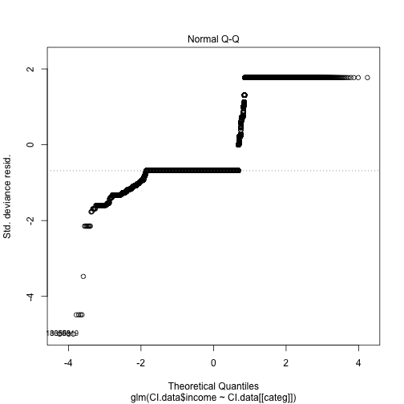

# Preface

For the final exam/project we will develop classification models using several approaches and compare their performance on a new dataset -- so-called "Census Income" from UCI ML.  It is available at UCI ML web site, but so that we are not at the mercy of UCI ML availability, there is also a local copy of it in our website in Canvas as a zip-archive of all associated files.  Among other things, the description for this dataset also presents performance (prediction accuracy) observed by the dataset providers using variety of modeling techniques -- this supplies a context for the errors of the models we will develop here.

Please note that the original data has been split up into training and test subsets, but there doesn't seem to be anything particular about that split, so we might want to pool those two datasets together and split them into training and test as necessary ourselves. As you do that, please check that the attribute levels are consistent between those two files.  For instance, the categorized income levels are indicated using slightly different notation in their training and test data.   By now it should be quite straightforward for you to correct that when you pool them together.

Also, please note that there is non-negligible number of rows with missing values that for most analyses cannot be included without modification in the computation.  Please decide how you want to handle them and proceed accordingly.  The simplest and perfectly acceptable approach would be to exclude those observations from the rest of the analyses, but if you have time and inclination to investigate the impact of imputing them by various means, you are welcome to try.

Attribute called "final weight" in the dataset description represents demographic weighting of these observations.  Please disregard it for the purposes of this assignment.

Additionally, several attributes in this dataset are categorical variables with more than two levels (e.g. native country, occupation, etc.).  Please make sure to translate them into corresponding sets of dummy indicator variables for the methods that require such conversion (e.g. PCA) -- R function `model.matrix` can be convenient for this, instead of generating those 0/1 indicators for each level of the factor manually (which is still perfectly fine).  Some of those multi-level factors contain very sparsely populated categories -- e.g. occupation "Armed-Forces" or work class "Never-worked" -- it is your call whether you want to keep those observations in the data or exclude also on the basis that there is not enough data to adequately capture the impact of those categories. Feel free to experiment away!

Among the multi-level categorical attributes, native country attribute has the largest number of levels -- several folds higher than any other attribute in this dataset -- some of which have relatively few observations.  This associated increase in dimensionality of the data may not be accompanied by a corresponding gain of resolution -- e.g. would we expect this data to support the *difference* in income between descendants from Peru and Nicaragua, for example, or from Cambodia and Laos?  Please feel free to evaluate the impact of inclusion and/or omission of this attribute in/from the model and/or discretizing it differently (e.g. US/non-US, etc.).

Lastly, the size of this dataset can make some of the modeling techniques run slower than what we were typically encountering in this class.  You may find it helpful to do some of the exploration and model tuning on multiple random samples of smaller size as you decide on useful ranges of parameters/modeling choices, and then only perform a final run of fully debugged and working code on the full dataset.

# Problem 1: univariate and unsupervised analysis (20 points)

Download and read "Census Income" data into R and prepare graphical and numerical summaries of it: e.g. histograms of continuous attributes, contingency tables of categorical variables, scatterplots of continuous attributes with some of the categorical variables indicated by color/symbol shape, etc.  Perform principal components analysis of this data (do you need to scale it prior to that? how would you represent multilevel categorical attributes to be used as inputs for PCA?) and plot observations in the space of the first few principal components with subjects' gender and/or categorized income indicated by color/shape of the symbol.  Perform univariate assessment of associations between outcome we will be modeling and each of the attributes (e.g. t-test or logistic regression for continuous attributes, contingency tables/Fisher exact test/$\chi^2$ test for categorical attributes).  Summarize your observations from these assessments: does it appear that there is association between outcome and predictors? Which predictors seem to be more/less relevant?

Summaries required:

Histograms of continuous,
Coningency of categorical
Specialized plots
PCA
 PCA plots
Anything to assess associations between attributes and outcome

Summarize observations


```r
CI.training.data <- read.table("adult.data", sep = ",")
CI.test.data <- read.table("adult.test", sep = ",", skip = 1)

#  The following can be done in the beginning because all the columns are in the same order and levels are the same 

CI.data <- rbind(CI.training.data, CI.test.data)


names(CI.data) <- c("age", "work.class", "delete.me", "education", "education.num", "marital.status", "occupation", "relationship", "race", "sex", "capital.gain", "capital.loss", "hours.per.week", "native.country", "income")

# eliminates delete.me

CI.data$delete.me <- NULL

# Gets rid of initial whitespace in factors

for(categ in names(CI.data)) {
        if(class(CI.data[[categ]]) == "factor") {
                levels(CI.data[[categ]]) <- trimws(levels(CI.data[[categ]]))
        }
}


# Changes above levels by removing trailing period

levels(CI.data$income) <- c("<=50K", ">50K", "<=50K", ">50K")

for(categ in names(CI.data)) {
        if(class(CI.data[[categ]]) == "factor") {
                CI.data <- CI.data[(CI.data[[categ]] != "?"),]
        }
}

## Creates a model matrix with dummy variables instead of factors


## CHANGE THIS AND SEE IF IT INFLUENCES PCA QUALITY

## PUTTING THIS TO MOD CI.DATA
sparse.threshold <- 0.02

## COMPLETE TEH BELOW AFTER RUNNING THROUGH THE GLM BETTER AND SEEING WHAT THE PROBLEM IS

for(categ in CI.data) {
        if(sum(categ)/nrow(CI.data) < sparse.threshold) {
                ##DOES THIS APPLY THE SAME WAY AS IN THE MODEL MATRIX?  WHAT ARE YOU ACTUALLY DOING HERE?
        }
}
```

```
## Error in Summary.factor(structure(c(8L, 7L, 5L, 5L, 5L, 5L, 5L, 7L, 5L, : 'sum' not meaningful for factors
```

```r
CI.data.MM <- model.matrix(income ~ ., CI.data)

sparse.column.indices <- numeric()

for(i in 1:ncol(CI.data.MM)) {
        if(colSums(CI.data.MM)[i]/nrow(CI.data.MM) < sparse.threshold) {
                sparse.column.indices <- c(sparse.column.indices, i)
        }
}

CI.data.MM <- CI.data.MM[,-sparse.column.indices]

# Eliminates columns with the same value for each datum, necessary because these columns can not be scaled

# PUT THIS TO MODIFY CI.DATA

constant.value.column.index <- numeric()
for(i in 1:ncol(CI.data.MM)) {
        if(apply(CI.data.MM, 2, function(x)var(x) == 0)[i]) {
                constant.value.column.index <- c(constant.value.column.index, i)
        }
}

CI.data.MM <- CI.data.MM[,-constant.value.column.index]


# DEAL WITH ZEROES at integers - capital gains, loss
## CREATE WORLD REGIONS OR OMIT COUNTIES ENTIRELY?
```


```r
attach(CI.data)

## MAKE MORE INTERESTING PLOTS

plot(age, sex, col = as.numeric(income), main = "Age and Sex to Income")
```


```r
plot(education.num, hours.per.week, col = as.numeric(income), main = "Level of Education and Hours Per Week to Income")
```


```r
plot(hours.per.week, race, col = as.numeric(income), main = "Hours per week and Race to Income")
```


```r
# The variables are scaled because the units for numeric varables are completely different and there are dummy variables

px <- prcomp(CI.data.MM, scale = TRUE)

for(categ in names(CI.data)) {
        if(categ == "income") {next}
        if(class(CI.data[[categ]]) == "factor") {
                print(table(CI.data$income, CI.data[[categ]]))
        } else {
                hist(CI.data[[categ]], main = categ)
        }
}
```


```
##        
##             ? Federal-gov Local-gov Never-worked Private Self-emp-inc
##   <=50K     0         857      2185            0   26056          734
##   >50K      0         549       915            0    7251          912
##        
##         Self-emp-not-inc State-gov Without-pay
##   <=50K             2737      1426          19
##   >50K              1059       520           2
##        
##          10th  11th  12th 1st-4th 5th-6th 7th-8th   9th Assoc-acdm
##   <=50K  1141  1530   534     214     427     768   638       1109
##   >50K     82    89    43       8      22      55    38        398
##        
##         Assoc-voc Bachelors Doctorate HS-grad Masters Preschool
##   <=50K      1455      4392       145   12367    1121        71
##   >50K        504      3178       399    2416    1393         1
##        
##         Prof-school Some-college
##   <=50K         193         7909
##   >50K          592         1990
```


```
##        
##         Divorced Married-AF-spouse Married-civ-spouse
##   <=50K     5642                18              11491
##   >50K       655                14               9564
##        
##         Married-spouse-absent Never-married Separated Widowed
##   <=50K                   498         13897      1312    1156
##   >50K                     54           701        99     121
##        
##            ? Adm-clerical Armed-Forces Craft-repair Exec-managerial
##   <=50K    0         4784           10         4665            3117
##   >50K     0          756            4         1355            2867
##        
##         Farming-fishing Handlers-cleaners Machine-op-inspct Other-service
##   <=50K            1308              1911              2605          4612
##   >50K              172               135               365           196
##        
##         Priv-house-serv Prof-specialty Protective-serv Sales Tech-support
##   <=50K             229           3304             669  3953         1009
##   >50K                3           2704             307  1455          411
##        
##         Transport-moving
##   <=50K             1838
##   >50K               478
##        
##         Husband Not-in-family Other-relative Own-child Unmarried  Wife
##   <=50K   10159         10474           1299      6521      4486  1075
##   >50K     8507          1228             50       105       302  1016
##        
##         Amer-Indian-Eskimo Asian-Pac-Islander Black Other White
##   <=50K                382                934  3694   308 28696
##   >50K                  53                369   534    45 10207
##        
##         Female  Male
##   <=50K  13026 20988
##   >50K    1669  9539
```


```
##        
##             ? Cambodia Canada China Columbia  Cuba Dominican-Republic
##   <=50K     0       17    103    77       78    99                 92
##   >50K      0        9     60    36        4    34                  5
##        
##         Ecuador El-Salvador England France Germany Greece Guatemala Haiti
##   <=50K      37         136      72     20     135     31        83    60
##   >50K        6          11      47     16      58     18         3     9
##        
##         Holand-Netherlands Honduras  Hong Hungary India  Iran Ireland
##   <=50K                  1       17    20      12    85    34      26
##   >50K                   0        2     8       6    62    22      10
##        
##         Italy Jamaica Japan  Laos Mexico Nicaragua
##   <=50K    67      89    58    19    856        45
##   >50K     33      14    31     2     47         3
##        
##         Outlying-US(Guam-USVI-etc)  Peru Philippines Poland Portugal
##   <=50K                         21    41         199     65       50
##   >50K                           1     4          84     16       12
##        
##         Puerto-Rico Scotland South Taiwan Thailand Trinadad&Tobago
##   <=50K         155       18    83     30       24              24
##   >50K           20        2    18     25        5               2
##        
##         United-States Vietnam Yugoslavia
##   <=50K         30844      76         15
##   >50K          10448       7          8
```

```r
## DO THESE SUMMARIES MAKE SENSE?  ANYTHING MISSING?
```


```r
biplot(px, xlabs=rep(".", nrow(CI.data.MM)))
```

This biplot is too involved, so below are four biplots of only 400 sampled points and the arrows removed.


```r
for(i in 1:4){
        sample.x <- sample(1:nrow(px$x), 400)
        plot(px$x[sample.x,1],px$x[sample.x,2], col = as.numeric(CI.data$income) + 1)
}
```

As shown above, the first two principal components do not seem to differentiate by income.


```r
for(categ in names(CI.data)) {
        if(categ == "income") {next}
        if(class(CI.data[[categ]]) == "factor") {next}
        else {
                categ.lm <- glm(CI.data$income ~ CI.data[[categ]], family = "binomial")  ## CHECK CLASS SYNTAX
                summary(categ.lm)
                plot(categ.lm)
        }
}
```


```
## Warning: glm.fit: fitted probabilities numerically 0 or 1 occurred
```



YOU MUST CHANGE DATA CHANGING TO MODIFY CI.DATA INSTEAD OF CI.DATA.MM, OR ELSE THE CONSTANT FACTORS WILL BE IN THE DATA AND CAUSE PROBLEMS WITH THE GLM FIT
MAKE THIS WORK WITH GLM, NOT LM, BECAUSE INCOME IS A BOOLEAN
# Problem 2: logistic regression (25 points)

Develop logistic regression model of the outcome as a function of multiple predictors in the model.  Which variables are significantly associated with the outcome?  Test model performance on multiple splits of data into training and test subsets, summarize it in terms of accuracy/error, sensitivity/specificity and compare to the performance of other methods reported in the dataset description.


# Problem 3: random forest (25 points)

Develop random forest model of the categorized income. Present variable importance plots and comment on relative importance of different attributes in the model.  Did attributes showing up as more important in random forest model also appear as significantly associated with the outcome by logistic regression?  Test model performance on multiple splits of data into training and test subsets, compare test and out-of-bag error estimates, summarize model performance in terms of accuracy/error, sensitivity/specificity and compare to the performance of other methods reported in the dataset description.

# Problem 4: SVM (25 points)

Develop SVM model of this data choosing parameters (e.g. choice of kernel, cost, etc.) that appear to yield better performance.  Test model performance on multiple splits of data into training and test subsets, summarize model performance in terms of accuracy/error, sensitivity/specificity and compare to the performance of other methods reported in the dataset description.

# Problem 5: compare logistic regression, random forest and SVM model performance (5 points)

Compare performance of the models developed above (logistic regression, random forest, SVM) in terms of their accuracy, error and sensitivity/specificity.  Comment on differences and similarities between them.

# Extra 10 points: KNN model

Develop KNN model for this data, evaluate its performance for different values of $k$ on different splits of the data into training and test and compare it to the performance of other methods reported in the dataset description.  Notice that this dataset includes many categorical variables as well as continuous attributes measured on different scales, so that the distance has to be defined to be meaningful (probably avoiding subtraction of the numerical values of multi-level factors directly or adding differences between untransformed age and capital gain/loss attributes).

# Extra 15 points: variable importance in SVM

SVM does not appear to provide readily available tools for judging relative importance of different attributes in the model.  Please evaluate here an approach similar to that employed by random forest where importance of any given attribute is measured by the decrease in model performance upon randomization of the values for this attribute.
