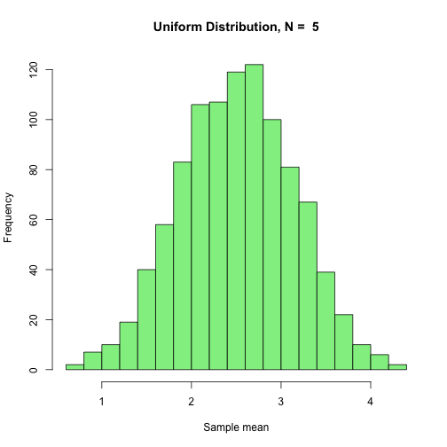

# Problem 1 (30 points).


```r
sample.sizes=c(3,10,50, 100, 500, 1000)

mean.sds = numeric(0) 

for ( N in sample.sizes ) {
        m = numeric(0)
        for ( i in 1:1000 ) {
                m[i] <- mean(runif(N))
        }
        mean.sds <- c(mean.sds, sd(m))

}

plot(sample.sizes,mean.sds, main="SEM vs sample size",pch=19, xlab = "Sample Size", ylab = "SEM")
lines(c(1:1000),1/sqrt(12*c(1:1000)),col='blue')
```


# Problem 2 (30 points).


```r
sample.sizes = c(1, 2, 5, 100, 2500, 25000)
repeats = 1000 

for (N in sample.sizes) {
        s.values=numeric()
        for (n.exp in 1:repeats) {
                x <- runif(N)
                s.values[n.exp] <- sum(x)
        }
        hist(s.values,breaks=25,col='lightgreen',main=paste("Uniform Distribution, N = ",N), xlab = "Sample mean")
}
```



Answer to final question: As N becomes large, the average of the sample mean approaches the population mean, the standard deviation of the the sample mean approaches infinity, and the shape of the distribution of the sample mean approaches that of a normal distrubution.


