# Introduction

In this assignment we will compare performance of random forest to that of LDA and KNN on a simulated dataset where we know exactly what is association between predictors and outcome.  The relationship between predictor levels and the outcome will involve interaction that is notoriously difficult to model by methods such as LDA. The following example below illustrates the main ideas on a 3D dataset with two of the three attributes associated with the outcome:


```r
# How many observations:
nObs <- 1000
# How many predictors are associated with outcome:
nClassVars <- 2
# How many predictors are not:
nNoiseVars <- 1
# To modulate average difference between two classes' predictor values:
deltaClass <- 1
# Simulate dataset with interaction between attribute levels associated with the outcome:
xyzTmp <- matrix(rnorm(nObs*(nClassVars+nNoiseVars)),nrow=nObs,ncol=nClassVars+nNoiseVars)
classTmp <- 1
for ( iTmp in 1:nClassVars ) {
  deltaTmp <- sample(deltaClass*c(-1,1),nObs,replace=TRUE)
  xyzTmp[,iTmp] <- xyzTmp[,iTmp] + deltaTmp
  classTmp <- classTmp * deltaTmp
}
classTmp <- factor(classTmp > 0)
table(classTmp)
```

```
## classTmp
## FALSE  TRUE 
##   521   479
```

```r
# plot resulting attribute levels colored by outcome:
pairs(xyzTmp,col=as.numeric(classTmp))
```

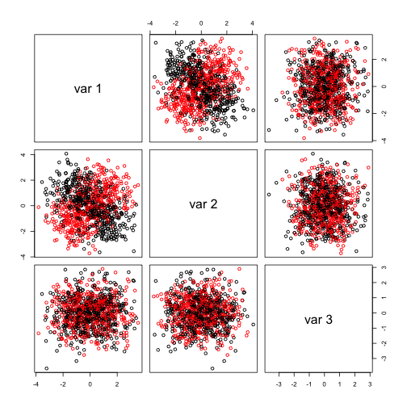

We can see that it is the interaction between the first two variables that has influences the outcome (we simulated it this way, of course!) and that points belonging to each of the two classes cannot be readily separated by a single line in 2D (or a single surface in 3D).


```r
# Split data into train and test
bTrain <- sample(c(FALSE,TRUE),nrow(xyzTmp),replace=TRUE)
# Fit random forest to train data, obtain test error:
rfRes <- randomForest(xyzTmp[bTrain,],classTmp[bTrain])
rfTmpTbl <- table(classTmp[!bTrain],predict(rfRes,newdata=xyzTmp[!bTrain,]))
rfTmpTbl
```

```
##        
##         FALSE TRUE
##   FALSE   192   63
##   TRUE     89  157
```

Random forest seems to do reasonably well on such dataset.


```r
# Fit LDA model to train data and evaluate error on the test data:
ldaRes <- lda(xyzTmp[bTrain,],classTmp[bTrain])
ldaTmpTbl <- table(classTmp[!bTrain],predict(ldaRes,newdata=xyzTmp[!bTrain,])$class)
ldaTmpTbl
```

```
##        
##         FALSE TRUE
##   FALSE   201   54
##   TRUE    206   40
```

LDA, on the other hand, not so good! (not a surprise given what we've seen above).  What about a more flexible method such a KNN?  Let's check it out remembering that k -- number of neihbors -- in KNN is the parameter to modulate its flexibility (i.e. bias-variance tradeoff).


```r
# Fit KNN model at several levels of k:
dfTmp <- NULL
for ( kTmp in floor(1.2^(1:33)) ) {
  knnRes <- knn(xyzTmp[bTrain,],xyzTmp[!bTrain,],classTmp[bTrain],k=kTmp)
  tmpTbl <- table(classTmp[!bTrain],knnRes)
  dfTmp <- rbind(dfTmp,data.frame(err=1-sum(diag(tmpTbl))/sum(tmpTbl),k=kTmp))
}
ggplot(dfTmp,aes(x=k,y=err))+geom_point()+scale_x_log10()+geom_hline(aes(yintercept = err,colour=type),data=data.frame(type=c("LDA","RF"),err=c(1-sum(diag(ldaTmpTbl))/sum(ldaTmpTbl),1-sum(diag(rfTmpTbl))/sum(rfTmpTbl))))+ggtitle("KNN error rate")
```

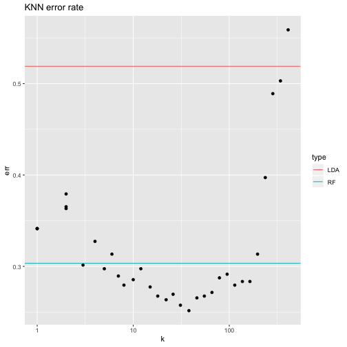

We can see from the above that there is a range of $k$ values where test error of KNN is the lowest and it is even lower that that of RF.  Now would be a good moment to think why one would want to choose RF over KNN or vice a versa for modeling the data if the figure above was representative of their true relative performance on a new dataset.

For the purposes of the assignment you can use the code above (probably best to wrap reusable parts of it into function(s)) to generate data with varying numbers of predictors associated with outcome and not, different numbers of observations and differences in the average values of predictors' between two classes as required below. These differences between datasets and parameters of the call to random forest will illustrate some of the factors influencing relative performance of random forest, LDA and KNN classifiers.  When comparing to KNN performance, please choose value(s) of `k` such that it performs sufficiently well -- feel free to refer to the plot above to select useful value(s) of `k` that you would like to evaluate here.  Keep in mind also that the value of `k` cannot be larger than the number of observations in the training dataset.

# Sub-problem 1 (15 points): effect of sample size

Generate datasets with `nObs=50`, `200` and `1000` observations (approximately evenly split between training and test datasets), two variables associated with the outcome as parameterized above and three not associated, and average difference between two classes same as above (i.e. in the notation from the above code `nClassVars=2`, `nNoisevars=3` and `deltaClass=1`).  Obtain random forest, LDA and KNN test error rates.  Describe the differences between different methods and across the sample sizes used here.


```r
set.seed(14)
# How many observations:
nObs <- c(50, 200, 1000)
# How many predictors are associated with outcome:
nClassVars <- 2
# How many predictors are not:
nNoiseVars <- 3
# To modulate average difference between two classes' predictor values:
deltaClass <- 1
# Simulate dataset with interaction between attribute levels associated with the outcome:
for (trial in 1:length(nObs)) {
  xyzTmp <- matrix(rnorm(nObs[trial]*(nClassVars+nNoiseVars)),nrow=nObs[trial],ncol=nClassVars+nNoiseVars)
  classTmp <- 1
  for ( iTmp in 1:nClassVars ) {
    deltaTmp <- sample(deltaClass*c(-1,1),nObs[trial],replace=TRUE)
    xyzTmp[,iTmp] <- xyzTmp[,iTmp] + deltaTmp
    classTmp <- classTmp * deltaTmp
  }
  classTmp <- factor(classTmp > 0)
  table(classTmp)
  # Split data into train and test
  bTrain <- sample(c(FALSE,TRUE),nrow(xyzTmp),replace=TRUE)
  # Fit random forest to train data, obtain test error:
  rfRes <- randomForest(xyzTmp[bTrain,],classTmp[bTrain])
  rfTmpTbl <- table(classTmp[!bTrain],predict(rfRes,newdata=xyzTmp[!bTrain,]))
  rfTmpTbl
  
  ldaRes <- lda(xyzTmp[bTrain,],classTmp[bTrain])
  ldaTmpTbl <- table(classTmp[!bTrain],predict(ldaRes,newdata=xyzTmp[!bTrain,])$class)
  # Fit KNN model at several levels of k:
  dfTmp <- NULL
  minK <- NULL
  minKErr <- Inf
  for ( kTmp in floor(exp(log(nObs[trial])*(1:25)/33))) {
    knnRes <- knn(xyzTmp[bTrain,],xyzTmp[!bTrain,],classTmp[bTrain],k=kTmp)
    tmpTbl <- table(classTmp[!bTrain],knnRes)
    err <- 1-sum(diag(tmpTbl))/sum(tmpTbl)
    dfTmp <- rbind(dfTmp,data.frame(err=err,k=kTmp))
    if (err < minKErr) {
            minK <- kTmp
            minKErr <- err
    }
  }
  print(paste("LDA test error for", nObs[trial], "observations:", 1-sum(diag(ldaTmpTbl))/sum(ldaTmpTbl)))
  print(paste("Random forest test error for", nObs[trial], "observations:", 1-sum(diag(rfTmpTbl))/sum(rfTmpTbl)))
  print(paste("Minimum K test error:", minKErr, "at K =", minK))
  print(ggplot(dfTmp,aes(x=k,y=err))+geom_point()+scale_x_log10()+geom_hline(aes(yintercept = err,colour=type),data=data.frame(type=c("LDA","RF"),err=c(1-sum(diag(ldaTmpTbl))/sum(ldaTmpTbl),1-sum(diag(rfTmpTbl))/sum(rfTmpTbl))))+ggtitle(paste("KNN error rate for", nObs[trial], "observations")))
}
```

```
## [1] "LDA test error for 50 observations: 0.535714285714286"
## [1] "Random forest test error for 50 observations: 0.714285714285714"
## [1] "Minimum K test error: 0.321428571428571 at K = 1"
```

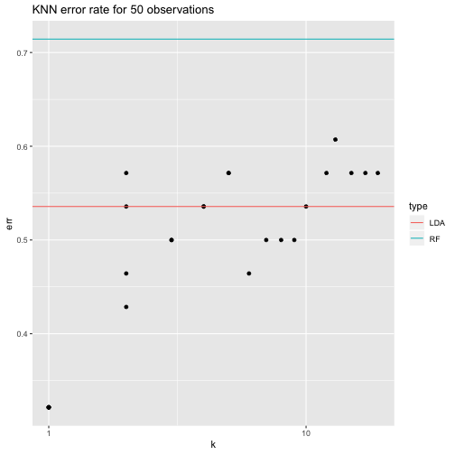

```
## [1] "LDA test error for 200 observations: 0.519230769230769"
## [1] "Random forest test error for 200 observations: 0.336538461538462"
## [1] "Minimum K test error: 0.278846153846154 at K = 9"
```

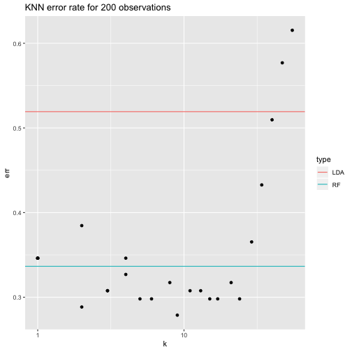

```
## [1] "LDA test error for 1000 observations: 0.480885311871227"
## [1] "Random forest test error for 1000 observations: 0.291750503018109"
## [1] "Minimum K test error: 0.257545271629779 at K = 53"
```

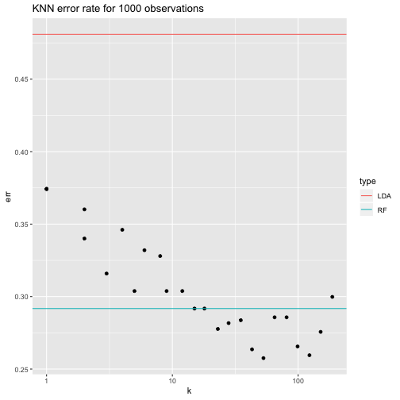

As shown above, for higher numbers of observations, Random forest and KNN outperform LDA to a considerable degree.  LDA assumes the boundary is linear, which it clearly is not.  In addition, LDA is superior for smaller numbers of observations.  That said, it is still no better than random guessing.

# Sub-problem 2 (15 points): effect of signal magnitude

For sample sizes of `nObs=200` and `1000` observations (approximately evenly split into training and test datasets) simulate data as shown above with average differences between the two classes that are same as above, half of that and twice that (`deltaClass=0.5`, `1` and `2`).  Obtain and plot test error rates of random forest, LDA and KNN for each of the six (two samples sizes times three signal magnitudes) combinations of sample size and signal strengths.  Describe the most pronounced differences across error rates for those datasets: does the increase in the number of observations impact the error rate of the models?  Does change in the magnitude of signal impact their performance?  Are different classifier approaches impacted in a similar way?


```r
set.seed(14)
# How many observations:
nObs <- c(200, 1000)
# How many predictors are associated with outcome:
nClassVars <- 2
# How many predictors are not:
nNoiseVars <- 3
# To modulate average difference between two classes' predictor values:
deltaClass <- c(0.5, 1, 2)
# Simulate dataset with interaction between attribute levels associated with the outcome:
for (trial in 1:length(nObs)) {
  for (trial2 in 1:length(deltaClass)) {
    xyzTmp <- matrix(rnorm(nObs[trial]*(nClassVars+nNoiseVars)),nrow=nObs[trial],ncol=nClassVars+nNoiseVars)
    classTmp <- 1
    for ( iTmp in 1:nClassVars ) {
      deltaTmp <- sample(deltaClass[trial2]*c(-1,1),nObs[trial],replace=TRUE)
      xyzTmp[,iTmp] <- xyzTmp[,iTmp] + deltaTmp
      classTmp <- classTmp * deltaTmp
    }
    classTmp <- factor(classTmp > 0)
    table(classTmp)
    # Split data into train and test
    bTrain <- sample(c(FALSE,TRUE),nrow(xyzTmp),replace=TRUE)
    # Fit random forest to train data, obtain test error:
    rfRes <- randomForest(xyzTmp[bTrain,],classTmp[bTrain])
    rfTmpTbl <- table(classTmp[!bTrain],predict(rfRes,newdata=xyzTmp[!bTrain,]))
    rfTmpTbl
    
    ldaRes <- lda(xyzTmp[bTrain,],classTmp[bTrain])
    ldaTmpTbl <- table(classTmp[!bTrain],predict(ldaRes,newdata=xyzTmp[!bTrain,])$class)
    # Fit KNN model at several levels of k:
    dfTmp <- NULL
    minK <- NULL
    minKErr <- Inf
    for ( kTmp in floor(exp(log(nObs[trial])*(1:25)/33))) {
      knnRes <- knn(xyzTmp[bTrain,],xyzTmp[!bTrain,],classTmp[bTrain],k=kTmp)
      tmpTbl <- table(classTmp[!bTrain],knnRes)
      err <- 1-sum(diag(tmpTbl))/sum(tmpTbl)
      dfTmp <- rbind(dfTmp,data.frame(err=err,k=kTmp))
      if (err < minKErr) {
        minK <- kTmp
        minKErr <- err
      }
    }
    print(paste("LDA test error for", nObs[trial], "observations and delta =", deltaClass[trial2], ":", 1-sum(diag(ldaTmpTbl))/sum(ldaTmpTbl)))
    print(paste("Random forest test error for", nObs[trial], "observations and delta =", deltaClass[trial2], ":", 1-sum(diag(rfTmpTbl))/sum(rfTmpTbl)))
    print(paste("Minimum K test error for delta =", deltaClass[trial2], ":", minKErr, "at K =", minK))
    print(ggplot(dfTmp,aes(x=k,y=err))+geom_point()+scale_x_log10()+geom_hline(aes(yintercept = err,colour=type),data=data.frame(type=c("LDA","RF"),err=c(1-sum(diag(ldaTmpTbl))/sum(ldaTmpTbl),1-sum(diag(rfTmpTbl))/sum(rfTmpTbl))))+ggtitle(paste("KNN error rate for", nObs[trial], "observations and delta =", deltaClass[trial2])))
  }
}
```

```
## [1] "LDA test error for 200 observations and delta = 0.5 : 0.522935779816514"
## [1] "Random forest test error for 200 observations and delta = 0.5 : 0.568807339449541"
## [1] "Minimum K test error for delta = 0.5 : 0.458715596330275 at K = 2"
```

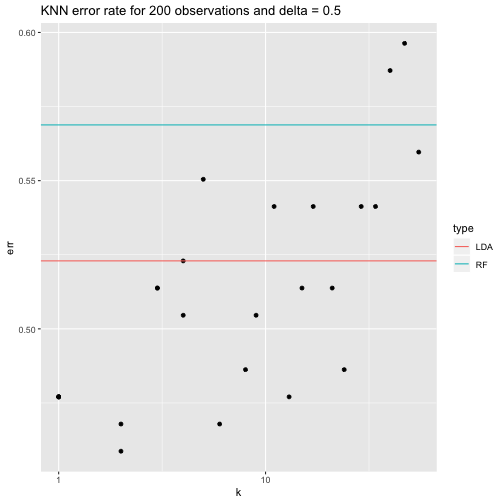

```
## [1] "LDA test error for 200 observations and delta = 1 : 0.434343434343434"
## [1] "Random forest test error for 200 observations and delta = 1 : 0.414141414141414"
## [1] "Minimum K test error for delta = 1 : 0.292929292929293 at K = 34"
```

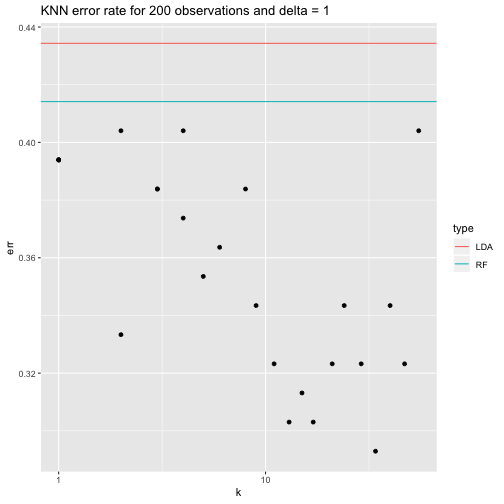

```
## [1] "LDA test error for 200 observations and delta = 2 : 0.505154639175258"
## [1] "Random forest test error for 200 observations and delta = 2 : 0.0618556701030928"
## [1] "Minimum K test error for delta = 2 : 0.0309278350515464 at K = 1"
```

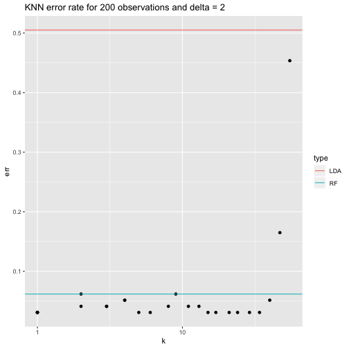

```
## [1] "LDA test error for 1000 observations and delta = 0.5 : 0.50398406374502"
## [1] "Random forest test error for 1000 observations and delta = 0.5 : 0.5"
## [1] "Minimum K test error for delta = 0.5 : 0.450199203187251 at K = 43"
```


```
## [1] "LDA test error for 1000 observations and delta = 1 : 0.501010101010101"
## [1] "Random forest test error for 1000 observations and delta = 1 : 0.303030303030303"
## [1] "Minimum K test error for delta = 1 : 0.282828282828283 at K = 18"
```

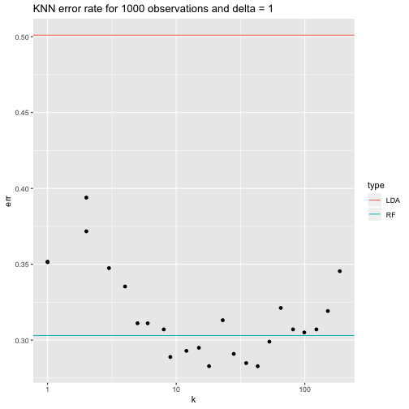

```
## [1] "LDA test error for 1000 observations and delta = 2 : 0.481132075471698"
## [1] "Random forest test error for 1000 observations and delta = 2 : 0.0471698113207547"
## [1] "Minimum K test error for delta = 2 : 0.0320754716981132 at K = 15"
```

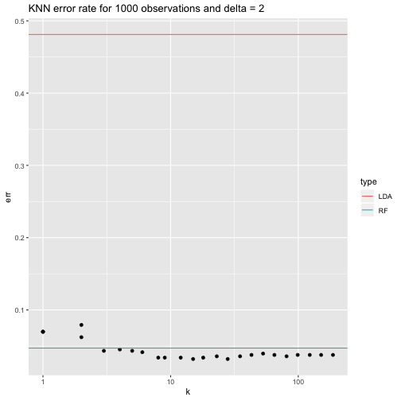

Higher numbers of observtions seem to slightly improve random forests and KNN's.  A higher magnitude of signal improves the classification models drastically.  This is because as the data corresponding to each classification moves farther apart, the two models distinguish them better.  However, LDA consistently performs similar to random guessing, as it assumes a linear decision boundary when there is none.

# Sub-problem 3 (15 points): varying counts of predictors

For all possible pairwise combinations of the numbers of variables associated with outcome (`nClassVars=2` and `5`) and those not associated with the outcome (`nNoiseVars=1`, `3` and `10`) -- six pairwise combinations in total -- obtain and present graphically test errors from random forest, LDA and KNN.  Choose signal magnitude (`deltaClass`) so that it will yield non-trvial results -- noticeable variability in the error rates across those six pairwise combinations of attribute counts.  Describe the results: what is the impact of the increase of the number of attributes associated with the outcome on the classifier performance?  What about the number of attributes not associated with outcome - does it affect classifier error rate?  Are different classifier methods affected by these simulation parameters in a similar way?


```r
set.seed(14)
# How many observations:
nObs <- 1000
# How many predictors are associated with outcome:
nClassVarss <- c(2, 5)
# How many predictors are not:
nNoiseVarss <- c(1, 3, 10)
# To modulate average difference between two classes' predictor values:
deltaClass <- 2
# Simulate dataset with interaction between attribute levels associated with the outcome:
for (nClassVars in nClassVarss) {
  for (nNoiseVars in nNoiseVarss) {
    xyzTmp <- matrix(rnorm(nObs*(nClassVars+nNoiseVars)),nrow=nObs,ncol=nClassVars+nNoiseVars)
    classTmp <- 1
    for ( iTmp in 1:nClassVars ) {
      deltaTmp <- sample(deltaClass*c(-1,1),nObs,replace=TRUE)
      xyzTmp[,iTmp] <- xyzTmp[,iTmp] + deltaTmp
      classTmp <- classTmp * deltaTmp
    }
    classTmp <- factor(classTmp > 0)
    table(classTmp)
    # Split data into train and test
    bTrain <- sample(c(FALSE,TRUE),nrow(xyzTmp),replace=TRUE)
    # Fit random forest to train data, obtain test error:
    rfRes <- randomForest(xyzTmp[bTrain,],classTmp[bTrain])
    rfTmpTbl <- table(classTmp[!bTrain],predict(rfRes,newdata=xyzTmp[!bTrain,]))
    rfTmpTbl
    
    ldaRes <- lda(xyzTmp[bTrain,],classTmp[bTrain])
    ldaTmpTbl <- table(classTmp[!bTrain],predict(ldaRes,newdata=xyzTmp[!bTrain,])$class)
    # Fit KNN model at several levels of k:
    dfTmp <- NULL
    minK <- NULL
    minKErr <- Inf
    for ( kTmp in floor(exp(log(nObs)*(1:25)/33))) {
      knnRes <- knn(xyzTmp[bTrain,],xyzTmp[!bTrain,],classTmp[bTrain],k=kTmp)
      tmpTbl <- table(classTmp[!bTrain],knnRes)
      err <- 1-sum(diag(tmpTbl))/sum(tmpTbl)
      dfTmp <- rbind(dfTmp,data.frame(err=err,k=kTmp))
      if (err < minKErr) {
              minK <- kTmp
              minKErr <- err
      }
    }
    print(paste("LDA test error for", nClassVars, "associated variables and", nNoiseVars, "noise variables:", 1 -sum(diag(ldaTmpTbl))/sum(ldaTmpTbl)))
    print(paste("Random forest test error for", nClassVars, "associated variables and", nNoiseVars, "noise variables:", 1-sum(diag(rfTmpTbl))/sum(rfTmpTbl)))
    print(paste("Minimum K test error for", nClassVars, "associated variables and", nNoiseVars, "noise variables", minKErr, "at K =", minK, ":"))
    print(ggplot(dfTmp,aes(x=k,y=err))+geom_point()+scale_x_log10()+geom_hline(aes(yintercept = err,colour=type),data=data.frame(type=c("LDA","RF"),err=c(1-sum(diag(ldaTmpTbl))/sum(ldaTmpTbl),1-sum(diag(rfTmpTbl))/sum(rfTmpTbl))))+ggtitle(paste("KNN error rate for", nClassVars, "associated variables and", nNoiseVars, "noise variables:")))
  }
}
```

```
## [1] "LDA test error for 2 associated variables and 1 noise variables: 0.52465483234714"
## [1] "Random forest test error for 2 associated variables and 1 noise variables: 0.0670611439842209"
## [1] "Minimum K test error for 2 associated variables and 1 noise variables 0.0571992110453649 at K = 81 :"
```

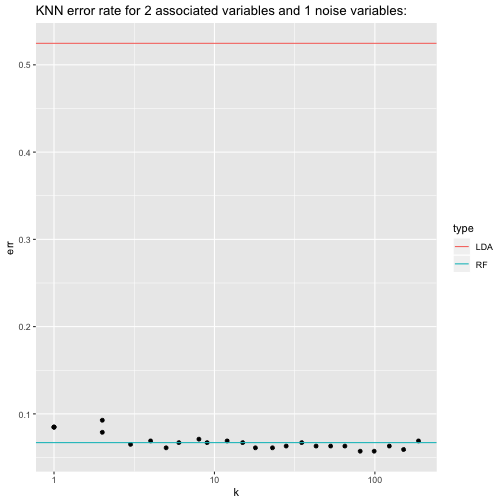

```
## [1] "LDA test error for 2 associated variables and 3 noise variables: 0.456349206349206"
## [1] "Random forest test error for 2 associated variables and 3 noise variables: 0.0595238095238095"
## [1] "Minimum K test error for 2 associated variables and 3 noise variables 0.0396825396825397 at K = 6 :"
```

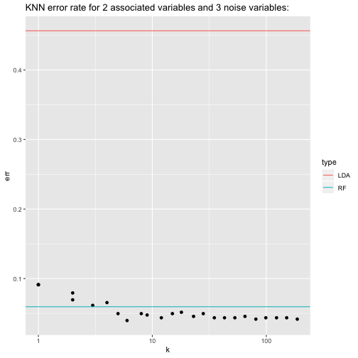

```
## [1] "LDA test error for 2 associated variables and 10 noise variables: 0.461538461538462"
## [1] "Random forest test error for 2 associated variables and 10 noise variables: 0.0668016194331984"
## [1] "Minimum K test error for 2 associated variables and 10 noise variables 0.048582995951417 at K = 12 :"
```


```
## [1] "LDA test error for 5 associated variables and 1 noise variables: 0.510978043912176"
## [1] "Random forest test error for 5 associated variables and 1 noise variables: 0.487025948103792"
## [1] "Minimum K test error for 5 associated variables and 1 noise variables 0.171656686626746 at K = 6 :"
```

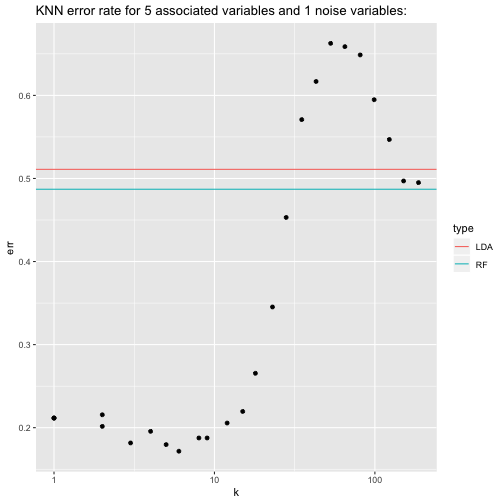

```
## [1] "LDA test error for 5 associated variables and 3 noise variables: 0.505882352941176"
## [1] "Random forest test error for 5 associated variables and 3 noise variables: 0.496078431372549"
## [1] "Minimum K test error for 5 associated variables and 3 noise variables 0.176470588235294 at K = 6 :"
```


```
## [1] "LDA test error for 5 associated variables and 10 noise variables: 0.489711934156379"
## [1] "Random forest test error for 5 associated variables and 10 noise variables: 0.487654320987654"
## [1] "Minimum K test error for 5 associated variables and 10 noise variables 0.251028806584362 at K = 5 :"
```


When there were two associated variables, LDA classified poorly as usual, whereas random forests and KNN performed well.  However, when there were five associated variables, only KNN performed well.  Random forests did not perform well in that case, similar to random guessing, even when there were even more noise variables. 

# Sub-problem 4: (15 points): effect of `mtry`

Parameter `mtry` in the call to `randomForest` defines the number of predictors randomly chosen to be evaluated for their association with the outcome at each split (please see help page for `randomForest` for more details).  By default for classification problem it is set as square root of the number of predictors in the dataset.  Here we will evaluate the impact of using different values of `mtry` on the error rate by random forest.

For `nObs=5000`, `deltaClass=2`, `nClassVars=3` and `nNoiseVars=20` generate data using the above approach and run `randomForest` on it with `mtry=2`, `5` and `10`.  Describe the impact of using different values of `mtry` on the error rate by random forest and compare it to that by LDA/KNN. 


```r
set.seed(17)
# How many observations:
nObs <- 5000
# How many predictors are associated with outcome:
nClassVars <- 3
# How many predictors are not:
nNoiseVars <- 20
# To modulate average difference between two classes' predictor values:
deltaClass <- 2
# Simulate dataset with interaction between attribute levels associated with the outcome:
mTrys <- c(2, 5, 10)
xyzTmp <- matrix(rnorm(nObs*(nClassVars+nNoiseVars)),nrow=nObs,ncol=nClassVars+nNoiseVars)
classTmp <- 1
for ( iTmp in 1:nClassVars ) {
  deltaTmp <- sample(deltaClass*c(-1,1),nObs,replace=TRUE)
  xyzTmp[,iTmp] <- xyzTmp[,iTmp] + deltaTmp
  classTmp <- classTmp * deltaTmp
}
classTmp <- factor(classTmp > 0)
table(classTmp)
```

```
## classTmp
## FALSE  TRUE 
##  2548  2452
```

```r
# Split data into train and test
bTrain <- sample(c(FALSE,TRUE),nrow(xyzTmp),replace=TRUE)
# Fit random forest to train data, obtain test error:
rfRes <- randomForest(xyzTmp[bTrain,],classTmp[bTrain], mTry = 2)
rfTmpTbl2 <- table(classTmp[!bTrain],predict(rfRes,newdata=xyzTmp[!bTrain,]))
rfRes <- randomForest(xyzTmp[bTrain,],classTmp[bTrain], mTry = 5)
rfTmpTbl5 <- table(classTmp[!bTrain],predict(rfRes,newdata=xyzTmp[!bTrain,]))
rfRes <- randomForest(xyzTmp[bTrain,],classTmp[bTrain], mTry = 10)
rfTmpTbl10 <- table(classTmp[!bTrain],predict(rfRes,newdata=xyzTmp[!bTrain,]))
ldaRes <- lda(xyzTmp[bTrain,],classTmp[bTrain])
ldaTmpTbl <- table(classTmp[!bTrain],predict(ldaRes,newdata=xyzTmp[!bTrain,])$class)
# Fit KNN model at several levels of k:
dfTmp <- NULL
minK <- NULL
minKErr <- Inf
for ( kTmp in floor(1.2^(1:33))) {
  knnRes <- knn(xyzTmp[bTrain,],xyzTmp[!bTrain,],classTmp[bTrain],k=kTmp)
  tmpTbl <- table(classTmp[!bTrain],knnRes)
  err <- 1-sum(diag(tmpTbl))/sum(tmpTbl)
  dfTmp <- rbind(dfTmp,data.frame(err=err,k=kTmp))
  if (err < minKErr) {
    minK <- kTmp
    minKErr <- err
  }
}
print(paste("LDA test error:", 1 -sum(diag(ldaTmpTbl))/sum(ldaTmpTbl)))
```

```
## [1] "LDA test error: 0.520049099836334"
```

```r
print(paste("Random forest test error for mTry = 2:", 1-sum(diag(rfTmpTbl2))/sum(rfTmpTbl2)))
```

```
## [1] "Random forest test error for mTry = 2: 0.416530278232406"
```

```r
print(paste("Random forest test error for mTry = 5:", 1-sum(diag(rfTmpTbl5))/sum(rfTmpTbl5)))
```

```
## [1] "Random forest test error for mTry = 5: 0.398527004909984"
```

```r
print(paste("Random forest test error for mTry = 10:", 1-sum(diag(rfTmpTbl10))/sum(rfTmpTbl10)))
```

```
## [1] "Random forest test error for mTry = 10: 0.398117839607201"
```

```r
print(paste("Minimum K test error at K =", minK, ":"))
```

```
## [1] "Minimum K test error at K = 66 :"
```

```r
print(ggplot(dfTmp,aes(x=k,y=err))+geom_point()+scale_x_log10()+geom_hline(aes(yintercept = err,colour=type),data=data.frame(type=c("LDA","RF mTry = 2", "RF mTry = 5", "RF mTry = 10"),err=c(1-sum(diag(ldaTmpTbl))/sum(ldaTmpTbl),1-sum(diag(rfTmpTbl2))/sum(rfTmpTbl2),1-sum(diag(rfTmpTbl5))/sum(rfTmpTbl5),1-sum(diag(rfTmpTbl10))/sum(rfTmpTbl10))))+ggtitle(paste("KNN error rate")))
```

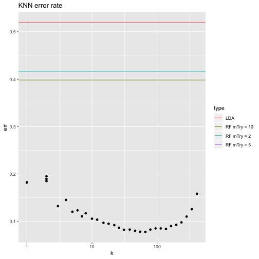

As shown above, changing the mTry parameter has little effect.  This is because we already know that there are only two parameters that are significant, so considering more does not at all enhance the fit.  LDA performs poorly as it assumes a linear decision boundary, and that is not the case in the data.  Random forest also generally performs poorly becuase we use three varables, and random forest usually performs poorly on three or more associated variables.  On the other hand, KNN performs well because deltaClass = 2, which gives the algorithm more than enough space between groups of data points to draw the decision boundary.
