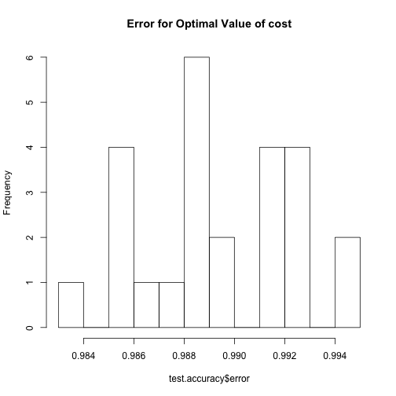
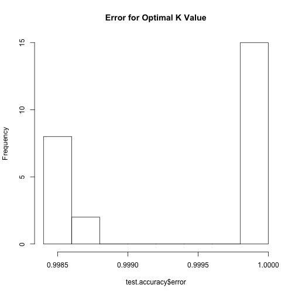
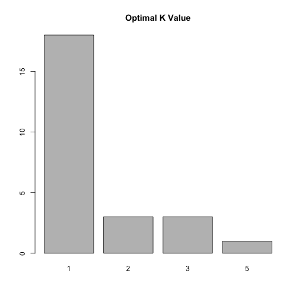
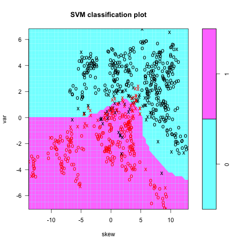
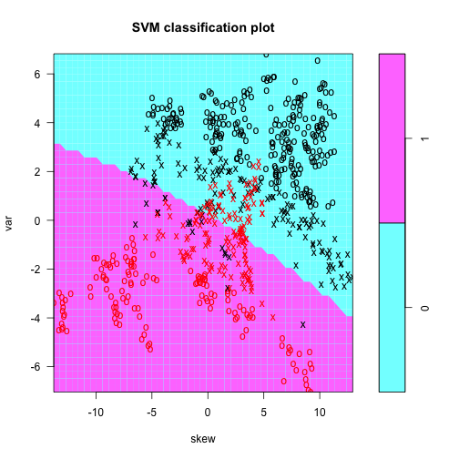
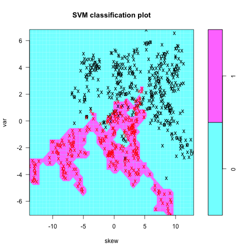
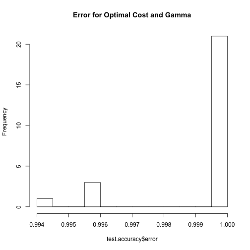
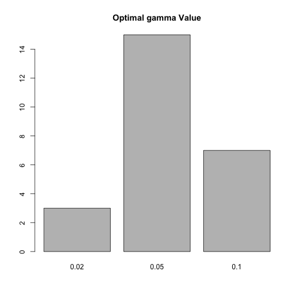

# Preface

This week assignment will explore behavior of support vector classifiers and SVMs (following the distinction made in ISLR) on banknote authentication dataset from UCI ML archive.  We worked with it on multiple occasions before (most recently two weeks ago evaluating performance of logistic regression, discriminant analysis and KNN on it):


```r
dbaDat <- read.table("data_banknote_authentication.txt",sep=",")
colnames(dbaDat) <- c("var","skew","curt","entr","auth")
dbaDat$auth <- factor(dbaDat$auth)
dim(dbaDat)
```

```
## [1] 1372    5
```

```r
summary(dbaDat)
```

```
##       var               skew              curt              entr        
##  Min.   :-7.0421   Min.   :-13.773   Min.   :-5.2861   Min.   :-8.5482  
##  1st Qu.:-1.7730   1st Qu.: -1.708   1st Qu.:-1.5750   1st Qu.:-2.4135  
##  Median : 0.4962   Median :  2.320   Median : 0.6166   Median :-0.5867  
##  Mean   : 0.4337   Mean   :  1.922   Mean   : 1.3976   Mean   :-1.1917  
##  3rd Qu.: 2.8215   3rd Qu.:  6.815   3rd Qu.: 3.1793   3rd Qu.: 0.3948  
##  Max.   : 6.8248   Max.   : 12.952   Max.   :17.9274   Max.   : 2.4495  
##  auth   
##  0:762  
##  1:610  
##         
##         
##         
## 
```

```r
head(dbaDat)
```

```
##       var    skew    curt     entr auth
## 1 3.62160  8.6661 -2.8073 -0.44699    0
## 2 4.54590  8.1674 -2.4586 -1.46210    0
## 3 3.86600 -2.6383  1.9242  0.10645    0
## 4 3.45660  9.5228 -4.0112 -3.59440    0
## 5 0.32924 -4.4552  4.5718 -0.98880    0
## 6 4.36840  9.6718 -3.9606 -3.16250    0
```

```r
pairs(dbaDat[,1:4],col=as.numeric(dbaDat$auth))
```


Here we will use SVM implementation available in library `e1071` to fit classifiers with linear and radial (polynomial for extra points) kernels and compare their relative performance as well as to that of random forest and KNN.

# Problem 1 (20 points): support vector classifier (i.e. using linear kernel) 

Use `svm` from library `e1071` with `kernel="linear"` to fit classifier (e.g. ISLR Ch.9.6.1) to the entire banknote authentication dataset setting parameter `cost` to 0.001, 1, 1000 and 1 mln.  Describe how this change in parameter `cost` affects model fitting process (hint: the difficulty of the underlying optimization problem increases with cost -- can you explain what drives it?) and its outcome (how does the number of support vectors change with `cost`?) and what are the implications of that.  Explain why change in `cost` value impacts number of support vectors found. (Hint: there is an answer in ISLR.)  Use `tune` function from library `e1071` (see ISLR Ch.9.6.1 for details and examples of usage) to determine approximate value of cost (in the range between 0.1 and 100 -- the suggested range spanning ordes of magnitude should hint that the density of the grid should be approximately logarithmic -- e.g. 1, 3, 10, ... or 1, 2, 5, 10, ... etc.) that yields the lowest error in cross-validation employed by `tune`.  Setup a resampling procedure repeatedly splitting entire dataset into training and test, using training data to `tune` cost value and test dataset to estimate classification error. Report and discuss distributions of test errors from this procedure and selected values of `cost`.


```r
set.seed(14)

costs <- c(0.001, 1, 1000, 1000000)

for (cost in costs) {
        svmfit <- svm(auth ~ ., data = dbaDat, kernel = "linear", cost = cost, scale = TRUE)
        summary(svmfit)
        
}

tune.out <- tune(svm, auth ~ ., data = dbaDat, kernel = "linear", ranges = list(cost = exp(seq(log(0.1), log(100), length.out = 10)), scale = TRUE))

summary(tune.out)
```

```
## 
## Parameter tuning of 'svm':
## 
## - sampling method: 10-fold cross validation 
## 
## - best parameters:
##      cost scale
##  2.154435  TRUE
## 
## - best performance: 0.009473183 
## 
## - Detailed performance results:
##           cost scale       error  dispersion
## 1    0.1000000  TRUE 0.017507670 0.007861804
## 2    0.2154435  TRUE 0.016047816 0.005775638
## 3    0.4641589  TRUE 0.015317889 0.006405993
## 4    1.0000000  TRUE 0.014587961 0.007705281
## 5    2.1544347  TRUE 0.009473183 0.006917970
## 6    4.6415888  TRUE 0.009473183 0.006917970
## 7   10.0000000  TRUE 0.010933037 0.007090681
## 8   21.5443469  TRUE 0.011662964 0.007845467
## 9   46.4158883  TRUE 0.012392891 0.006925407
## 10 100.0000000  TRUE 0.011662964 0.007845467
```

```r
tune.out2 <- tune(svm, auth ~ ., data = dbaDat, kernel = "linear", ranges = list(cost = exp(seq(log(2.15), log(4.64), length.out = 10)), scale = TRUE))

summary(tune.out2)
```

```
## 
## Parameter tuning of 'svm':
## 
## - sampling method: 10-fold cross validation 
## 
## - best parameters:
##      cost scale
##  3.590527  TRUE
## 
## - best performance: 0.008018618 
## 
## - Detailed performance results:
##        cost scale       error  dispersion
## 1  2.150000  TRUE 0.012387602 0.011403751
## 2  2.341846  TRUE 0.011657675 0.010397475
## 3  2.550811  TRUE 0.010927748 0.009839985
## 4  2.778423  TRUE 0.010927748 0.009839985
## 5  3.026344  TRUE 0.008748545 0.006697409
## 6  3.296387  TRUE 0.008748545 0.006697409
## 7  3.590527  TRUE 0.008018618 0.006379199
## 8  3.910912  TRUE 0.008018618 0.006379199
## 9  4.259887  TRUE 0.008018618 0.006379199
## 10 4.640000  TRUE 0.008018618 0.006379199
```

```r
bestmod <- tune.out2$best.model
summary(bestmod)
```

```
## 
## Call:
## best.tune(method = svm, train.x = auth ~ ., data = dbaDat, ranges = list(cost = exp(seq(log(2.15), 
##     log(4.64), length.out = 10)), scale = TRUE), kernel = "linear")
## 
## 
## Parameters:
##    SVM-Type:  C-classification 
##  SVM-Kernel:  linear 
##        cost:  3.590527 
##       gamma:  0.25 
## 
## Number of Support Vectors:  57
## 
##  ( 29 28 )
## 
## 
## Number of Classes:  2 
## 
## Levels: 
##  0 1
```


```r
test.accuracy <- data.frame()
for (i in 1:25) {
        train <- sample(c(FALSE, TRUE), nrow(dbaDat), replace = TRUE)
        tune.out3 <- tune(svm, auth ~ ., data = dbaDat[train,], kernel = "linear", ranges = list(cost = exp(seq(log(2.15), log(4.64), length.out = 10)), scale = TRUE))
        pred <- predict(tune.out3$best.model, subset(dbaDat[!train,], select = -auth))
        min.cost <- tune.out3$performances[[which.min(tune.out3$performances$error), "cost"]]
        test.accuracy <- rbind(test.accuracy, data.frame(cost = min.cost, error = sum(pred == as.factor(dbaDat[!train, "auth"]))/length(pred)))
}
        
hist(test.accuracy$error, 10, main = "Error for Optimal Value of cost")
```



```r
barplot(table(signif(test.accuracy$cost, digits = 4)), main = "Optimal Value of cost")
```


When "cost" is increased, the margin becomes smaller and there are fewer support vectors.  This can lead to overfitting if done in excess.  There are fewer support vectors because higher values of cost decrease the allowance in the optimization formula for high slack variables.  A smaller margin means that there are fewer variables that have any slack, and the variables that have slack have less of it.   If cost is increased so much that the model overfits the data, then the training error will be low but the test error may increase.

The data suggests that an accuracy of 98.8% is the most common for the model with minimum test error.  The best model tends to have a cost of about 3.911.

# Problem 2 (10 points): comparison to random forest

Fit random forest classifier on the entire banknote authentication dataset with default parameters.  Calculate resulting misclassification error as reported by the confusion matrix in random forest output.  Explain why error reported in random forest confusion matrix represents estimated test (as opposed to train) error of the procedure.  Compare resulting test error to that for support vector classifier obtained above and discuss results of such comparison.


```r
rf <- randomForest(auth ~ ., data = dbaDat)
rf.pred <- predict(rf)
table(dbaDat$auth, rf.pred)
```

```
##    rf.pred
##       0   1
##   0 756   6
##   1   1 609
```

```r
## Test error
756 + 609 / 756 + 609
```

```
## [1] 1365.806
```

The random forest model predicts the vast majority of observations correctly, near perfect.  This reported error represents test error because in all random forests, approximately one third of the data are not used to make the forest.  The random forest's strong performance indicates distance between the authenticity classification clusters.

# Extra 7 points problem: effect of `mtry` and `ntree` in random forest

Not directly related to SVM, but while we are at it: fit random forest to the entire banknote authentication dataset for every possible value of parameter `mtry` and using `ntree` of 100 and 1000 for each of them.  The values of `mtry` possible in this case are 1, 2, 3 and 4.  Please explain what is governed by this parameter and why this is the exhaustive set of the values allowed for it in this case. Would it change for another dataset?  What is the default value of `mtry` for this dataset?  Repeat this several times to assess center and spread of the error rates produced by random forest with these parameters across multiple runs of random forest procedure.  Present these results graphically and comment on the impact of the choices of `mtry` and `ntree` on the resulting error rates.


# Problem 3 (10 points): Comparison to cross-validation tuned KNN predictor

Use convenience wrapper `tune.knn` provided by the library `e1071` on the entire dataset to determine optimal value for the number of the nearest neighbors 'k' to be used in KNN classifier.  Consider our observations in week 9 assignment when choosing range of values of `k` to be evaluated by `tune.knn`.  Setup resampling procedure similar to that used above for support vector classifier that will repeatedly: a) split banknote authentication dataset into training and test, b) use `tune.knn` on training data to determine optimal `k`, and c) use `k` estimated by `tune.knn` to make KNN classifications on test data.  Report and discuss distributions of test errors from this procedure and selected values of `k`, compare them to those obtained for random forest and support vector classifier above.


```r
library(class)

test.accuracy <- data.frame()
for (i in 1:25) {
        train <- sample(c(FALSE, TRUE), nrow(dbaDat), replace = TRUE)
        tuneKNN <- tune.knn(dbaDat[train, !names(dbaDat) %in% "auth"], as.factor(dbaDat[train, "auth"]), k = c(1, 2, 3, 5, 10, 25, 50, 100), tunecontrol = tune.control(sampling = "cross"), cross=10, scale = TRUE)
        pred <- knn(dbaDat[train, !names(dbaDat) %in% "auth"], dbaDat[!train, !names(dbaDat) %in% "auth"], cl = as.factor(dbaDat[train, "auth"]), k = tuneKNN$best.model$k)
        min.error.k <- tuneKNN$best.model$k
        test.accuracy <- rbind(test.accuracy, data.frame(minimum.error.k = min.error.k, error = sum(pred == as.factor(dbaDat[!train, "auth"]))/length(pred)))
}

hist(test.accuracy$error, 10, main = "Error for Optimal K Value")
```



```r
barplot(table(signif(test.accuracy$minimum.error.k, digits = 4)), main = "Optimal K Value")
```



As shown in Homework 9, for K = 1, KNN classification has perfect accuracy on the training data..  This is because for K = 1, each training data point is predicted to be located at its own position.  This is infinitely overfit.  Surprisingly, KNN with K = 1 also performs best on the test data for 16 out of 25 samplings.  This means that the authenticity status of a banknote generally depends heavily on the status of the most similar banknote, even if the more general environment of similar banknotes has another status.  Most of the time, the best model had no test error.

# Problem 4 (20 points): SVM with radial kernel

## Sub-problem 4a (10 points): impact of $gamma$ on classification surface

*Plot* SVM model fit to the banknote authentication dataset using (for the ease of plotting) *only variance and skewness* as predictors variables, `kernel="radial"`, `cost=1` and `gamma=1` (see ISLR Ch.9.6.2 for an example of that done with a simulated dataset).  You should be able to see in the resulting plot the magenta-cyan classification boundary as computed by this model.  Produce the same kinds of plots using 0.01 and 100 as values of `gamma` also.  Compare classification boundaries between these three plots and describe how they are impacted by the change in the value of `gamma`.  Can you trace it back to the role of `gamma` in the equation introducing it with the radial kernel in ISLR?


```r
train <- sample(c(FALSE, TRUE), nrow(dbaDat), replace = TRUE)
for(gamma in c(1, 0.01, 100)) {
        svmFit <- svm(auth ~ var + skew, data = dbaDat[train,], kernel = "radial", cost = 1, gamma = gamma)
        plot(svmFit, dbaDat[train, names(dbaDat) %in% c("auth", "var", "skew")])
}
```



The low gamma of 0.01 results in a nearly linear plot with high bias, whereas the high gamma of 100 leads to a very complicated plot that clearly overfits the data and has high variance.  This is because with a low gamma, the impact of the kernel, with gamma as a coefficient in the exponent, is lessened.  A kernel with a low impact leads to less of a relationship between the predicted class of an observation and neighboring observations, while a kernel with a high impact leads to more of that relationship.  For a low gamma, this leads to a linear classification boundary, as a line does not bend according to neighboring observations.  For a high gamma, the classification is almost exclusively related to neighboring observations, leading to overfitting on the training data.

## Sub-problem 4b (10 points): test error for SVM with radial kernel

Similar to how it was done above for support vector classifier (and KNN), set up a resampling process that will repeatedly: a) split the entire dataset (using all attributes as predictors) into training and test datasets, b) use `tune` function to determine optimal values of `cost` and `gamma` and c) calculate test error using these values of `cost` and `gamma`.  You can start with `cost=c(1,2,5,10,20)` and `gamma=c(0.01,0.02,0.05,0.1,0.2)` as starting ranges to evaluate by `tune`, but please feel free to experiment with different sets of values and discuss the results of it and how you would go about selecting those ranges starting from scratch.  Present resulting test error graphically, compare it to that of support vector classifier (with linear kernel), random forest and KNN classifiers obtained above and discuss results of these comparisons. 


```r
test.accuracy <- data.frame()
for (i in 1:25) {
        train <- sample(c(FALSE, TRUE), nrow(dbaDat), replace = TRUE)
        tune.radial <- tune(svm, auth ~ ., data = dbaDat[train,], kernel = "radial", ranges = list(cost = c(1, 2, 5, 10, 20), gamma = c(0.01, 0.02, 0.05, 0.1, 0.2)), scale = TRUE)
        pred <- predict(tune.radial$best.model, subset(dbaDat[!train,], select = -auth))
        min.cost <- tune.radial$performances[[which.min(tune.radial$performances$error), "cost"]]
        min.gamma <- tune.radial$performances[[which.min(tune.radial$performances$error), "gamma"]]
        test.accuracy <- rbind(test.accuracy, data.frame(cost = min.cost, gamma = min.gamma, error = sum(pred == as.factor(dbaDat[!train, "auth"]))/length(pred)))
}

hist(test.accuracy$error, 10, main = "Error for Optimal Cost and Gamma")
```



```r
barplot(table(signif(test.accuracy$cost, digits = 4)), main = "Optimal cost Value")
```


```r
barplot(table(signif(test.accuracy$gamma, digits = 4)), main = "Optimal gamma Value")
```



As shown above, the optimal cost is 20 and the optimal gamma is 0.05.  These are a high value of cost and a low value of gamma.  Radial SVM seems to be the best model, as it usually classifies with perfect accuracy.  This is better than linear SVM and random forest, and similar to KNN, i.e., usually perfect.  This is likely a result of non-linearity.  The values of K in KNN and gamma in radial SVM have high variance, indicating that models that fit the training data well (not linear SVM) perform the best.  That said, all the models in this homework perform very well, since the clusters of counterfeit and authentic banknotes are distant with respect to multiple predictors.

# Extra 8 points problem: SVM with polynomial kernel

Repeat what was done above (plots of decision boundaries for various interesting values of tuning parameters and test error for their best values estimated from training data) using `kernel="polynomial"`.   Determine ranges of `cost` and `gamma` to be evaluated by `tune`.  Present and discuss resulting test error and how it compares to linear and radial kernels and those of random forest and SVM.

