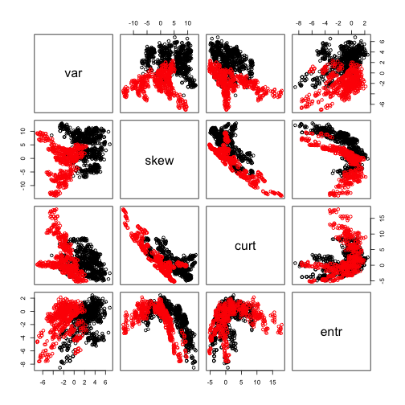

# Preface

This week assignment will explore behavior of support vector classifiers and SVMs (following the distinction made in ISLR) on banknote authentication dataset from UCI ML archive.  We worked with it on multiple occasions before (most recently two weeks ago evaluating performance of logistic regression, discriminant analysis and KNN on it):


```r
dbaDat <- read.table("data_banknote_authentication.txt",sep=",")
colnames(dbaDat) <- c("var","skew","curt","entr","auth")
dbaDat$auth <- factor(dbaDat$auth)
dim(dbaDat)
```

```
## [1] 1372    5
```

```r
summary(dbaDat)
```

```
##       var               skew              curt              entr        
##  Min.   :-7.0421   Min.   :-13.773   Min.   :-5.2861   Min.   :-8.5482  
##  1st Qu.:-1.7730   1st Qu.: -1.708   1st Qu.:-1.5750   1st Qu.:-2.4135  
##  Median : 0.4962   Median :  2.320   Median : 0.6166   Median :-0.5867  
##  Mean   : 0.4337   Mean   :  1.922   Mean   : 1.3976   Mean   :-1.1917  
##  3rd Qu.: 2.8215   3rd Qu.:  6.815   3rd Qu.: 3.1793   3rd Qu.: 0.3948  
##  Max.   : 6.8248   Max.   : 12.952   Max.   :17.9274   Max.   : 2.4495  
##  auth   
##  0:762  
##  1:610  
##         
##         
##         
## 
```

```r
head(dbaDat)
```

```
##       var    skew    curt     entr auth
## 1 3.62160  8.6661 -2.8073 -0.44699    0
## 2 4.54590  8.1674 -2.4586 -1.46210    0
## 3 3.86600 -2.6383  1.9242  0.10645    0
## 4 3.45660  9.5228 -4.0112 -3.59440    0
## 5 0.32924 -4.4552  4.5718 -0.98880    0
## 6 4.36840  9.6718 -3.9606 -3.16250    0
```

```r
pairs(dbaDat[,1:4],col=as.numeric(dbaDat$auth))
```



Here we will use SVM implementation available in library `e1071` to fit classifiers with linear and radial (polynomial for extra points) kernels and compare their relative performance as well as to that of random forest and KNN.

# Problem 1 (20 points): support vector classifier (i.e. using linear kernel) 

Use `svm` from library `e1071` with `kernel="linear"` to fit classifier (e.g. ISLR Ch.9.6.1) to the entire banknote authentication dataset setting parameter `cost` to 0.001, 1, 1000 and 1 mln.  Describe how this change in parameter `cost` affects model fitting process (hint: the difficulty of the underlying optimization problem increases with cost -- can you explain what drives it?) and its outcome (how does the number of support vectors change with `cost`?) and what are the implications of that.  Explain why change in `cost` value impacts number of support vectors found. (Hint: there is an answer in ISLR.)  Use `tune` function from library `e1071` (see ISLR Ch.9.6.1 for details and examples of usage) to determine approximate value of cost (in the range between 0.1 and 100 -- the suggested range spanning ordes of magnitude should hint that the density of the grid should be approximately logarithmic -- e.g. 1, 3, 10, ... or 1, 2, 5, 10, ... etc.) that yields the lowest error in cross-validation employed by `tune`.  Setup a resampling procedure repeatedly splitting entire dataset into training and test, using training data to `tune` cost value and test dataset to estimate classification error. Report and discuss distributions of test errors from this procedure and selected values of `cost`.


```r
set.seed(14)

costs <- c(0.001, 1, 1000, 1000000)

for (cost in costs) {
        svmfit <- svm(auth ~ ., data = dbaDat, kernel = "linear", cost = cost, scale = FALSE)
        
}

tune.out <- tune(svm, auth ~ ., data = dbaDat, kernel = "linear", ranges = list(cost = exp(seq(log(0.1), log(100), length.out = 10))))

summary(tune.out)
```

```
## 
## Parameter tuning of 'svm':
## 
## - sampling method: 10-fold cross validation 
## 
## - best parameters:
##      cost
##  2.154435
## 
## - best performance: 0.009473183 
## 
## - Detailed performance results:
##           cost       error  dispersion
## 1    0.1000000 0.017507670 0.007861804
## 2    0.2154435 0.016047816 0.005775638
## 3    0.4641589 0.015317889 0.006405993
## 4    1.0000000 0.014587961 0.007705281
## 5    2.1544347 0.009473183 0.006917970
## 6    4.6415888 0.009473183 0.006917970
## 7   10.0000000 0.010933037 0.007090681
## 8   21.5443469 0.011662964 0.007845467
## 9   46.4158883 0.012392891 0.006925407
## 10 100.0000000 0.011662964 0.007845467
```

```r
tune.out2 <- tune(svm, auth ~ ., data = dbaDat, kernel = "linear", ranges = list(cost = exp(seq(log(2.15), log(4.64), length.out = 10))))

summary(tune.out2)
```

```
## 
## Parameter tuning of 'svm':
## 
## - sampling method: 10-fold cross validation 
## 
## - best parameters:
##      cost
##  3.590527
## 
## - best performance: 0.008018618 
## 
## - Detailed performance results:
##        cost       error  dispersion
## 1  2.150000 0.012387602 0.011403751
## 2  2.341846 0.011657675 0.010397475
## 3  2.550811 0.010927748 0.009839985
## 4  2.778423 0.010927748 0.009839985
## 5  3.026344 0.008748545 0.006697409
## 6  3.296387 0.008748545 0.006697409
## 7  3.590527 0.008018618 0.006379199
## 8  3.910912 0.008018618 0.006379199
## 9  4.259887 0.008018618 0.006379199
## 10 4.640000 0.008018618 0.006379199
```

```r
bestmod <- tune.out2$best.model
summary(bestmod)
```

```
## 
## Call:
## best.tune(method = svm, train.x = auth ~ ., data = dbaDat, ranges = list(cost = exp(seq(log(2.15), 
##     log(4.64), length.out = 10))), kernel = "linear")
## 
## 
## Parameters:
##    SVM-Type:  C-classification 
##  SVM-Kernel:  linear 
##        cost:  3.590527 
##       gamma:  0.25 
## 
## Number of Support Vectors:  57
## 
##  ( 29 28 )
## 
## 
## Number of Classes:  2 
## 
## Levels: 
##  0 1
```

```r
best.model <- NULL
test.error <- data.frame()
for (i in 1:5) {
        train <- sample(c(FALSE, TRUE), nrow(dbaDat), replace = TRUE)
        tune.out3 <- tune(svm, auth ~ ., data = dbaDat[train,], kernel = "linear", ranges = list(cost = exp(seq(log(2.15), log(4.64), length.out = 10))))
        test.error <- rbind(test.error, tune.out3$performances[c("cost", "error")])
}
```

print(test.error)        
        EXPAIN BOTH PARTS
SHOULD SCALE BE = TO FALSE?

# Problem 2 (10 points): comparison to random forest

Fit random forest classifier on the entire banknote authentication dataset with default parameters.  Calculate resulting misclassification error as reported by the confusion matrix in random forest output.  Explain why error reported in random forest confusion matrix represents estimated test (as opposed to train) error of the procedure.  Compare resulting test error to that for support vector classifier obtained above and discuss results of such comparison.

# Extra 7 points problem: effect of `mtry` and `ntree` in random forest

Not directly related to SVM, but while we are at it: fit random forest to the entire banknote authentication dataset for every possible value of parameter `mtry` and using `ntree` of 100 and 1000 for each of them.  The values of `mtry` possible in this case are 1, 2, 3 and 4.  Please explain what is governed by this parameter and why this is the exhaustive set of the values allowed for it in this case. Would it change for another dataset?  What is the default value of `mtry` for this dataset?  Repeat this several times to assess center and spread of the error rates produced by random forest with these parameters across multiple runs of random forest procedure.  Present these results graphically and comment on the impact of the choices of `mtry` and `ntree` on the resulting error rates.


# Problem 3 (10 points): Comparison to cross-validation tuned KNN predictor

Use convenience wrapper `tune.knn` provided by the library `e1071` on the entire dataset to determine optimal value for the number of the nearest neighbors 'k' to be used in KNN classifier.  Consider our observations in week 9 assignment when choosing range of values of `k` to be evaluated by `tune.knn`.  Setup resampling procedure similar to that used above for support vector classifier that will repeatedly: a) split banknote authentication dataset into training and test, b) use `tune.knn` on training data to determine optimal `k`, and c) use `k` estimated by `tune.knn` to make KNN classifications on test data.  Report and discuss distributions of test errors from this procedure and selected values of `k`, compare them to those obtained for random forest and support vector classifier above.


# Problem 4 (20 points): SVM with radial kernel

## Sub-problem 4a (10 points): impact of $gamma$ on classification surface

*Plot* SVM model fit to the banknote authentication dataset using (for the ease of plotting) *only variance and skewness* as predictors variables, `kernel="radial"`, `cost=1` and `gamma=1` (see ISLR Ch.9.6.2 for an example of that done with a simulated dataset).  You should be able to see in the resulting plot the magenta-cyan classification boundary as computed by this model.  Produce the same kinds of plots using 0.01 and 100 as values of `gamma` also.  Compare classification boundaries between these three plots and describe how they are impacted by the change in the value of `gamma`.  Can you trace it back to the role of `gamma` in the equation introducing it with the radial kernel in ISLR?


## Sub-problem 4b (10 points): test error for SVM with radial kernel

Similar to how it was done above for support vector classifier (and KNN), set up a resampling process that will repeatedly: a) split the entire dataset (using all attributes as predictors) into training and test datasets, b) use `tune` function to determine optimal values of `cost` and `gamma` and c) calculate test error using these values of `cost` and `gamma`.  You can start with `cost=c(1,2,5,10,20)` and `gamma=c(0.01,0.02,0.05,0.1,0.2)` as starting ranges to evaluate by `tune`, but please feel free to experiment with different sets of values and discuss the results of it and how you would go about selecting those ranges starting from scratch.  Present resulting test error graphically, compare it to that of support vector classifier (with linear kernel), random forest and KNN classifiers obtained above and discuss results of these comparisons. 


# Extra 8 points problem: SVM with polynomial kernel

Repeat what was done above (plots of decision boundaries for various interesting values of tuning parameters and test error for their best values estimated from training data) using `kernel="polynomial"`.   Determine ranges of `cost` and `gamma` to be evaluated by `tune`.  Present and discuss resulting test error and how it compares to linear and radial kernels and those of random forest and SVM.

