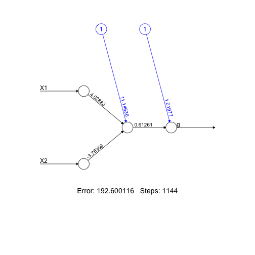
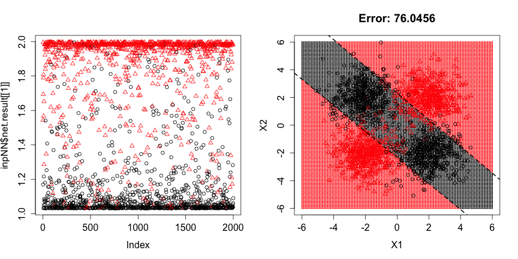
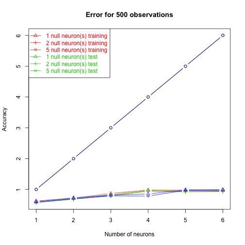

# Preface

The goal of this assignment is to develop some intuition about the impact of the number of nodes in the hidden layer of the neural network.  We will use few simulated examples to have clear understanding of the structure of the data we are modeling and will assess how performance of the neural network model is impacted by the structure in the data and the setup of the network.

First of all, to compensate for lack of coverage on this topic in ISLR, let's go over a couple of simple examples.  We start with simulating a simple two class dataset in 2D predictor space with an outcome representative of an interaction between attributes.


```r
# fix seed so that narrative always matches the plots:
set.seed(1234567890)
nObs <- 1000
ctrPos <- 2
xyTmp <- matrix(rnorm(4*nObs),ncol=2)
xyCtrsTmp <- matrix(sample(c(-1,1)*ctrPos,nObs*4,replace=TRUE),ncol=2)
xyTmp <- xyTmp + xyCtrsTmp
gTmp <- paste0("class",(1+sign(apply(xyCtrsTmp,1,prod)))/2)
plot(xyTmp,col=as.numeric(factor(gTmp)),pch=as.numeric(factor(gTmp)),xlab="X1",ylab="X2")
abline(h=0)
abline(v=0)
```


Symbol color and shape indicate class.  Typical problem that will present a problem for ant approach estimating a single linear decision boundary.  We used similar simulated data for the random forest assignment.

## One hidden node

We can fit simple neural network (using all default values in the call to `neuralnet` -- notice that both covariates and outcome have to be numeric as opposed to factor) and plot its layout (allowing for its output to be included in Rmarkdown generated report actually seems to be quite painful - one has to overwrite original implementation of `plot.nn` with the one that doesn't call `dev.new()` that is included in this Rmarkdown file with `echo=FALSE` -- to do the same you have to include that block into your Rmarkdown file also):


```r
### Doesn't run: "requires numeric/complex ... arguments"
### nnRes <- neuralnet(g~X1+X2,data.frame(g=gTmp,xyTmp))
nnRes <- neuralnet(g~X1+X2,data.frame(g=as.numeric(factor(gTmp)),xyTmp))
plot(nnRes)
```



That shows us model one node in a single hidden layer (default parameters).

We can lookup actual model predictions and recalculate them from input variables (in the field `covariate`) and model weight and activation function (fields `weights` and `act.fct` respectively):


```r
head(nnRes$net.result[[1]])
```

```
##          [,1]
## 1 1.632380797
## 2 1.632380951
## 3 1.632376796
## 4 1.547455068
## 5 1.632380951
## 6 1.632380931
```

```r
cbind(rep(1,6),nnRes$act.fct(cbind(rep(1,6),nnRes$covariate[1:6,])%*%nnRes$weights[[1]][[1]]))%*%nnRes$weights[[1]][[2]]
```

```
##             [,1]
## [1,] 1.632380797
## [2,] 1.632380951
## [3,] 1.632376796
## [4,] 1.547455068
## [5,] 1.632380951
## [6,] 1.632380931
```

Notice that input parameter `linear.output` governs whether activation function is called on the value of the output node or not:


```r
nnResNLO <- neuralnet(g~X1+X2,data.frame(g=as.numeric(factor(gTmp)),xyTmp),linear.output=FALSE)
head(nnResNLO$net.result[[1]])
```

```
##           [,1]
## 1 0.9999903688
## 2 0.9999903531
## 3 0.9999903914
## 4 0.9999904043
## 5 0.9999903216
## 6 0.9999903639
```

```r
nnResNLO$act.fct(cbind(rep(1,6),nnResNLO$act.fct(cbind(rep(1,6),nnResNLO$covariate[1:6,])%*%nnResNLO$weights[[1]][[1]]))%*%nnResNLO$weights[[1]][[2]])
```

```
##              [,1]
## [1,] 0.9999903688
## [2,] 0.9999903531
## [3,] 0.9999903914
## [4,] 0.9999904043
## [5,] 0.9999903216
## [6,] 0.9999903639
```

We can plot model output indicating class identity (left panel below) that tells us that majority of the points were estimated to be close to 1 or 1.6 and that majority of those estimated to be close to 1 correspond to the about half of the observations at the first level of the class factor (i.e. numerical value of 1).  It is also easy to see that those with predicted value of 1.6 represent roughly 1:2 mix of observations from the first and second levels of the outcome respectively, so that $1.6 \approx (1+2*2)/3 = 5/3$ approximately equals average of their numerical values corresponding to the levels of the factor representing them.

The nature of the model estimated by `neuralnet` in this (very simple!) case becomes even more intuitive if we render all points in the area encompassing our training set with model predictions and overlay training dataset on top of that (right panel below).  It is immediately apparent that this model identified a line in this 2D space separating one cloud of points belonging mostly to one class from all others so that predicted values are approximately equal to the average outcome on each side of this decision boundary.


```r
plotNNpreds2D2class <- function(inpNN,inpClassThresh,inpGrid=(-60:60)/10) {
  plot(inpNN$net.result[[1]],col=inpNN$response,pch=inpNN$response)
  table(inpNN$net.result[[1]][,1]>inpClassThresh,inpNN$response)
  xyGridTmp <- cbind(X1=rep(inpGrid,length(inpGrid)),X2=sort(rep(inpGrid,length(inpGrid))))
  gridValsTmp <- compute(inpNN,xyGridTmp)
  plot(xyGridTmp,col=as.numeric(gridValsTmp$net.result>inpClassThresh)+1,pch=20,cex=0.3,main=paste("Error:",signif(sum(inpNN$err.fct(inpNN$response,inpNN$net.result[[1]][,1])),6)))
  points(inpNN$covariate,col=inpNN$response,pch=inpNN$response)
  ## Equations defining decision boundary:
  ## 1*w0 + X1*w1 + X2*w2 = 0, i.e.:
  ## 0 = inpNN$weights[[1]][1]+inpNN$weights[[1]][2]*X1+inpNN$weights[[1]][3]*X2, i.e:
  ## X2 = (-inpNN$weights[[1]][1] - inpNN$weights[[1]][2]*X1) / inpNN$weights[[1]][3]
  for ( iTmp in 1:ncol(inpNN$weights[[1]][[1]]) ) {
    abline(-inpNN$weights[[1]][[1]][1,iTmp] / inpNN$weights[[1]][[1]][3,iTmp], -inpNN$weights[[1]][[1]][2,iTmp] /inpNN$weights[[1]][[1]][3,iTmp],lty=2,lwd=2)
  }
}
old.par <- par(mfrow=c(1,2),ps=16)
plotNNpreds2D2class(nnRes,1.3)
```


```r
par(old.par)
```

The important points resulting from the figure above are the following:

* as simple of a model as the one that was employed here (with one node in a single hidden layer along with all other default parameters) used cannot do much better than what we observed here
* because calling (default - logistic) activation function on a given linear combination of the input variables more or less amounts to assigning almost all points on one side of hyperplane (line in 2D, plane in 3D, etc.) to zero and on the other side -- to unity
* weights involved in transforming outcome of the hidden layer into model predictions will change those zeroes and ones to values closer to the desired outcome values, but still, use if such a simple model (with a single hidden node) employed here to prime our intuition more or amounts to spliting covariate space into two half spaces by a hyperplane and assigning constant outcomes to the vast majority of the points on either side of it
* the weights for the inputs into the single hidden node shown in the network layout plot above and stored in `weights` field of the result returned by `neuralnet` define this hyperplane (line in 2D, etc.) shown as dashes in the right panel above
* this hyperplane is where sum of weighted input variables and a constant is identical zero (and thus the result of logistic activation function is 0.5 rapidly becoming zero or one for points further away from this boundary)

## Two hidden nodes, single hidden layer

Now, let's add another node to the hidden layer of this network.  From the above, we know what to expect as a result of that -- another hyperplane (line in 2D) will be added to the space of covariates now dividing it into (depending on whether those hyperplans are almost parallel or not) three or four subspaces, consequently, assigning most of the points to three or four potentially different constants.  Clearly, this level of granularity could suffice for developing a model that would do quite well in our toy example.

To have more than one node in the hidden layer we set `hidden` parameter to the number of nodes in it (length of vector provided as `hidden` parameter governs the number of the hidden *layers* in the network -- we still use one layer here):


```r
nnRes2 <- neuralnet(g~X1+X2,data.frame(g=as.numeric(factor(gTmp)),xyTmp),hidden=2)
plot(nnRes2)
```


We can see that now resulting network has two nodes in a single hidden layer, which two covariates enter with weights that are approximately comparable in magnitude and opposite in sign.  Their comparably weighted sum added to a constant close to one gives the outcome value of this model. The effect of those weights in defining decision boundaries in the space of predictors is best seen from the figure below:


```r
old.par <- par(mfrow=c(1,2),ps=16)
plotNNpreds2D2class(nnRes2,1.5)
```



```r
par(old.par)
```

This model sets up two almost parallel lines that encompass most of the observations from the first class, leaving most of the observations from the second class outside of the resulting slab.  Now let's repeat fitting neural network three times (each time starting with random choice of starting weights in the model) and compare stability of the resulting models:


```r
old.par <- par(mfcol=c(2,3),ps=16)
for ( iTry in 1:3 ) {
  nnRes2 <- neuralnet(g~X1+X2,data.frame(g=as.numeric(factor(gTmp)),xyTmp),hidden=2)
  plotNNpreds2D2class(nnRes2,1.5)
}
```


```r
par(old.par)
```

We can see that quite frequently given the parameters used the process converges to a suboptimal solution with about half of the observations remaining in "gray" zone where their assignment to either of the classes is not immediately apparent.

Aside from the multitude of local minima for neural network fitting procedure that could prevent it from finding better solutions, the main point to take from this exercise is that adding more nodes to the hidden layer (with all other default choices employed here) amounts to adding more hyperplanes bisecting the space of predictors, creating more and more subspaces where the outcome can take different values (often close to a constant in each subspace).  Obviously, the geometry of the resulting decision surfaces can become quite complicated even with modest number of nodes in the hidden layer. Lastly, these considerations provide some intuition for considering what could be a useful number of hidden nodes in the model. In thinking about that it might be useful to consider how many such hyperplanes could be sufficient to effectively separate observations belonging to different outcome categories.  Not that we necessarily would have such knowledge ahead of time, but this might prove to be a complementary way to think about the problem in addition to the often sited empirical guidelines that are based on the number of predictor variables, etc.

The point of this homework is to assess how these aspects of neural network fitting play out in another simulated dataset.

# Problem 1 (10 points): 3D data with spherical class boundary

Simulate data with n=1000 observations and p=3 covariates -- all random variables from standard normal distribution.  Create two category class variable assigning all observations within a sphere with radius of 1.5 centered at 3D zero to one class category and all others -- to the second.  Since you will be reusing this code in the following two problems it is probably best to turn this procedure into a function with appropriate parameters.  Check that resulting class assignments split these observations very roughly evenly between these two groups.  Plot values of the resulting covariates projected at each pair of the axes indicating classes to which observations belong with symbol color and/or shape (you can use function `pairs`, for example).  What is the smallest number of planes in 3D space that would completely enclose points from the "inner" class?


```r
simulData <- function(nObs, null.vars, A, pairs = FALSE) {
        simul.data <- data.frame(x1 = rnorm(nObs), x2 = rnorm(nObs), x3 = rnorm(nObs))
        if(null.vars != "0") {
                for(i in 1:as.numeric(null.vars)) {
                        simul.data[[paste("null", i, sep = ".")]] <- rnorm(nObs)
                }
        }
        simul.data[["y"]] <- ifelse(apply(simul.data[c("x1", "x2", "x3")], 1, function(x) {sqrt(sum(x^2))}) < 1.5, 1, 0)
        if (pairs == TRUE) {
                pairs(simul.data[,1:3], col = simul.data[["y"]]+1)
        }
        return(simul.data)
}

df <- simulData(nObs = 1000, null.vars = "0", A = 1, pairs = TRUE)
```


```r
## The following should be about 0.5 if the classes are split evenly.
nrow(df[df$y == 1,])/nrow(df)
```

```
## [1] 0.476
```

Four planes would be necessary to enclose a sphere in three-dimensional space.  In n-dimensional space, n+1 hyperplanes are necessary to enclose a hypersphere.


# Problem 2 (20 points): neural network classifier

For the dataset simulated above fit neural networks with 1 through 6 nodes in a single hidden layer (use `neuralnet` implementation).  For each of them calculate training error (see an example in Preface where it was calculated using `err.fct` field in the result returned by `neuralnet`).  Simulate another independent dataset (with n=10,000 observations to make resulting test error estimates less variable) using the same procedure as above (3D, two classes, decision boundary as a sphere of 1.5 radius) and use it to calculate test error at each number of hidden nodes.  Plot training and test errors as function of the number of nodes in the hidden layer.  What does resulting plot tells you about the interplay between model error, model complexity and problem geometry?  What is the geometrical interpretation of this error behavior?


```r
## The following stores data frames for numbers of observations,
## Using a list of lists of data frames since we don't have
## four-dimensional data frames

## A is 1 in problem 2 and 2 in problem 3 because we only run
## The function twice
create.plots <- function(A) {
       # print("Running function")
        if (A == 1) {
                master.list <- vector("list", 1)
                names(master.list) <- "1000"
        } else {
                master.list <- vector("list", 3)
                names(master.list) <- c("100", "200", "500")
        }
       # print(master.list)
        for (nObs in names(master.list)) {
                print("Reached nested loop level 2")
                if (A == 1) {
                        master.list[[nObs]] <- vector("list", 1)
                        names(master.list[[nObs]]) <- "0" 
                } else {
                        master.list[[nObs]] <- vector("list", 3)
                        names(master.list[[nObs]]) <- c("1", "2", "5") 
                }
                for(null.vars in names(master.list[[nObs]])) {
                        master.list[[nObs]][[null.vars]] <- data.frame()
                        training.data <- simulData(nObs, null.vars, A)
                        for(neurons in 1:6) {
                                nn.formula.string <- "y ~ x1 + x2 + x3"
                                if(null.vars != "0") {
                                        nn.formula.string <- paste(nn.formula.string, paste("+ null.", as.numeric(null.vars), sep = "", collapse = " + "))
                                }
                           #     print(nn.formula.string)
                                nnRes <- neuralnet(nn.formula.string, training.data, hidden = neurons, linear = FALSE, threshold = 0.2)
                                if (is.null(nnRes$weights[[1]])) {next}
                                
                                SSE <- signif(sum(nnRes$err.fct(nnRes$response[,1], nnRes$net.result[[1]][,1])), 6)
                                print(paste("The SSE for ", nObs, " observations, ", null.vars, " null variables, and ", neurons, " neuron(s) is", SSE, ".", sep = ""))
                                
                                training.covariates <- NULL
                                if(null.vars != "0") {
                                        training.covariates <- paste("null.", (null.vars), sep = "")}
                              #  print(training.covariates)
                               # print(head(compute(nnRes, training.data[c("x1", "x2", "x3", training.covariates)])$net.result))
                                
                                
                                
                                training.results <- round(compute(nnRes, training.data[c("x1", "x2", "x3", training.covariates)])$net.result)
                                training.accuracy <- sum(diag(table(training.data$y, training.results)))/length(training.data$y)
                                test.data <- simulData(10000, null.vars, A)
                                test.results <- round(compute(nnRes, test.data[c("x1", "x2", "x3", training.covariates)])$net.result)
                                test.accuracy <- sum(diag(table(test.data$y, test.results)))/length(test.data$y)
                                master.list[[nObs]][[null.vars]] <- rbind(master.list[[nObs]][[null.vars]], data.frame(number.of.hidden.neurons = neurons, training.accuracy = training.accuracy, test.accuracy = test.accuracy))
                        }
                }
                
                ##This might hvae to be changed since the introduction of next
                #print(do.call(function(x) {subset(x, select = c("training.accuracy", "test.accuracy"))}, master.list[[nObs]]))
                matplot(1:6, do.call(cbind, master.list[[nObs]]), pch = 1:length(master.list[[nObs]][[null.vars]]), col = rep(1:length(master.list[[nObs]]), each = length(master.list[[nObs]][[null.vars]])) + 1, lty = 1, type = "b", xlab = "Number of neurons", ylab = "Accuracy", main = paste("Error for", nObs, "observations", sep = " "))
                legend("topleft", paste(paste(names(master.list[[nObs]]), "null neuron(s)", sep = " "), paste(rep(c("training", "test"), each = length(master.list[[nObs]][[null.vars]])))), col = rep(1:length(master.list[[nObs]]) + 1, each = length(master.list[[nObs]][[null.vars]])), text.col = rep(1:length(master.list[[nObs]]) + 1, each = length(master.list[[nObs]][[null.vars]])), pch = 1:length(master.list[[nObs]]) + 1, lty=1)
        }
}
###
create.plots(A = 1)
```

```
## [1] "Reached nested loop level 2"
## [1] "The SSE for 1000 observations, 0 null variables, and 1 neuron(s) is110.388."
## [1] "The SSE for 1000 observations, 0 null variables, and 2 neuron(s) is91.6574."
## [1] "The SSE for 1000 observations, 0 null variables, and 3 neuron(s) is54.6344."
## [1] "The SSE for 1000 observations, 0 null variables, and 4 neuron(s) is8.84633."
## [1] "The SSE for 1000 observations, 0 null variables, and 5 neuron(s) is3.64915."
## [1] "The SSE for 1000 observations, 0 null variables, and 6 neuron(s) is3.92471."
```


This plot indicates that as more hidden neurons are used in the first layer, both training and test accuracy increase (and error decreases).  However, the models with three and four hidden neurons have similar accuracy, and the models with five and six also have similar accuracy.  This may possibly indicate that the fourth and fifth neuron have a synergistic relationship, so that the fourth neuron does not increase accuracy alone but the fifth one does.  Five neurons appears to be enough to completely fit the training data, so it is no surprise that a sixth has little to add.

# Problem 3 (30 points): evaluate impacts of sample size and noise

Setup a simulation repeating procedure described above for n=100, 200 and 500 observations in the *training* set as well adding none, 1, 2 and 5 null variables to the training and test data (and to the covariates in formula provided to `neuralnet`).  Draw values for null variables from standard normal distribution as well and do not use them in the assignment of the observations to the class category (e.g. `x<-matrix(rnorm(600),ncol=6); cl<-as.numeric(factor(sqrt(rowSums(x[,1:3]^2))<1.5))` creates dataset with three informative and three null variables). Repeat calculation of training and test errors at least several times for each combination of sample size, number of null variables and size of the hidden layer simulating new training and test dataset every time to assess variability in those estimates.  Present resulting error rates so that the effects of sample size and fraction of null variables can be discerned and discuss their impact of the resulting model fits.


```r
create.plots(A = 2)
```

```
## [1] "Reached nested loop level 2"
## [1] "The SSE for 100 observations, 1 null variables, and 1 neuron(s) is10.2595."
## [1] "The SSE for 100 observations, 1 null variables, and 2 neuron(s) is10.5196."
## [1] "The SSE for 100 observations, 1 null variables, and 3 neuron(s) is4.94911."
## [1] "The SSE for 100 observations, 1 null variables, and 4 neuron(s) is3.35709."
## [1] "The SSE for 100 observations, 1 null variables, and 5 neuron(s) is3.66734."
## [1] "The SSE for 100 observations, 1 null variables, and 6 neuron(s) is3.68062."
## [1] "The SSE for 100 observations, 2 null variables, and 1 neuron(s) is12.6033."
## [1] "The SSE for 100 observations, 2 null variables, and 2 neuron(s) is7.24558."
## [1] "The SSE for 100 observations, 2 null variables, and 3 neuron(s) is12.4428."
## [1] "The SSE for 100 observations, 2 null variables, and 4 neuron(s) is3.3003."
## [1] "The SSE for 100 observations, 2 null variables, and 5 neuron(s) is1.60084."
## [1] "The SSE for 100 observations, 2 null variables, and 6 neuron(s) is1.52258."
## [1] "The SSE for 100 observations, 5 null variables, and 1 neuron(s) is11.8214."
## [1] "The SSE for 100 observations, 5 null variables, and 2 neuron(s) is8.62298."
## [1] "The SSE for 100 observations, 5 null variables, and 3 neuron(s) is11.5916."
## [1] "The SSE for 100 observations, 5 null variables, and 4 neuron(s) is6.72698."
## [1] "The SSE for 100 observations, 5 null variables, and 5 neuron(s) is4.68061."
## [1] "The SSE for 100 observations, 5 null variables, and 6 neuron(s) is2.92533."
```


```
## [1] "Reached nested loop level 2"
## [1] "The SSE for 200 observations, 1 null variables, and 1 neuron(s) is21.5005."
## [1] "The SSE for 200 observations, 1 null variables, and 2 neuron(s) is18.2298."
## [1] "The SSE for 200 observations, 1 null variables, and 3 neuron(s) is9.92938."
## [1] "The SSE for 200 observations, 1 null variables, and 4 neuron(s) is4.19357."
## [1] "The SSE for 200 observations, 1 null variables, and 5 neuron(s) is4.41245."
## [1] "The SSE for 200 observations, 1 null variables, and 6 neuron(s) is2.89491."
## [1] "The SSE for 200 observations, 2 null variables, and 1 neuron(s) is20.8722."
## [1] "The SSE for 200 observations, 2 null variables, and 2 neuron(s) is23.0651."
## [1] "The SSE for 200 observations, 2 null variables, and 3 neuron(s) is12.6569."
## [1] "The SSE for 200 observations, 2 null variables, and 4 neuron(s) is10.0413."
## [1] "The SSE for 200 observations, 2 null variables, and 5 neuron(s) is2.69124."
## [1] "The SSE for 200 observations, 2 null variables, and 6 neuron(s) is4.02902."
## [1] "The SSE for 200 observations, 5 null variables, and 1 neuron(s) is21.1419."
## [1] "The SSE for 200 observations, 5 null variables, and 2 neuron(s) is15.487."
## [1] "The SSE for 200 observations, 5 null variables, and 3 neuron(s) is7.75798."
## [1] "The SSE for 200 observations, 5 null variables, and 4 neuron(s) is6.80413."
## [1] "The SSE for 200 observations, 5 null variables, and 5 neuron(s) is5.96506."
## [1] "The SSE for 200 observations, 5 null variables, and 6 neuron(s) is4.38533."
```


```
## [1] "Reached nested loop level 2"
## [1] "The SSE for 500 observations, 1 null variables, and 1 neuron(s) is55.2371."
## [1] "The SSE for 500 observations, 1 null variables, and 2 neuron(s) is45.7682."
## [1] "The SSE for 500 observations, 1 null variables, and 3 neuron(s) is25.9744."
## [1] "The SSE for 500 observations, 1 null variables, and 4 neuron(s) is5.30227."
## [1] "The SSE for 500 observations, 1 null variables, and 5 neuron(s) is6.77028."
## [1] "The SSE for 500 observations, 1 null variables, and 6 neuron(s) is4.48331."
## [1] "The SSE for 500 observations, 2 null variables, and 1 neuron(s) is55.4473."
## [1] "The SSE for 500 observations, 2 null variables, and 2 neuron(s) is47.3866."
## [1] "The SSE for 500 observations, 2 null variables, and 3 neuron(s) is31.2214."
## [1] "The SSE for 500 observations, 2 null variables, and 4 neuron(s) is7.07755."
## [1] "The SSE for 500 observations, 2 null variables, and 5 neuron(s) is11.3563."
## [1] "The SSE for 500 observations, 2 null variables, and 6 neuron(s) is7.57226."
## [1] "The SSE for 500 observations, 5 null variables, and 1 neuron(s) is55.7151."
## [1] "The SSE for 500 observations, 5 null variables, and 2 neuron(s) is45.3889."
## [1] "The SSE for 500 observations, 5 null variables, and 3 neuron(s) is34.2405."
## [1] "The SSE for 500 observations, 5 null variables, and 4 neuron(s) is29.0607."
## [1] "The SSE for 500 observations, 5 null variables, and 5 neuron(s) is4.36561."
## [1] "The SSE for 500 observations, 5 null variables, and 6 neuron(s) is2.19305."
```




# Extra 20 points problem: model banknote authentication data

Use `neuralnet` to model the outcome in banknote authentication dataset that we used in previous assignments and compare its test error at several sizes of hidden layer to that observed for SVM and KNN approaches.
