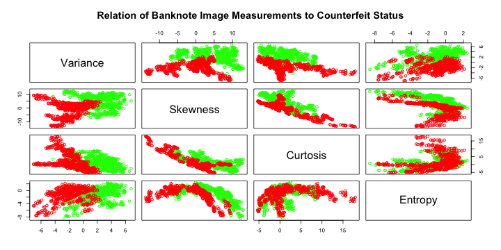
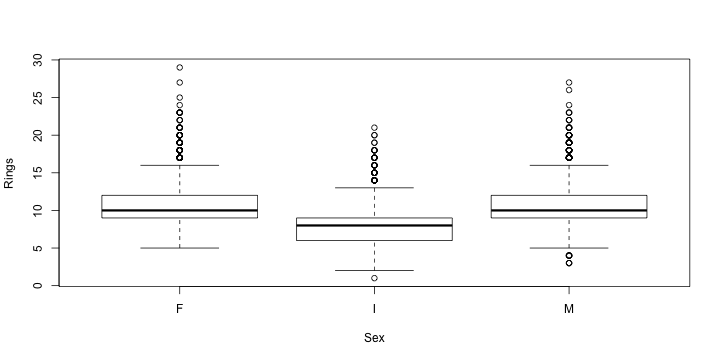

# Preface

One of the first steps in the analysis of a new dataset, often as part of data cleaning, typically involves generation of high level summaries, such as: how many observations, attributes, which ones are predictors and which ones are (could be?) outcomes, what are their ranges, distributions, percentages of missing values, how strongly correlated are the predictors among themselves and with the outcome(s), etc.  It is usually at this stage when we develop our initial intuition about the level of difficulty of the problem and of the challenges presented by this particular dataset and therefore form our first set of ideas as to how to approach it.  There are many multivariate methods under unsupervised learning umbrella that are extremely useful in this setting (that will be introduced later in the course), but first things first, and here we will start by loading few datasets into R and exploring their attributes in the form of univariate summaries and bivariate plots and contingency tables (where applicable).

For this assignment we will use several datasets available from [UCI machine learning repository](http://archive.ics.uci.edu/ml/datasets.html) that for convenience and as to not to depend on UCI ML repository availability have been also copied into this course website. Once you have downloaded them onto your computer, they can be loaded into R using function `read.table` with necessary options (of which most useful/relevant include: `sep` -- defining field separator and `header` -- instructing `read.table` to use fields in the first line as column headers). In principle, `read.table` can also use URL as a full path to the dataset, but here, to be able to work independently of network connection, we recommend that you download those datasets locally and provide `read.table` with appropriate paths to their local copies.  The simplest thing is probably to copy them to the same directory where your .Rmd file is, in which case just the file name passed to `read.table` should suffice.  As always, please remember, that `help(read.table)` (or, `?read.table` as a shorthand) will tell you quite a bit about this function and its parameters.

For those datasets that do not have column names included in their data files, it is often convenient to assign them explicitly. Please note that for some of these datasets categorical variables are encoded in the form of integer values, that by default R will interpret as continuous variables while the behavior of many R functions depends on the type of the input variables.

The code excerpts and their output presented below illustrate some of these most basic steps as applied to one of the datasets available from UCI. The homework problems follow after that -- they will require you to apply similar kind of approaches to generate high levels summaries of few other UCI datasets.


```r
habDat <- read.table("haberman.data",sep=",")
colnames(habDat) <- c("age","year","nodes","surv")
summary(habDat$surv)
```

```
##    Min. 1st Qu.  Median    Mean 3rd Qu.    Max. 
##   1.000   1.000   1.000   1.265   2.000   2.000
```

```r
habDat$surv <- c("yes","no")[habDat$surv]
summary(habDat$surv)
```

```
##    Length     Class      Mode 
##       306 character character
```

```r
habDat$surv <- factor(habDat$surv)
summary(habDat$surv)
```

```
##  no yes 
##  81 225
```

The following two examples below show generation of xy-scatterplots of age and node count for the patients in this dataset with color indicating their survival past 5 years using basic plotting capabilities in R as well as those provided by the package `ggplot2`.


```r
oldPar <- par(mfrow=c(1:2),ps=16)
for ( iSurv in sort(unique(habDat$surv)) ) {
    plot(habDat[,c("age","nodes")],type="n",
        main=paste("Survival:",iSurv))
    iTmp <- (1:length(levels(habDat$surv)))[levels(habDat$surv)==iSurv]
    points(habDat[habDat$surv==iSurv,c("age","nodes")],col=iTmp,pch=iTmp)
}
```


```r
par(oldPar)
```


```r
ggplot(habDat,aes(x=age,y=nodes,colour=surv,shape=surv)) + 
geom_point() + facet_wrap(~surv)
```


It seems that higher number of nodes might be associated with lower probability of survival. One attempt to quantify this relationship might involve testing relationship between indicators of survival and count of nodes exceeding arbitrarily chosen cutoffs (zero or 75th percentile in the example below). There is also substantial degree of overplotting due to integer values of node count and year that might, for instance, make it less apparent that not all patients with zero nodes survive if all of them were plotted in the same panel.  


```r
habDat$nodes0 <- habDat$nodes==0
table(habDat[, c("surv","nodes0")])
```

```
##      nodes0
## surv  FALSE TRUE
##   no     62   19
##   yes   108  117
```

```r
habDat$nodes75 <- habDat$nodes>=quantile(habDat$nodes,probs=0.75)
table(habDat[, c("surv","nodes75")])
```

```
##      nodes75
## surv  FALSE TRUE
##   no     39   42
##   yes   178   47
```

Please feel free to model your solutions after the examples shown above, while exercising necessary judgement as to which attributes are best represented as continuous and which ones -- as categorical, etc.  The descriptions of homework problems provide some guidance as to what is expected, but leave some of those choices up to you. Making such calls is an integral part of any data analysis project and we will be working on advancing this skill throughout
this course.

**Lastly -- do ask questions!  Piazza is the best for that**

# Banknote authentication (30 points)

This dataset presents an example of classification problem (authentic vs. counterfeit bank notes) using continuous predictors derived from image processing. More details about underlying data can be found in corresponding [dataset description](http://archive.ics.uci.edu/ml/datasets/banknote+authentication) at UCI ML website. To load data into R please use data file `data_banknote_authentication.txt` available at the course website as well as in UCI ML dataset repository.

Once the dataset in loaded into R, please name appropriately data set attributes, determine number of variables (explain which ones are predictors and which one is outcome) and observations in the dataset (R functions such as `dim`, `nrow`, `ncol` could be useful for this), generate summary of the data using `summary` function in R and generate pairwise XY-scatterplots of each pair of continuous predictors indicating outcome using colour and/or shape of the symbols (you may find it convenient to use `pairs` plotting function). Describe your observations and discuss which of the variables are more likely to be informative with respect to discriminating forged bank notes from genuine.

Please comment on whether given the data at hand such problem appears to be an easy or hard one to solve.  Try to guess using your best intuition, what could be an error in discriminating forged banknotes from genuine  in this dataset: 50%, 20%, 10%, 5%, 2%, less than that?  Later in the course we will work with this dataset again to actually develop such a classifier at which point you will get quantitative answer to this question, but for now, just from visual inspection of the scatterplots above, what do you think such an error could be?  There is no wrong answer at this point, just try your best and make a note of it, so you can go back to it several weeks later.  Also, please discuss some of the tradeoffs that might be associated with that. For instance, should one expect the cost of calling genuine note counterfeit to be the same as making the opposite call (allowing fake bills as authentic).  Consider also anticipated frequency of these cases in the practical settings and how it could potentially interact with these costs.


```r
banknote.data <- read.table("data_banknote_authentication.txt", sep = ",")
names(banknote.data) <- c("Variance", "Skewness", "Curtosis", "Entropy", "Counterfeit")
paste("The number of variables is", ncol(banknote.data))
```

```
## [1] "The number of variables is 5"
```

```r
## The outcome is Counterfeit and the other four variables are predictors.
paste("The number of observations is", nrow(banknote.data))
```

```
## [1] "The number of observations is 1372"
```

```r
summary(banknote.data)
```

```
##     Variance          Skewness          Curtosis          Entropy       
##  Min.   :-7.0421   Min.   :-13.773   Min.   :-5.2861   Min.   :-8.5482  
##  1st Qu.:-1.7730   1st Qu.: -1.708   1st Qu.:-1.5750   1st Qu.:-2.4135  
##  Median : 0.4962   Median :  2.320   Median : 0.6166   Median :-0.5867  
##  Mean   : 0.4337   Mean   :  1.922   Mean   : 1.3976   Mean   :-1.1917  
##  3rd Qu.: 2.8215   3rd Qu.:  6.815   3rd Qu.: 3.1793   3rd Qu.: 0.3948  
##  Max.   : 6.8248   Max.   : 12.952   Max.   :17.9274   Max.   : 2.4495  
##   Counterfeit    
##  Min.   :0.0000  
##  1st Qu.:0.0000  
##  Median :0.0000  
##  Mean   :0.4446  
##  3rd Qu.:1.0000  
##  Max.   :1.0000
```

```r
pairs(banknote.data[1:4], names(banknote.data)[1:4], col = c("green", "red")[banknote.data$Counterfeit + 1], main = "Relation of Banknote Image Measurements to Counterfeit Status")
```



In the above pairwise plots, green indicates an ordinary banknote.  Red indicates a counterfeit banknote.  As can be seen from the pairwise plots, variance and skewness seem to be related to whether or not a banknote is counterfeit, whereas curtosis and entropy are not.  All pairwise plots containing either variance or skewness show a separation between the samples of ordinary and counterfeit banknotes, whereas the plots containing only the other two variables show no separation.

Variance and skewness seem to be mostly reliable for differentiating ordinary and counterfeit banknotes.  But the problem is difficult to completely solve because the samples have overlap, and for observations with values that correspond to the overlap may be ambiguous.  The error appears to be 5%.  There is a trade off between accuracy and the importance of identifying counterfeit banknotes.  On one hand, it is important to avoid fraudulent or improper transactions.  Errors in such action could result in punishment for using counterfeit banknotes or the needless disposal of ordinary banknotes.  If I were using a statistical model to determine whether my own banknotes were counterfeit, I would err on the side that they were because the consequences of disposal of ordinary money are only the value of the money, whereas the punishment related to using counterfeit money could be much greater.  However, if it were someone else's money that they were going to use in some way detrimental to me, I would err toward identifying it as real so that I would be prepared for the worst.

# Abalone age (30 points)

This dataset presents an example of a regression problem -- predicting mollusc age from measurements that are easier to obtain. More details about underlying data can be found in corresponding [dataset description](http://archive.ics.uci.edu/ml/datasets/Abalone). To load data into R please use file `abalone.data` available at the course website as well as at the UCI ML data repository.

Once the dataset in loaded into R, please name appropriately data set attributes, determine number of variables (explain which ones are predictors -- categorical vs. continuous -- and which one is the outcome) and observations in the dataset (R functions such as `dim`, `nrow`, `ncol` could be useful for this), generate summary of the data using `summary` function in R and generate pairwise XY-scatterplots of each pair of *continuous* attributes.

Describe your observations and discuss which attributes might be more useful for predicting snail age.


```r
abalone.data <- read.table("abalone.data", sep = ",")
names(abalone.data) <- c("Sex","Length","Diameter","Height","Whole weight","Shucked weight", "Viscera weight","Shell weight","Rings")
head(abalone.data)
```

```
##   Sex Length Diameter Height Whole weight Shucked weight Viscera weight
## 1   M  0.455    0.365  0.095       0.5140         0.2245         0.1010
## 2   M  0.350    0.265  0.090       0.2255         0.0995         0.0485
## 3   F  0.530    0.420  0.135       0.6770         0.2565         0.1415
## 4   M  0.440    0.365  0.125       0.5160         0.2155         0.1140
## 5   I  0.330    0.255  0.080       0.2050         0.0895         0.0395
## 6   I  0.425    0.300  0.095       0.3515         0.1410         0.0775
##   Shell weight Rings
## 1        0.150    15
## 2        0.070     7
## 3        0.210     9
## 4        0.155    10
## 5        0.055     7
## 6        0.120     8
```

```r
paste("The number of variables is", ncol(abalone.data))
```

```
## [1] "The number of variables is 9"
```

```r
## The outcome is Rings and the other eight variables are predictors. Sex is categorical and the other predictors are continuous.
paste("The number of observations is", nrow(abalone.data))
```

```
## [1] "The number of observations is 4177"
```

```r
summary(abalone.data)
```

```
##  Sex          Length         Diameter          Height      
##  F:1307   Min.   :0.075   Min.   :0.0550   Min.   :0.0000  
##  I:1342   1st Qu.:0.450   1st Qu.:0.3500   1st Qu.:0.1150  
##  M:1528   Median :0.545   Median :0.4250   Median :0.1400  
##           Mean   :0.524   Mean   :0.4079   Mean   :0.1395  
##           3rd Qu.:0.615   3rd Qu.:0.4800   3rd Qu.:0.1650  
##           Max.   :0.815   Max.   :0.6500   Max.   :1.1300  
##   Whole weight    Shucked weight   Viscera weight    Shell weight   
##  Min.   :0.0020   Min.   :0.0010   Min.   :0.0005   Min.   :0.0015  
##  1st Qu.:0.4415   1st Qu.:0.1860   1st Qu.:0.0935   1st Qu.:0.1300  
##  Median :0.7995   Median :0.3360   Median :0.1710   Median :0.2340  
##  Mean   :0.8287   Mean   :0.3594   Mean   :0.1806   Mean   :0.2388  
##  3rd Qu.:1.1530   3rd Qu.:0.5020   3rd Qu.:0.2530   3rd Qu.:0.3290  
##  Max.   :2.8255   Max.   :1.4880   Max.   :0.7600   Max.   :1.0050  
##      Rings       
##  Min.   : 1.000  
##  1st Qu.: 8.000  
##  Median : 9.000  
##  Mean   : 9.934  
##  3rd Qu.:11.000  
##  Max.   :29.000
```

```r
for(predictor in names(abalone.data)[!(names(abalone.data) %in% "Rings")]) {
        plot(abalone.data[[predictor]], abalone.data$Rings, xlab = predictor, ylab = "Rings")
}
```



Height and sex seem to be the best predictors of age as determined by number of rings, with a taller specimen likely to be older and a male or female specimen likely to be older than a specimen with gender "I."  The other variables are somewhat related but much poorer predictors.

For **extra 5 points** for some of the continuous and
categorical predictors generate boxplots rendering relationship between them.
