# Preface

The goal of this week assignment is to practice basic tools available in R for developing linear regression models with one or more variables, conduct visual and quantitative evaluation of their relative performance and reason about associated tradeoffs.  We will continue working with abalone dataset (that you have already downloaded and used for the previous week assignment) and will use some of the variables available there to develop model of snail age.  Given the simplicity of the measurements available in this dataset (essentially just dimensions and masses of various compartments of the mollusc) and potential variability in growth rates due to differences in environmental conditions (e.g. location, temperature, nutrients, etc.) that are not captured in this dataset, we should expect substantial fraction of variability in abalone age to remain unexplained as part of this exercise.  Furthermore, given strong correlations between some of the predictors in this dataset it is possible that only a small number of those could be justifiably used in the model (for the reasons related to collinearity - see Ch.3.3.3 section 6 of ISLR).


Here an uninspiring example of the model of shell length and diameter is used to illustrate R tools that will be needed for this assignment. Please note that by this time `abaDat` dataset has been already created and corresponding columns have been named `len` and `diam` respectively -- the variables names in your code likely will be different.  Then a simple linear model can be fit using function `lm()` and summarized using `summary`:


```r
summary(lm(len~diam,abaDat))
```

```
## 
## Call:
## lm(formula = len ~ diam, data = abaDat)
## 
## Residuals:
##       Min        1Q    Median        3Q       Max 
## -0.299726 -0.010843  0.000032  0.010515  0.137215 
## 
## Coefficients:
##             Estimate Std. Error t value Pr(>|t|)    
## (Intercept) 0.036913   0.001273   29.01   <2e-16 ***
## diam        1.194168   0.003032  393.90   <2e-16 ***
## ---
## Signif. codes:  0 '***' 0.001 '**' 0.01 '*' 0.05 '.' 0.1 ' ' 1
## 
## Residual standard error: 0.01944 on 4175 degrees of freedom
## Multiple R-squared:  0.9738,	Adjusted R-squared:  0.9738 
## F-statistic: 1.552e+05 on 1 and 4175 DF,  p-value: < 2.2e-16
```

The plot of predictor and response with regression line added to it can be generated using standard R functions `plot` and `abline`:


```r
plot(abaDat[,c("diam","len")])
abline(lm(len~diam,abaDat))
```

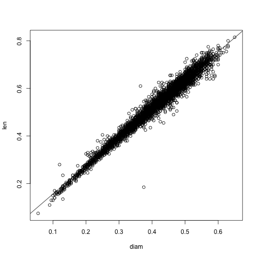

Diagnostic plots for this model can be obtained also by the call to `plot` with `lm()` result as input:


```r
old.par <- par(mfrow=c(2,2))
plot(lm(len~diam,abaDat))
```

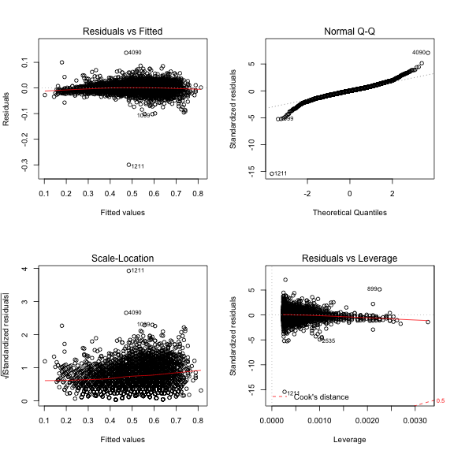

```r
par(old.par)
```

R functions `confint` returns confidence intervals for model parameters and `predict` (with appropriate parameters) returns model predictions for the new data and corresponding estimates of uncertainty associated with them:


```r
confint(lm(len~diam,abaDat))
```

```
##                  2.5 %     97.5 %
## (Intercept) 0.03441834 0.03940834
## diam        1.18822442 1.20011168
```

```r
predict(lm(len~diam,abaDat),newdata=data.frame(diam=c(0.2,0.3,0.4,0.5)),interval='confidence')
```

```
##         fit       lwr       upr
## 1 0.2757469 0.2743778 0.2771161
## 2 0.3951638 0.3942926 0.3960349
## 3 0.5145806 0.5139889 0.5151722
## 4 0.6339974 0.6331926 0.6348021
```

```r
predict(lm(len~diam,abaDat),newdata=data.frame(diam=c(0.2,0.3,0.4,0.5)),interval='prediction')
```

```
##         fit       lwr       upr
## 1 0.2757469 0.2376054 0.3138885
## 2 0.3951638 0.3570369 0.4332906
## 3 0.5145806 0.4764590 0.5527021
## 4 0.6339974 0.5958719 0.6721228
```

# Problem 1: model of age and shell weight (30 points)

Here we will identify variable most correlated with the outcome (abalone age), build simple linear model of snail age (rings+1.5 as per dataset description) as function of this variable, evaluate model summary and diagnostic plots and assess impact of using log-transformed (instead of untransformed) attributes on the model peformance.  The following steps provide approximate outline of tasks for achieving these goals:

1. Calculate correlations between all *continuous* attributes in this dataset.  Given potential non-linear relationship between some of the attributes and snail age, it might be prudent to use both Pearson and Spearman correlations to determine which variable is most robustly correlated with age.


```r
## Pearson correlation
cor(abaDat[sapply(abaDat, class) == "numeric"], method = "pearson")
```

```
##            len      diam         h        ww        sw        vw        sh
## len  1.0000000 0.9868116 0.8275536 0.9252612 0.8979137 0.9030177 0.8977056
## diam 0.9868116 1.0000000 0.8336837 0.9254521 0.8931625 0.8997244 0.9053298
## h    0.8275536 0.8336837 1.0000000 0.8192208 0.7749723 0.7983193 0.8173380
## ww   0.9252612 0.9254521 0.8192208 1.0000000 0.9694055 0.9663751 0.9553554
## sw   0.8979137 0.8931625 0.7749723 0.9694055 1.0000000 0.9319613 0.8826171
## vw   0.9030177 0.8997244 0.7983193 0.9663751 0.9319613 1.0000000 0.9076563
## sh   0.8977056 0.9053298 0.8173380 0.9553554 0.8826171 0.9076563 1.0000000
## age  0.5567196 0.5746599 0.5574673 0.5403897 0.4208837 0.5038192 0.6275740
##            age
## len  0.5567196
## diam 0.5746599
## h    0.5574673
## ww   0.5403897
## sw   0.4208837
## vw   0.5038192
## sh   0.6275740
## age  1.0000000
```

```r
## Spearman correlation
cor(abaDat[sapply(abaDat, class) == "numeric"], method = "spearman")
```

```
##            len      diam         h        ww        sw        vw        sh
## len  1.0000000 0.9833190 0.8882060 0.9726329 0.9568303 0.9526577 0.9479264
## diam 0.9833190 1.0000000 0.8957053 0.9713244 0.9504722 0.9483906 0.9541488
## h    0.8882060 0.8957053 1.0000000 0.9159848 0.8741960 0.9005869 0.9212243
## ww   0.9726329 0.9713244 0.9159848 1.0000000 0.9770596 0.9752517 0.9694259
## sw   0.9568303 0.9504722 0.8741960 0.9770596 1.0000000 0.9476354 0.9177305
## vw   0.9526577 0.9483906 0.9005869 0.9752517 0.9476354 1.0000000 0.9381434
## sh   0.9479264 0.9541488 0.9212243 0.9694259 0.9177305 0.9381434 1.0000000
## age  0.6043853 0.6228950 0.6577164 0.6308320 0.5394200 0.6143438 0.6924746
##            age
## len  0.6043853
## diam 0.6228950
## h    0.6577164
## ww   0.6308320
## sw   0.5394200
## vw   0.6143438
## sh   0.6924746
## age  1.0000000
```
The variable sh (shell weight) seems to be the most correlated with age using both Pearson and Spearman correlations.

2. Fit linear model of age as outcome and shell weight as predictor using R function `lm`, display the result using `summary` function, use its output to answer the following questions:

   + Does this predictor explain significant amount of variability in response?  I.e. is there significant association between them?
   
   + What is the RSE and $R^2$ of this model?  Remember, you can find them in the `summary` output or use `sigma` and `r.sq` slots in the result returned by `summary` instead
   
   + What are the model coefficients and what would be their interpretation? What is the meaning of the intercept of the model, for example?  How sensible is it?


```r
aba.lm <- lm(age ~ sh, abaDat)
summary(aba.lm)
```

```
## 
## Call:
## lm(formula = age ~ sh, data = abaDat)
## 
## Residuals:
##     Min      1Q  Median      3Q     Max 
## -5.9830 -1.6005 -0.5843  0.9390 15.6334 
## 
## Coefficients:
##             Estimate Std. Error t value Pr(>|t|)    
## (Intercept)  7.96212    0.07715  103.21   <2e-16 ***
## sh          14.53568    0.27908   52.08   <2e-16 ***
## ---
## Signif. codes:  0 '***' 0.001 '**' 0.01 '*' 0.05 '.' 0.1 ' ' 1
## 
## Residual standard error: 2.51 on 4175 degrees of freedom
## Multiple R-squared:  0.3938,	Adjusted R-squared:  0.3937 
## F-statistic:  2713 on 1 and 4175 DF,  p-value: < 2.2e-16
```

   + A significant amount of the variablility in age is explained by shell weight.

   + The RSE is 2.51 on 4175 degrees of freedom, and the $R^2$ is 0.3938.

   + β0 is 7.96212, and β1 is 14.53568.  The meaning of the intercept, β0, is the model's prediction of the age of a shell weighing nothing and the meaning of β1 is the increase in age predicted for a unit increase in shell weight.  The intercept is meaningless and not sensible because an abalone cannot be of weight 0.

3. Create scatterplot of age and shell weight and add regression line from the model to the plot using `abline` function


```r
plot(abaDat$sh, abaDat$age, xlab = "Shell Weight", ylab = "Age")
abline(aba.lm, col = "red")
```

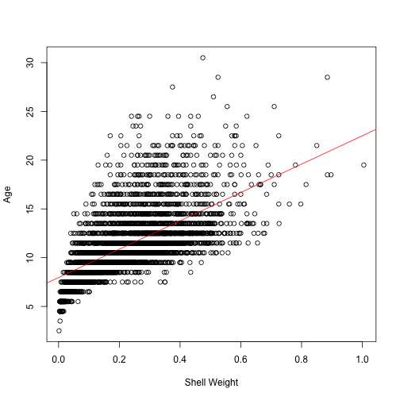

4. Create diagnostic plots of the model and comment on any irregularities that they present.  For instance, does plot of residuals vs. fitted values suggest presence of non-linearity that remained unexplained by the model?  How does it compare to the plot of the predictor and outcome with regression line added to it that was generated above?


```r
plot(aba.lm)
```

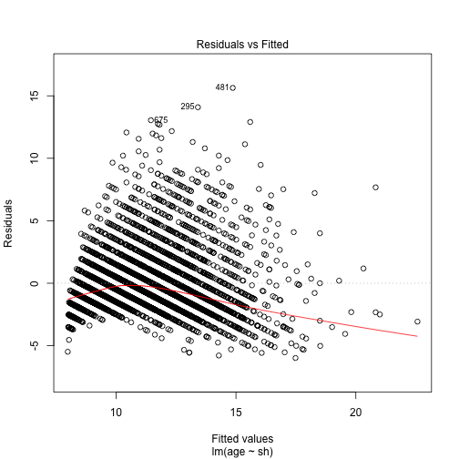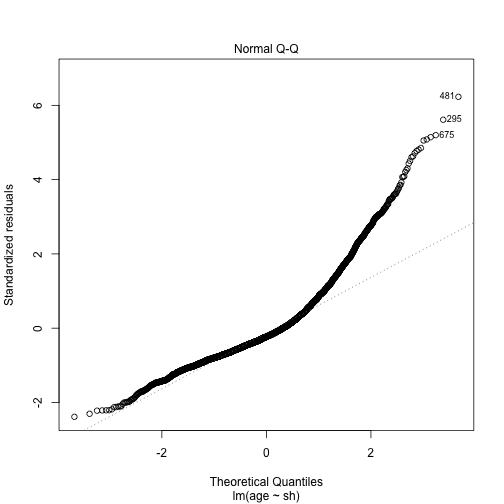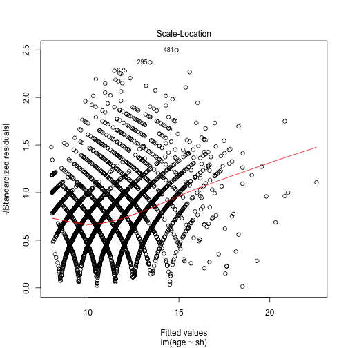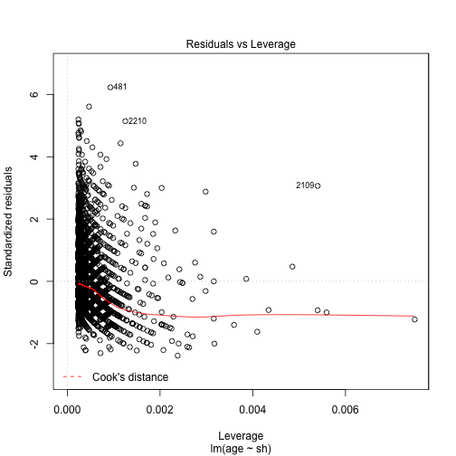

The residuals vs. fitted values seem to suggest both non-linearity, as demonstrateged by the inconsistent residuals, and changing variance, as shown by increasing residuals on the right.

5. Use function `confint` to obtain confidence intervals on model parameters


```r
confint(aba.lm)
```

```
##                 2.5 %    97.5 %
## (Intercept)  7.810869  8.113365
## sh          13.988525 15.082825
```

6. Use this model and `predict` function to make predictions for shell weight values of 0.1, 0.2 and 0.3. Use `confidence` and `prediction` settings for parameter `interval` in the call to `predict` to obtain confidence and prediction intervals on these model predictions.  Explain the differences between interpretation of:
    + confidence intervals on model parameters and model predictions
    + confidence and prediction intervals on model predictions
    + Comment on whether confidence or predicion intervals (on predictions) are wider and why


```r
predict(aba.lm, newdata = data.frame(sh = c(0.1, 0.2, 0.3)), interval = "confidence")
```

```
##         fit       lwr       upr
## 1  9.415684  9.308121  9.523247
## 2 10.869252 10.790188 10.948315
## 3 12.322819 12.239634 12.406005
```

```r
predict(aba.lm, newdata = data.frame(sh = c(0.1, 0.2, 0.3)), interval = "prediction")
```

```
##         fit      lwr      upr
## 1  9.415684 4.492593 14.33878
## 2 10.869252 5.946701 15.79180
## 3 12.322819 7.400201 17.24544
```
   + Confidence intervals on model paramaters and model predictions correspond to different entities. Confidence intervals on model paramters relate to how well we can fit our model to the given data in terms of the model, and confidence intervals on model predictions relate to how well we can fit our model to the given data in terms of the data itself.
   + Confidence intervals and prediction intervals on model predictions predict two different things. The confidence interval gives a range for the expected value of the data based on the predictor variable and the true relationship between it and the data. The prediction interval gives a range for any particular datum given the predictor variable, regardless of their relationship.
   + The prediction intervals must be wider because the error of the data they express accounts for both the error in the model and the error not explained in the model, whereas the confidence intervals only account for the error in the model.

# Problem 2: model using log-transformed attributes (20 points)

1. Use `lm()` to fit a regression model of *log-transformed* age as linear function of *log-transformed* shell weight and use `summary` to evaluate its results.  Can we compare fits obtained from using untransformed (above) and log-transformed attributes?  Can we directly compare RSE from these two models?  What about comparing $R^2$?  What would we conclude from this? (Please consult ISLR Ch.3.1.3 if unsure)  What would be the physical meaning of model coefficients this time?  What does model intercept represent in this case, for example?  How sensible is this and how does it compare to that from the fit on untransformed data?


```r
log.aba.lm <- lm(log(age) ~ log(sh), abaDat)
summary(log.aba.lm)
```

```
## 
## Call:
## lm(formula = log(age) ~ log(sh), data = abaDat)
## 
## Residuals:
##      Min       1Q   Median       3Q      Max 
## -0.53640 -0.13059 -0.03779  0.09806  0.79228 
## 
## Coefficients:
##             Estimate Std. Error t value Pr(>|t|)    
## (Intercept) 2.807031   0.006642  422.62   <2e-16 ***
## log(sh)     0.243920   0.003574   68.25   <2e-16 ***
## ---
## Signif. codes:  0 '***' 0.001 '**' 0.01 '*' 0.05 '.' 0.1 ' ' 1
## 
## Residual standard error: 0.1874 on 4175 degrees of freedom
## Multiple R-squared:  0.5273,	Adjusted R-squared:  0.5272 
## F-statistic:  4657 on 1 and 4175 DF,  p-value: < 2.2e-16
```

One cannot compare the fits obtained from log-tranformed models and the untransformed models because the units are different, i.e. in untransformed, β1 units = y units / x units, but in log transformed β1 units = y units ^ (1 / x units). The same applies to the RSE, as the untransformed model RSE has y units, but the log-transformed model RSE has log y units. The $R^2$, however, can be compared, as it has no units. The log-transformed model $R^2$ is higher than the untransformed model $R^2$.  Therefore, the log-transformed model explains more of the variance. The meaning of the log-transformed model coefficients is that β0 is log y at unit (1) x (i.e., log x = 0), and β1 is the proportion (percent) increase in age given a proportion increase in shell weight.  As a unit shell weight is out of the the range of the non-outlier abalones (there is one outlier exception), β0 has no interpretable meaning in the log-transformed model.


2. Create a XY-scatterplot of log-transformed predictor and response and add corresponding regression line to it.  Compared it to the same plot but in untransformed coordinates obtained above.  What would you conclude from such comparison?


```r
plot(log(abaDat$sh), log(abaDat$age), xlab = "Logarithm Shell Weight", ylab = "Logarithm Age")
abline(abline(log.aba.lm, col = "red"))
```

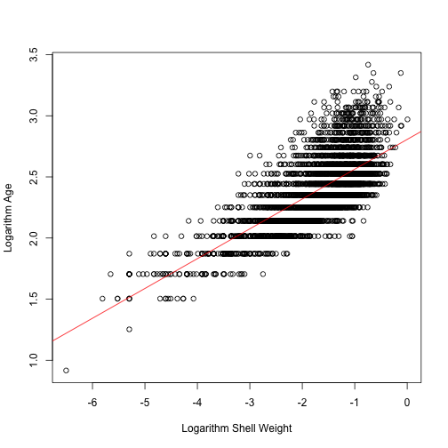

The log-transformed model seems to have smaller error.

From this comparison I could conclude two things:

   + The log-transformed model is more useful in predicting age from shell weight, and
   + Weight seems to affect age proportionally rather than additively.
    
3. Make diagnostic plots for model fit on log-transformed age and shell weight.  Compare their appearance to that for the model using original scale of measurements. What would you conclude from this comparison about their relative quality?


```r
plot(log.aba.lm)
```

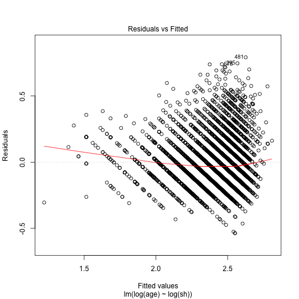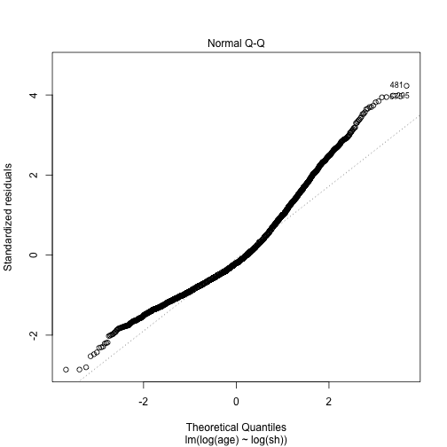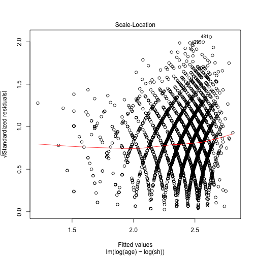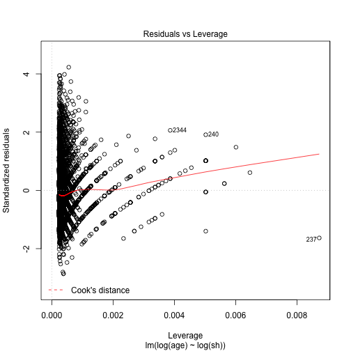

In the log-transformed model, the Residuals vs Fitted plot seems to be more evenly distributed, and the Normal Q-Q plot seems to deviate less from a diagonal line.  Thereofre, we can say that the log-transformed model is of higher quality.

# Problem 3: Adding second variable to the model (10 points)

To explore effects of adding another variable to the model, continue using log-transformed attributes and fit a model of log-transformed age as a function of shell weight and shucked weight (both log-transformed also).  Just an additive model -- no interaction term is necessary at this point. Please obtain and evaluate the summary of this model fit, confidence intervals on its parameters and its diagnostic plots. Where applicable, compare them to the model obtained above and reflect on pros and cons of including shucked weight as another variable into the model.


```r
multiv.aba.lm <- lm(log(age) ~ log(sh) + log(sw), abaDat)
summary(multiv.aba.lm)
```

```
## 
## Call:
## lm(formula = log(age) ~ log(sh) + log(sw), data = abaDat)
## 
## Residuals:
##      Min       1Q   Median       3Q      Max 
## -1.18739 -0.11470 -0.02266  0.09106  0.79285 
## 
## Coefficients:
##              Estimate Std. Error t value Pr(>|t|)    
## (Intercept)  2.926705   0.007407  395.14   <2e-16 ***
## log(sh)      0.544297   0.011098   49.05   <2e-16 ***
## log(sw)     -0.296300   0.010460  -28.33   <2e-16 ***
## ---
## Signif. codes:  0 '***' 0.001 '**' 0.01 '*' 0.05 '.' 0.1 ' ' 1
## 
## Residual standard error: 0.1717 on 4174 degrees of freedom
## Multiple R-squared:  0.6035,	Adjusted R-squared:  0.6033 
## F-statistic:  3177 on 2 and 4174 DF,  p-value: < 2.2e-16
```

```r
confint(multiv.aba.lm)
```

```
##                  2.5 %     97.5 %
## (Intercept)  2.9121840  2.9412263
## log(sh)      0.5225392  0.5660546
## log(sw)     -0.3168073 -0.2757926
```

```r
plot(multiv.aba.lm)
```

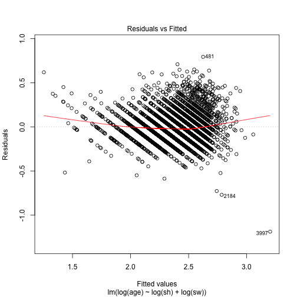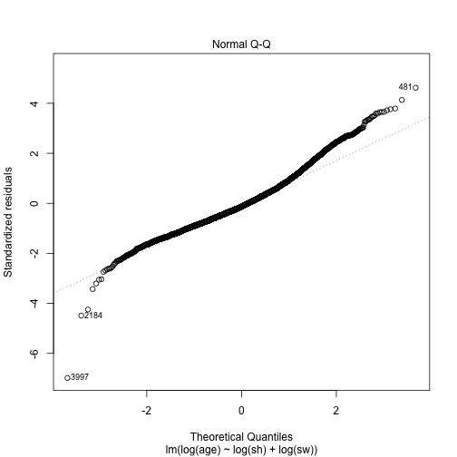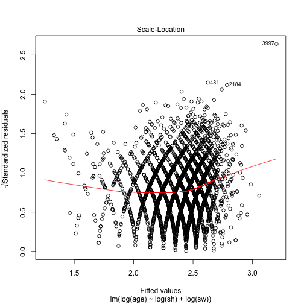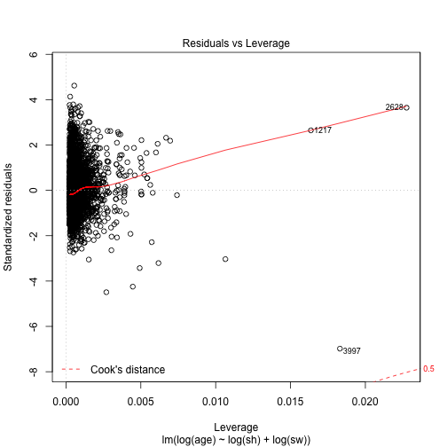

The model that includes the logarithm of shucked weight better explains the variance in the logarithm of age. The $R^2$ is significantly higher, the p-values are very small, and the F-statistic is very large. However, the model is considerably more complicated when it has both variables, and therefore is harder to interpret.  Shell weight and shucked weight as variables are conceptually similar, so attributing opposing influences to each obscures the intuition of the model.
