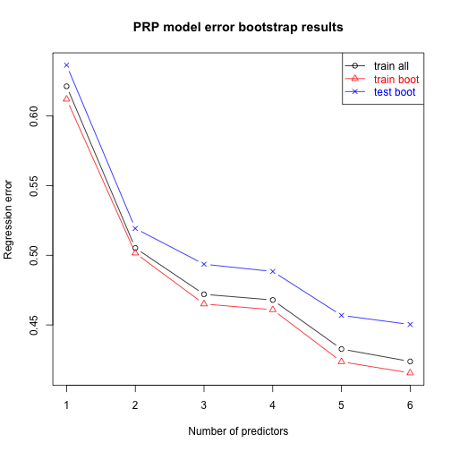

# Preface

This assignment is focused on using resampling (specifically, bootstrap) to estimate and compare training and test error of linear models with progressively increasing number of variables as linear and quadratic (ultimately all pairwise combinations) terms. The goal is to advance your familiarity with fitting multiple regression models, to develop hands on experience with use of resampling and to observe first hand the discrepancy in the trending of training and test error with the increase in model complexity.

The assignment will use new dataset available at UCI ML repository -- https://archive.ics.uci.edu/ml/datasets/Computer+Hardware -- on CPU performance (from quaint times of processors speed in single digits MHz).  As before, you are encouraged to download and use a copy local to your machine to decrease the dependency on availability of UCI ML website.  For the same purposes a copy of this dataset is also made available at this course website in canvas.  Below main steps of the assignment are illustrated on a simulated dataset.

For the purposes of this illustration we start with developing an R function that produces a simulated dataset for given numbers of observations and variables. Its output includes given number of i.i.d. standard normal deviates as well as all their pairwise combinations in addition to the outcome as an unweighted average of a given subset of these variables with controlled amount of gaussian noise added to it.  Admittedly, gross oversimplification of any real-life dataset typically encountered in the wild, but it will suffice for our purposes (to see through resampling the divergence of training and test errors with increasing model complexity):


```r
simuLinQuadDat <- function(inpNobs=100, inpNlinVars=5, inpYidx=1:2, inpSDerr=0.5) {
  # Nobs x Nvars matrix of linear terms:
  xTmp <- matrix(rnorm(inpNobs*inpNlinVars),ncol=inpNlinVars)
  # Make all pairwise products of linear terms,
  # X1*X1, X1*X2, X1*X3, ..., Xn*Xn:
  x2Tmp <- NULL
  tmpCnms <- NULL
  # for each linear term:
  for ( iTmp in 1:dim(xTmp)[2] ) {
    # multiply it by itself and all other terms,
    # excluding already generated pairwise combinations: 
    for ( jTmp in iTmp:dim(xTmp)[2] ) {
      x2Tmp <- cbind(x2Tmp,xTmp[,iTmp]*xTmp[,jTmp])
      # maintain vector of column names for quadratic
      # terms along the way:
      tmpCnms <- c(tmpCnms,paste0("X",iTmp,"X",jTmp))
    }
  }
  # name attributes in the matrix of quadratic terms:
  colnames(x2Tmp) <- tmpCnms
  # create outcome as a sum of an unweighted average of 
  # specified columns and controlled amount 
  # of gaussian noise:
  yTmp <- rowMeans(cbind(xTmp,x2Tmp)[,inpYidx])+rnorm(inpNobs,sd=inpSDerr)
  # return data.frame with outcome as a first column,
  # followed by linear, then by quadratic terms:
  data.frame(Y=yTmp,xTmp,x2Tmp)
}
```

For the purposes of this assignment you will have the computer hardware dataset to work with, so that you won't have to simulate data from standard normal.  However, this assignment will ask you to include all pairwise products of its continuous attributes in the model, so some aspects of the above code will have to be incorporated in your work.

Now, let's simulate a dataset using the default parameters, briefly look it over and fit a couple of linear models to it:


```r
simDat <- simuLinQuadDat()
class(simDat)
```

```
## [1] "data.frame"
```

```r
dim(simDat)
```

```
## [1] 100  21
```

```r
head(simDat)
```

```
##             Y         X1          X2         X3         X4         X5
## 1 -0.07494347 -0.6815974 -0.73742604 -2.2920106  0.6657563  0.9416220
## 2 -0.62840029 -0.8872572  0.15035668 -0.2008009  1.4370021  1.9649428
## 3 -0.96227589 -1.0132114  0.25348076 -0.4755940  0.7549187  1.2697778
## 4  0.23244158 -0.4943525 -1.06183188 -0.9424246 -0.6647269 -0.3306032
## 5  0.35970068 -0.8266381  2.22036821  0.4696084 -0.8128653  1.4609116
## 6 -0.01044730 -0.4437537 -0.05576178 -0.6324676  0.8925296 -1.1011265
##        X1X1        X1X2       X1X3       X1X4       X1X5        X2X2
## 1 0.4645751  0.50262770  1.5622285 -0.4537778 -0.6418071 0.543797171
## 2 0.7872253 -0.13340504  0.1781621 -1.2749904 -1.7434097 0.022607130
## 3 1.0265973 -0.25682960  0.4818772 -0.7648922 -1.2865534 0.064252498
## 4 0.2443844  0.52491923  0.4658899  0.3286094  0.1634345 1.127486950
## 5 0.6833306 -1.83544100 -0.3881962  0.6719455 -1.2076452 4.930034984
## 6 0.1969173  0.02474449  0.2806598 -0.3960633  0.4886290 0.003109376
##          X2X3        X2X4        X2X5       X3X3       X3X4       X3X5
## 1  1.69018828 -0.49094607 -0.69437659 5.25331238 -1.5259206 -2.1582076
## 2 -0.03019176  0.21606286  0.29544227 0.04032102 -0.2885514 -0.3945624
## 3 -0.12055392  0.19135736  0.32186425 0.22618961 -0.3590348 -0.6038986
## 4  1.00069650  0.70582824  0.35104501 0.88816415  0.6264550  0.3115686
## 5  1.04270355 -1.80486035  3.24376164 0.22053204 -0.3817284  0.6860563
## 6  0.03526752 -0.04976904  0.06140077 0.40001533 -0.5644961  0.6964269
##        X4X4       X4X5      X5X5
## 1 0.4432315  0.6268908 0.8866520
## 2 2.0649750  2.8236269 3.8610004
## 3 0.5699022  0.9585790 1.6123357
## 4 0.4418619  0.2197608 0.1092985
## 5 0.6607501 -1.1875244 2.1342627
## 6 0.7966092 -0.9827881 1.2124797
```

```r
pairs(simDat[,1:5])
```


For defaults of $n=100$ observations and $k=5$ linear terms it returns a `data.frame` of $n$ rows and $p=1+k+k*(k+1)/2$ columns (outcome, linear terms, all pairwise quadratic combinations). Because, by default, the outcome is the average of first two attributes (with added noise), they show noticeable correlation with the outcome, unlike others.

For the purposes of model fitting, the terms can be either explicitly provided by the formula:


```r
lm(Y~X1+X2+X1X1+X1X2+X2X2,simDat)
```

```
## 
## Call:
## lm(formula = Y ~ X1 + X2 + X1X1 + X1X2 + X2X2, data = simDat)
## 
## Coefficients:
## (Intercept)           X1           X2         X1X1         X1X2  
##    -0.13162      0.44190      0.40354      0.03749     -0.07891  
##        X2X2  
##     0.06444
```

or, by providing `lm()` with a subset of columns in the input data and using formula that incorporates all terms from the input data in the model:


```r
lm(Y~.,simDat[,c("Y","X1","X2","X1X1","X1X2","X2X2")])
```

```
## 
## Call:
## lm(formula = Y ~ ., data = simDat[, c("Y", "X1", "X2", "X1X1", 
##     "X1X2", "X2X2")])
## 
## Coefficients:
## (Intercept)           X1           X2         X1X1         X1X2  
##    -0.13162      0.44190      0.40354      0.03749     -0.07891  
##        X2X2  
##     0.06444
```

or, equivalently, by numeric indices into `data.frame` columns:


```r
lm(Y~.,simDat[,c(1:3,7,8,12)])
```

```
## 
## Call:
## lm(formula = Y ~ ., data = simDat[, c(1:3, 7, 8, 12)])
## 
## Coefficients:
## (Intercept)           X1           X2         X1X1         X1X2  
##    -0.13162      0.44190      0.40354      0.03749     -0.07891  
##        X2X2  
##     0.06444
```

*Explicit* inclusion of model terms in the formula is the most suitable for interactive model fitting, easiest to read and understand and overall is the recommended approach for these reasons.  Using `as.formula` and `paste` with suitable value for `collapse` (e.g. `"+"`, `"*"` and/or `":"`) called on a proper subset of data frame column names one can compile and parse model formulas _dynamically_ -- for instance, the code chunk below fits exactly the same model as the code chunk above:


```r
lm(as.formula(paste0("Y~",paste(colnames(simDat)[c(2:3,7,8,12)],collapse="+"))),simDat)
```

```
## 
## Call:
## lm(formula = as.formula(paste0("Y~", paste(colnames(simDat)[c(2:3, 
##     7, 8, 12)], collapse = "+"))), data = simDat)
## 
## Coefficients:
## (Intercept)           X1           X2         X1X1         X1X2  
##    -0.13162      0.44190      0.40354      0.03749     -0.07891  
##        X2X2  
##     0.06444
```

However, the code or result of its execution is not much more readable as the one just be fore and practically speaking in both cases one has to provide correct sets of column indices anyway, so to march through models of increasing complexity programmatically we will use appropriate subsets of dataset instead.  Figuring out which indices to use is one of those tasks that are harder to do in the head, but easier to code.

Let's create a dataset with $n=200$ observations and $k=6$ linear predictors (and corresponding quadratic terms) where outcome is the average of the first three linear terms with some noise added, fit linear models starting with one linear term all the way to all linear and quadratic terms included and plot resulting error:


```r
simDat <- simuLinQuadDat(inpNobs=200, inpNlinVars=6, inpYidx=1:3, inpSDerr=1)
df2plot <- NULL
for ( iTmp in 2:dim(simDat)[2] ) {
  lmTmp <- lm(Y~.,simDat[,1:iTmp])
  errTmp <- sqrt(mean((simDat[,"Y"]-predict(lmTmp))^2))
  df2plot <- rbind(df2plot,data.frame(nvars=iTmp-1,err=errTmp))
}
plot(df2plot,xlab="Number of variables",ylab="Regression error",main=paste(dim(simDat)[1],"observations"))
```


As one would expect, inclusion of the first three predictors (average of which plus noise *is* the outcome) results in the most dramatic decrease in the average quadratic difference between observed and predicted outcome (that is training error, of course -- because it is calculated on the same dataset that the model was fit to), followed by the gradual decrease in the error as more model terms are incorporated.  Here, we pretend to know which predictors are the most important and have to be included first and in which order the rest of them have to be added.  More disciplined approaches involve ordering predictors by their corresponding model improvement at each step of variable selection. We use this shortcut for the purposes of simplicity to allow us to focus on resampling and the difference between training and test errors.

Two more caveats due here concern the notion of the degrees of freedom. First, once again for simplicity, the training error as calculated above is different from `sigma` slot in the output of `summary()` by $\sqrt{n/(n-p-1)}$ where $n$ is the number of observations and $p$ -- number of the variables included in the model (aka degrees of freedom used up by the model).  For more details, see for instance, corresponding section in [LHSP](http://www.jerrydallal.com/LHSP/dof.htm) -- that is a great source of all kinds of practical statistical wisdom.  Second, as the number of variables included in the model approaches about 10-20, for a given number of observations ($n=200$) it starts to exceed maximal recommended ratio of the number of observations to the number of predictors included in the model, that is also about 10-20 for the kind of signal/noise ratios typically encountered in biomedical and social sciences. In other words, fitting model with 27 variables on 200 observations is generally a bad idea, but we will see below that the discrepancy between training and test error for our examples kicks in way before that.

Back to the demo -- the plot above demonstrates that the training error continues to decrease as the model complexity increases.  How the training and test errors would look like if model is trained on a bootstrap of the data and tested on the subset of the data not included in the bootstrap?  First, again, let's write a function evaluating inclusion of one to all predictors over a number of bootstraps. For the purposes of clarity and simplicity here we disregard existing bootstrap facilities that are available in R in packages such as `boot` and implement simple bootstrap resampling directly:


```r
bootTrainTestErrOneAllVars <- function(inpDat,nBoot=100) {
  # matrices and vector to store bootstrap training
  # and test errors as well as training error for model
  # fit on all observations -- for one through all
  # variables in the dataset:
  errTrain <- matrix(NA,nrow=nBoot,ncol=dim(inpDat)[2]-1)
  errTest <- matrix(NA,nrow=nBoot,ncol=dim(inpDat)[2]-1)
  allTrainErr <- numeric()
  # first predictor is the second column in
  # the input data - first is the outcome "Y":
  for ( iTmp in 2:dim(inpDat)[2] ) {
    # fit model and calculate error on all observations:
    lmTmp <- lm(Y~.,inpDat[,1:iTmp])
    allTrainErr[iTmp-1] <- sqrt(mean((inpDat[,"Y"]-predict(lmTmp))^2))
    # draw repeated boostraps of the data:
    for ( iBoot in 1:nBoot ) {
      # replace=TRUE is critical for bootstrap to work correctly:
      tmpBootIdx <- sample(dim(inpDat)[1],dim(inpDat)[1],replace=TRUE)
      # model fit on the bootstrap sample and
      # corresponding training error:
      lmTmpBoot <- lm(Y~.,inpDat[tmpBootIdx,1:iTmp])
      errTrain[iBoot,iTmp-1] <- sqrt(mean((inpDat[tmpBootIdx,"Y"]-predict(lmTmpBoot))^2))
      # test error is calculated on the observations
      # =not= in the bootstrap sample - thus "-tmpBootIdx"
      errTest[iBoot,iTmp-1] <- sqrt(mean((inpDat[-tmpBootIdx,"Y"]-predict(lmTmpBoot,newdata=inpDat[-tmpBootIdx,1:iTmp]))^2))
    }
  }
  # return results as different slots in the list:
  list(bootTrain=errTrain,bootTest=errTest,allTrain=allTrainErr)
}
```

Let's calculate training and test bootstrap errors (as well as training error on all observations) on the dataset we have already generated previously and plot them as function of the number of variables in the model:


```r
# wrapper for plotting:
plotBootRegrErrRes <- function(inpRes,inpPchClr=c(1,2,4),mainTxt="") {
  matplot(1:length(inpRes$allTrain),cbind(inpRes$allTrain,colMeans(inpRes$bootTrain),colMeans(inpRes$bootTest)),pch=inpPchClr,col=inpPchClr,lty=1,type="b",xlab="Number of predictors",ylab="Regression error",main=mainTxt)
  legend("topright",c("train all","train boot","test boot"),col=inpPchClr,text.col=inpPchClr,pch=inpPchClr,lty=1)
}
bootErrRes <- bootTrainTestErrOneAllVars(simDat,30)
plotBootRegrErrRes(bootErrRes,mainTxt="200 observations")
```


Notice how test error starts to increase once all variables truly associated with the outcome has been already included in the model, while training errors continue to decrease reflecting overfit (and increasing contribution of the variance term to the model error).

Lastly, let's repeat this exercise for two larger numbers of observations simulated under the same conditions:


```r
old.par <- par(mfrow=c(1,3))
for ( tmpNobs in c(200,500,1000) ) {
  simDat <- simuLinQuadDat(inpNobs=tmpNobs, inpNlinVars=6, inpYidx=1:3, inpSDerr=1)
  bootErrRes <- bootTrainTestErrOneAllVars(simDat,30)
  plotBootRegrErrRes(bootErrRes,mainTxt=paste(tmpNobs,"observations"))
}
par(old.par)
```

Notice how  the increase in test error with the number of predictors becomes less pronounced for larger numbers of observations.

To conclude, the examples above present code and analyses that are very close to what you will need to complete this assignment.  Please feel free to start with those examples and modify them as necessary.  And, as always, do ask questions if anything seems unclear.


# Problem: estimating multiple regression error rate by resampling (60 points)

This week assignment closely follows what is explained in the preface above, except that instead of using simulated dataset, you are expected to use dataset on CPU performance (from the 80s) available at UCI ML data archive (https://archive.ics.uci.edu/ml/datasets/Computer+Hardware) as well as on this course website in canvas (file `machine.data` there).  It is probably the best to download and use local copy on your computer.

The first two columns -- vendor and model names -- are irrelevant for the regression task. The continuous (this is regression problem) outcome that we will model is PRP.  One of the continuous attributes in the dataset -- ERP, very highly correlated with PRP -- is a result of modeling PRP by the dataset contributors and has to be discarded as well.  In the end you should be working with a dataset with seven continuous attributes -- one outcome, PRP and six predictors (MYCT, MMIN, MMAX, CACH, CHMIN and CHMAX to use data contributors' notation).  Due to non-linearity affecting multiple attributes in this dataset, you are better off working with log transformed *both* predictors and the outcome -- because several values in this dataset are zeroes and to avoid dealing with NaNs just add prior to log-transform "1"" to all values in this dataset (e.g. `cpuDat <- log(cpuDat+1)`).


```r
CPUDatRaw <- read.table("machine.data",sep=",")
names(CPUDatRaw) <- c("vendor name","model name","MYCT","MMIN","MMAX","CACH","CHMIN","CHMAX","PRP","ERP")
regColnames <- names(CPUDatRaw)[!(names(CPUDatRaw) %in% c("vendor name","model name","ERP"))]
## Discard irrelevant columns
CPUDat <- CPUDatRaw[regColnames]
## Log-transform everything
CPUDat <- log(CPUDat+1)
```

## Sub-problem 1: read in the dataset and provide numerical and graphical summaries (10 points)

Use methods such as `summary` and `pairs` that have been used in the previous assigments.  Comment on the extent of the signal available in the data for modeling PRP. Rearrange columns in the dataset in the decreasing order of absolute values of their correlation with the outcome (PRP).  So that PRP is the first column, the next one is the predictor that is most (positively or negatively) correlated with it, and so on.  You may find it convenient to use R function `order` for that.


```r
## I found in the line below that if I didn't use sapply, CPUDatCor would be a matrix rather than a list or data frame, due to the returned data type of cor(), and then I couldn't use names() later
CPUDatCor <- sapply(CPUDat, function(x) cor(CPUDat[["PRP"]], x))
CPUDatCor
```

```
##       MYCT       MMIN       MMAX       CACH      CHMIN      CHMAX 
## -0.7002057  0.7646672  0.7951432  0.7680780  0.6746297  0.6402101 
##        PRP 
##  1.0000000
```

```r
CPUDatCor <- abs(CPUDatCor) ## absolute value
## The following line identifies the index of "PRP", finds the reverse order of the absolute values of correlations, and removes the index corresponding to "PRP"
CPUDatCorOrder <- order(CPUDatCor, decreasing = TRUE)[order(CPUDatCor, decreasing = TRUE) != which(names(CPUDatCor) == "PRP")]
## Adds "PRP" as the first variable (here the predicted variable) and concates the other variables in the proper order
CPUDat <- CPUDat[c(which(names(CPUDatCor) == "PRP"), CPUDatCorOrder)]
head(CPUDat)
```

```
##        PRP      MMAX     CACH     MMIN     MYCT    CHMIN    CHMAX
## 1 5.293305  8.699681 5.549076 5.549076 4.836282 2.833213 4.859812
## 2 5.598422 10.373522 3.496508 8.987322 3.401197 2.197225 3.496508
## 3 5.398163 10.373522 3.496508 8.987322 3.401197 2.197225 3.496508
## 4 5.153292 10.373522 3.496508 8.987322 3.401197 2.197225 3.496508
## 5 4.890349  9.680406 3.496508 8.987322 3.401197 2.197225 2.833213
## 6 5.765191 10.373522 4.174387 8.987322 3.295837 2.197225 3.496508
```

```r
PRPlm <- lm(PRP~.,CPUDat)
summary(PRPlm)
```

```
## 
## Call:
## lm(formula = PRP ~ ., data = CPUDat)
## 
## Residuals:
##      Min       1Q   Median       3Q      Max 
## -1.35980 -0.29745 -0.00527  0.24627  1.36076 
## 
## Coefficients:
##              Estimate Std. Error t value Pr(>|t|)    
## (Intercept) -1.172608   0.537865  -2.180  0.03040 *  
## MMAX         0.314586   0.046797   6.722 1.79e-10 ***
## CACH         0.186278   0.024540   7.591 1.15e-12 ***
## MMIN         0.193740   0.048012   4.035 7.74e-05 ***
## MYCT         0.008777   0.047818   0.184  0.85455    
## CHMIN        0.196694   0.059239   3.320  0.00107 ** 
## CHMAX        0.128308   0.043763   2.932  0.00376 ** 
## ---
## Signif. codes:  0 '***' 0.001 '**' 0.01 '*' 0.05 '.' 0.1 ' ' 1
## 
## Residual standard error: 0.4311 on 202 degrees of freedom
## Multiple R-squared:  0.8289,	Adjusted R-squared:  0.8238 
## F-statistic: 163.1 on 6 and 202 DF,  p-value: < 2.2e-16
```

```r
pairs(CPUDat)
```


In this dataset, the F-statistic is much larger than 1, indicating that PRP is related to the other variables.  In addtion, the $R^2$ is close to 1 and the RSE is low compared to a typical value of PRP, indicating that the model fits the data well.


## Sub-problem 2: add quadratic terms to the dataset (10 points)

Use the code presented in the preface as a template to develop your own procedure for adding to the computer hardware dataset containing outcome (PRP) and all continuous predictors (MYCT through CHMAX) all pairwise products of continuous predictors (e.g. MYCT x MYCT, MYCT x MMIN, ..., CHMAX x CHMAX).  The data used here has to be the one from computer hardware dataset, _not_ simulated from normal distribution.  In the end your dataset should have 28 columns: PRP, 6 predictors and 6*7/2=21 of their pairwise combinations.


```r
xTmp <- CPUDat
x2Tmp <- data.frame(matrix(ncol = 0, nrow = nrow(CPUDat)))
tmpCnms <- NULL
head(xTmp)
```

```
##        PRP      MMAX     CACH     MMIN     MYCT    CHMIN    CHMAX
## 1 5.293305  8.699681 5.549076 5.549076 4.836282 2.833213 4.859812
## 2 5.598422 10.373522 3.496508 8.987322 3.401197 2.197225 3.496508
## 3 5.398163 10.373522 3.496508 8.987322 3.401197 2.197225 3.496508
## 4 5.153292 10.373522 3.496508 8.987322 3.401197 2.197225 3.496508
## 5 4.890349  9.680406 3.496508 8.987322 3.401197 2.197225 2.833213
## 6 5.765191 10.373522 4.174387 8.987322 3.295837 2.197225 3.496508
```

```r
for ( iTmp in 2:ncol(CPUDat) ) {
        for ( jTmp in iTmp:ncol(CPUDat) ) {
                x2Tmp <- cbind(x2Tmp,xTmp[,iTmp]*xTmp[,jTmp])
                tmpCnms <- c(tmpCnms,paste0(names(xTmp)[iTmp]," x ",names(xTmp)[jTmp]))
        }
}
colnames(x2Tmp) <- tmpCnms
CPUlmDat <- cbind(xTmp,x2Tmp)
head(CPUlmDat)
```

```
##        PRP      MMAX     CACH     MMIN     MYCT    CHMIN    CHMAX
## 1 5.293305  8.699681 5.549076 5.549076 4.836282 2.833213 4.859812
## 2 5.598422 10.373522 3.496508 8.987322 3.401197 2.197225 3.496508
## 3 5.398163 10.373522 3.496508 8.987322 3.401197 2.197225 3.496508
## 4 5.153292 10.373522 3.496508 8.987322 3.401197 2.197225 3.496508
## 5 4.890349  9.680406 3.496508 8.987322 3.401197 2.197225 2.833213
## 6 5.765191 10.373522 4.174387 8.987322 3.295837 2.197225 3.496508
##   MMAX x MMAX MMAX x CACH MMAX x MMIN MMAX x MYCT MMAX x CHMIN
## 1    75.68446    48.27519    48.27519    42.07411     24.64805
## 2   107.60997    36.27110    93.23018    35.28240     22.79296
## 3   107.60997    36.27110    93.23018    35.28240     22.79296
## 4   107.60997    36.27110    93.23018    35.28240     22.79296
## 5    93.71027    33.84761    87.00093    32.92497     21.27003
## 6   107.60997    43.30310    93.23018    34.18944     22.79296
##   MMAX x CHMAX CACH x CACH CACH x MMIN CACH x MYCT CACH x CHMIN
## 1     42.27882    30.79225    30.79225    26.83690    15.721716
## 2     36.27110    12.22557    31.42424    11.89231     7.682612
## 3     36.27110    12.22557    31.42424    11.89231     7.682612
## 4     36.27110    12.22557    31.42424    11.89231     7.682612
## 5     27.42666    12.22557    31.42424    11.89231     7.682612
## 6     36.27110    17.42551    37.51656    13.75810     9.172066
##   CACH x CHMAX MMIN x MMIN MMIN x MYCT MMIN x CHMIN MMIN x CHMAX
## 1    26.967469    30.79225    26.83690     15.72172     26.96747
## 2    12.225565    80.77195    30.56766     19.74716     31.42424
## 3    12.225565    80.77195    30.56766     19.74716     31.42424
## 4    12.225565    80.77195    30.56766     19.74716     31.42424
## 5     9.906352    80.77195    30.56766     19.74716     25.46300
## 6    14.595777    80.77195    29.62075     19.74716     31.42424
##   MYCT x MYCT MYCT x CHMIN MYCT x CHMAX CHMIN x CHMIN CHMIN x CHMAX
## 1    23.38962    13.702218    23.503423      8.027098     13.768885
## 2    11.56814     7.473194    11.892312      4.827796      7.682612
## 3    11.56814     7.473194    11.892312      4.827796      7.682612
## 4    11.56814     7.473194    11.892312      4.827796      7.682612
## 5    11.56814     7.473194     9.636318      4.827796      6.225206
## 6    10.86254     7.241694    11.523919      4.827796      7.682612
##   CHMAX x CHMAX
## 1     23.617777
## 2     12.225565
## 3     12.225565
## 4     12.225565
## 5      8.027098
## 6     12.225565
```

## Sub-problem 3: fit multiple regression models on the entire dataset (10 points)

As illustrated in the preface above, starting from the first, most correlated with PRP, predictor, fit linear models with one, two, ..., all 27 linear and quadratic terms on the entire dataset and calculate resulting (training) error for each of the models. Plot error as a function of the number of predictors in the model (similar to the plot in the preface that shows just the training error on the entire dataset).  Because the underlying data is different the plot you obtain here for computer hardware dataset will be different from that shown in the preface.  Please comment on this difference.


```r
df2plot <- NULL
for (numPredVar in 2:ncol(CPUlmDat)) {
        lmTmp <- lm(PRP~., data = CPUlmDat[1:numPredVar])
        errTmp <- sqrt(mean((CPUDat["PRP"]-predict(lmTmp))^2))
        df2plot <- rbind(df2plot,data.frame(nvars = numPredVar-1,err=errTmp))
}
```

```
## Warning in mean.default((CPUDat["PRP"] - predict(lmTmp))^2): argument is
## not numeric or logical: returning NA

## Warning in mean.default((CPUDat["PRP"] - predict(lmTmp))^2): argument is
## not numeric or logical: returning NA

## Warning in mean.default((CPUDat["PRP"] - predict(lmTmp))^2): argument is
## not numeric or logical: returning NA

## Warning in mean.default((CPUDat["PRP"] - predict(lmTmp))^2): argument is
## not numeric or logical: returning NA

## Warning in mean.default((CPUDat["PRP"] - predict(lmTmp))^2): argument is
## not numeric or logical: returning NA

## Warning in mean.default((CPUDat["PRP"] - predict(lmTmp))^2): argument is
## not numeric or logical: returning NA

## Warning in mean.default((CPUDat["PRP"] - predict(lmTmp))^2): argument is
## not numeric or logical: returning NA

## Warning in mean.default((CPUDat["PRP"] - predict(lmTmp))^2): argument is
## not numeric or logical: returning NA

## Warning in mean.default((CPUDat["PRP"] - predict(lmTmp))^2): argument is
## not numeric or logical: returning NA

## Warning in mean.default((CPUDat["PRP"] - predict(lmTmp))^2): argument is
## not numeric or logical: returning NA

## Warning in mean.default((CPUDat["PRP"] - predict(lmTmp))^2): argument is
## not numeric or logical: returning NA

## Warning in mean.default((CPUDat["PRP"] - predict(lmTmp))^2): argument is
## not numeric or logical: returning NA

## Warning in mean.default((CPUDat["PRP"] - predict(lmTmp))^2): argument is
## not numeric or logical: returning NA

## Warning in mean.default((CPUDat["PRP"] - predict(lmTmp))^2): argument is
## not numeric or logical: returning NA

## Warning in mean.default((CPUDat["PRP"] - predict(lmTmp))^2): argument is
## not numeric or logical: returning NA

## Warning in mean.default((CPUDat["PRP"] - predict(lmTmp))^2): argument is
## not numeric or logical: returning NA

## Warning in mean.default((CPUDat["PRP"] - predict(lmTmp))^2): argument is
## not numeric or logical: returning NA

## Warning in mean.default((CPUDat["PRP"] - predict(lmTmp))^2): argument is
## not numeric or logical: returning NA

## Warning in mean.default((CPUDat["PRP"] - predict(lmTmp))^2): argument is
## not numeric or logical: returning NA

## Warning in mean.default((CPUDat["PRP"] - predict(lmTmp))^2): argument is
## not numeric or logical: returning NA

## Warning in mean.default((CPUDat["PRP"] - predict(lmTmp))^2): argument is
## not numeric or logical: returning NA

## Warning in mean.default((CPUDat["PRP"] - predict(lmTmp))^2): argument is
## not numeric or logical: returning NA

## Warning in mean.default((CPUDat["PRP"] - predict(lmTmp))^2): argument is
## not numeric or logical: returning NA

## Warning in mean.default((CPUDat["PRP"] - predict(lmTmp))^2): argument is
## not numeric or logical: returning NA

## Warning in mean.default((CPUDat["PRP"] - predict(lmTmp))^2): argument is
## not numeric or logical: returning NA

## Warning in mean.default((CPUDat["PRP"] - predict(lmTmp))^2): argument is
## not numeric or logical: returning NA

## Warning in mean.default((CPUDat["PRP"] - predict(lmTmp))^2): argument is
## not numeric or logical: returning NA
```

```r
plot(df2plot,xlab="Number of variables",ylab="Regression error",main="Residual Error vs. No. of predictive variables")
```

```
## Warning in min(x): no non-missing arguments to min; returning Inf
```

```
## Warning in max(x): no non-missing arguments to max; returning -Inf
```

```
## Error in plot.window(...): need finite 'ylim' values
```


The difference here is that in the underlying CPU data, adding a 2nd, 3rd, 5th, and 7th variable all seem to reduce the residual error in the model.  This indicates that those variables are likely to be relevant to PRP.  However, in the preface data, only the first three variables reduced the residual error.  In the prefarce, this was to be expected due to the length of the vector supplied to inpYidx, 1:3.

## Sub-problem 4: develop function performing bootstrap on computer hardware dataset (15 points)

Modify function `bootTrainTestErrOneAllVars` defined in the preface to perform similar kind of analysis on the computer hardware dataset.  Alternatively, you can determine what modifications are necessary to the computer hardware dataset, so that it can be used as input to `bootTrainTestErrOneAllVars`.


```r
bootWrapper <- function(inputData, nBoot = 100) {
        colnames(inputData)[1] <- "Y"
        bootTrainTestErrOneAllVars(inputData, nBoot)
}
```


## Sub-problem 5: use bootstrap to estimate training and test error on computer hardware dataset (15 points)

Use function developed above to estimate training and test error in modeling PRP on the computer hardware dataset.  Plot and discuss the results.  Compare model error over the range of model complexity to that obtained by the dataset contributors (as a difference between ERP and PRP in the original full dataset once the log-transform performed before proceeding with modeling here has been accounted for -- by either calculating error on log-transform of PRP and ERP or transforming our model predictions back to the original scale of PRP measurements)


```r
bootResults <- bootWrapper(CPUDat)
plotBootRegrErrRes(bootResults, mainTxt = "PRP model error bootstrap results")
```



```r
## Our model test error (in RSE) for all numbers of variables for PRP
bootResults$allTrain
```

```
## [1] 0.6213247 0.5052333 0.4719782 0.4678974 0.4326960 0.4237734
```

```r
## The author's model test error (as measured by ERP - PRP)
log(sqrt(mean((CPUDatRaw["ERP"]-CPUDatRaw["PRP"])^2)))
```

```
## Warning in mean.default((CPUDatRaw["ERP"] - CPUDatRaw["PRP"])^2): argument
## is not numeric or logical: returning NA
```

```
## [1] NA
```
The test error (log-corrected) of the author's model is much greater than the test error of our model.  Therefore, out model can be said to better fit the data.
