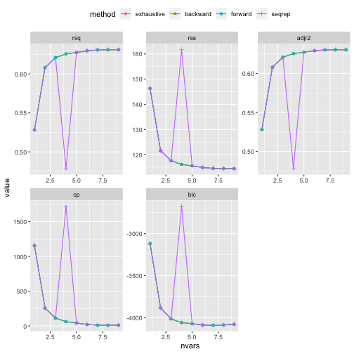
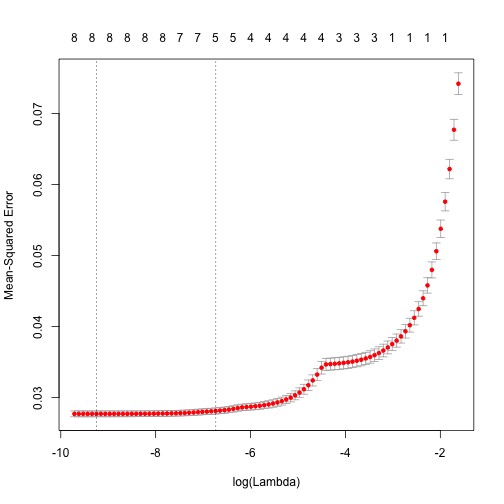

# Preface

For this assignment we will apply some of the approaches presented in ISLR for variable selection and model regularization to some of those datasets that we have worked with previously.  The goal will be to see whether some of the more principled methods for model selection will allow us better understand relative variable importance, variability of predictive performance of the models, etc.

For the purposes of the preface we will use abalone dataset to illustrate some of the concepts and approaches here.  The problems in the assignment will use computer hardware dataset from the previous week assignment.  The flow below follows closely the outline of the Labs 6.5 and 6.6 in ISLR and you are encouraged to refer to them for additional examples and details.


## Selecting best variable subset on the entire dataset

Assuming that we have read and pre-processed abalone data (converted rings to age, log-transformed, removed height outliers -- two zeroes and two largest values), let's use `regsubsets` from library `leaps` to select optimal models with number of terms ranging from one to all variables in the dataset using each of the methods available for this function and collect corresponding model metrics (please notice that we override default value of `nvmax` argument and reflect on as to why we do that):


```r
summaryMetrics <- NULL
whichAll <- list()
for ( myMthd in c("exhaustive", "backward", "forward", "seqrep") ) {
  rsRes <- regsubsets(age~.,lnAbaDat,method=myMthd,nvmax=9)
  summRes <- summary(rsRes)
  whichAll[[myMthd]] <- summRes$which
  for ( metricName in c("rsq","rss","adjr2","cp","bic") ) {
    summaryMetrics <- rbind(summaryMetrics,
      data.frame(method=myMthd,metric=metricName,
                nvars=1:length(summRes[[metricName]]),
                value=summRes[[metricName]]))
  }
}
ggplot(summaryMetrics,aes(x=nvars,y=value,shape=method,colour=method)) + geom_path() + geom_point() + facet_wrap(~metric,scales="free") +   theme(legend.position="top")
```



We can see that, except for sequential replacement that has chosen quite a model as the best with four variables, all others came with models of very comparable performance by every associated metric. Plotting variable membership for each of those models as captured by `which` attribute of the `summary` further illustrates that the variables chosen by sequential replacement for four variable model were sex and highly correlated length and diameter explaining its poor performance (but not its choice by this algorithm):


```r
old.par <- par(mfrow=c(2,2),ps=16,mar=c(5,7,2,1))
for ( myMthd in names(whichAll) ) {
  image(1:nrow(whichAll[[myMthd]]),
        1:ncol(whichAll[[myMthd]]),
        whichAll[[myMthd]],xlab="N(vars)",ylab="",
        xaxt="n",yaxt="n",breaks=c(-0.5,0.5,1.5),
        col=c("white","gray"),main=myMthd)
  axis(1,1:nrow(whichAll[[myMthd]]),rownames(whichAll[[myMthd]]))
  axis(2,1:ncol(whichAll[[myMthd]]),colnames(whichAll[[myMthd]]),las=2)
}
```


```r
par(old.par)
```

## Using training and test data to select best subset

Next, following Lab 6.5.3 in ISLR we will split our data approximately evenly into training and test, select the best subset of variables on training data, evaluate its performance on training and test and record which variables have been selected each time.  First, to be able to use `regsubsets` output to make predictions we follow ISLR and setup `predict` function that can be applied to the output from `regsubsets` (notice `.regsubsets` in its name -- this is how under S3 OOP framework in R methods are matched to corresponding classes -- we will further down call it just by passing output from `regsubsets` to `predict` -- this, in its turn, works because *function* `regsubsets` returns object of *class* `regsubsets`):


```r
predict.regsubsets <- function (object, newdata, id, ...){
  form=as.formula(object$call [[2]])
  mat=model.matrix(form,newdata)
  coefi=coef(object,id=id)
  xvars=names (coefi)
  mat[,xvars] %*% coefi
}
```

We are all set now to repeatedly draw training sets, choose the best set of variables on them by each of the four different methods available in `regsubsets`, calculate test error on the remaining samples, etc.  To summarize variable selection over multiple splits of the data into training and test, we will use 3-dimensional array `whichSum` -- third dimension corresponding to the four methods available in `regsubsets`.  To split data into training and test we will use again `sample` function -- those who are curious and are paying attention may want to reflect on the difference in how it is done below and how it is implemented in the Ch. 6.5.3 of ISLR and what are the consequences of that. (Hint: consider how size of training or test datasets will vary from one iteration to another in these two implementations)


```r
dfTmp <- NULL
whichSum <- array(0,dim=c(9,10,4),
  dimnames=list(NULL,colnames(model.matrix(age~.,lnAbaDat)),
      c("exhaustive", "backward", "forward", "seqrep")))
# Split data into training and test 30 times:
nTries <- 30
for ( iTry in 1:nTries ) {
  bTrain <- sample(rep(c(TRUE,FALSE),length.out=nrow(lnAbaDat)))
  # Try each method available in regsubsets
  # to select best model of each size:
  for ( jSelect in c("exhaustive", "backward", "forward", "seqrep") ) {
    rsTrain <- regsubsets(age~.,lnAbaDat[bTrain,],nvmax=9,method=jSelect)
    # Add up variable selections:
    whichSum[,,jSelect] <- whichSum[,,jSelect] + summary(rsTrain)$which
    # Calculate test error for each set of variables
    # using predict.regsubsets implemented above:
    for ( kVarSet in 1:9 ) {
      # make predictions:
      testPred <- predict(rsTrain,lnAbaDat[!bTrain,],id=kVarSet)
      # calculate MSE:
      mseTest <- mean((testPred-lnAbaDat[!bTrain,"age"])^2)
      # add to data.frame for future plotting:
      dfTmp <- rbind(dfTmp,data.frame(sim=iTry,sel=jSelect,vars=kVarSet,
      mse=c(mseTest,summary(rsTrain)$rss[kVarSet]/sum(bTrain)),trainTest=c("test","train")))
    }
  }
}
# plot MSEs by training/test, number of 
# variables and selection method:
ggplot(dfTmp,aes(x=factor(vars),y=mse,colour=sel)) + geom_boxplot()+facet_wrap(~trainTest)
```


We can see that:

* sequential replacement has difficult time selecting optimal subsets of variables on some of the splits into training and test
* the other three methods yield models of very comparable performance
* addition of the second variable to the model clearly improves test error by much more than its variability across different selections of training sets
* by similar logic model with three variables could also be justified
* the difference in error among models with four variables or more is comparable to their variability across different selections of training data and, therefore, probably not particularly meaningful
* training error is slightly lower than the test one (the number of observations in abalone dataset is couple of orders of magnitude larger than the number of variables used in these models)

This is further supported by plotting average fraction of each variable inclusion in best model of every size by each of the four methods (darker shades of gray indicate closer to unity fraction of times given variable has been included in the best subset):


```r
old.par <- par(mfrow=c(2,2),ps=16,mar=c(5,7,2,1))
for ( myMthd in dimnames(whichSum)[[3]] ) {
  tmpWhich <- whichSum[,,myMthd] / nTries
  image(1:nrow(tmpWhich),1:ncol(tmpWhich),tmpWhich,
        xlab="N(vars)",ylab="",xaxt="n",yaxt="n",main=myMthd,
        breaks=c(-0.1,0.1,0.25,0.5,0.75,0.9,1.1),
        col=c("white","gray90","gray75","gray50","gray25","gray10"))
  axis(1,1:nrow(tmpWhich),rownames(tmpWhich))
  axis(2,1:ncol(tmpWhich),colnames(tmpWhich),las=2)
}
```


```r
par(old.par)
```

From the best subset of about four or more variable inclusion starts to vary more among different selection of training and test sets.

Similar observations can be made using cross-validation rather than the split of the dataset into training and test that is omitted here for the purposes of brevity.

## Ridge for variable selection:

As explained in the lecture and ISLR Ch.6.6 lasso and ridge regression can be performed by `glmnet` function from library `glmnet` -- its argument `alpha` governs the form of the shrinkage penalty, so that `alpha=0` corresponds to ridge and `alpha=1` -- to lasso regression.  The arguments to `glmnet` differ from those used for `lm` for example and require specification of the matrix of predictors and outcome separately.  `model.matrix` is particularly helpful for specifying matrix of predictors by creating dummy variables for categorical predictors:


```r
# -1 to get rid of intercept that glmnet knows to include:
x <- model.matrix(age~.,lnAbaDat)[,-1]
head(lnAbaDat)
```

```
##   sex        len       diam         h         ww        sw        vw
## 1   M -0.7874579 -1.0078579 -2.353878 -0.6655320 -1.493880 -2.292635
## 2   M -1.0498221 -1.3280255 -2.407946 -1.4894351 -2.307598 -3.026191
## 3   F -0.6348783 -0.8675006 -2.002481 -0.3900840 -1.360627 -1.955456
## 4   M -0.8209806 -1.0078579 -2.079442 -0.6616485 -1.534794 -2.171557
## 5   I -1.1086626 -1.3664917 -2.525729 -1.5847453 -2.413517 -3.231455
## 6   I -0.8556661 -1.2039728 -2.353878 -1.0455456 -1.958995 -2.557477
##          sh      age
## 1 -1.897120 2.803360
## 2 -2.659260 2.140066
## 3 -1.560648 2.351375
## 4 -1.864330 2.442347
## 5 -2.900422 2.140066
## 6 -2.120264 2.251292
```

```r
# notice how it created two columns for sex (first level is for intercept):
head(x)
```

```
##   sexI sexM        len       diam         h         ww        sw        vw
## 1    0    1 -0.7874579 -1.0078579 -2.353878 -0.6655320 -1.493880 -2.292635
## 2    0    1 -1.0498221 -1.3280255 -2.407946 -1.4894351 -2.307598 -3.026191
## 3    0    0 -0.6348783 -0.8675006 -2.002481 -0.3900840 -1.360627 -1.955456
## 4    0    1 -0.8209806 -1.0078579 -2.079442 -0.6616485 -1.534794 -2.171557
## 5    1    0 -1.1086626 -1.3664917 -2.525729 -1.5847453 -2.413517 -3.231455
## 6    1    0 -0.8556661 -1.2039728 -2.353878 -1.0455456 -1.958995 -2.557477
##          sh
## 1 -1.897120
## 2 -2.659260
## 3 -1.560648
## 4 -1.864330
## 5 -2.900422
## 6 -2.120264
```

```r
y <- lnAbaDat[,"age"]
ridgeRes <- glmnet(x,y,alpha=0)
plot(ridgeRes)
```


Plotting output of `glmnet` illustrates change in the contributions of each of the predictors as amount of shrinkage changes.  In ridge regression each predictor contributes more or less over the entire range of shrinkage levels.

Output of `cv.glmnet` shows averages and variabilities of MSE in cross-validation across different levels of regularization.  `lambda.min` field indicates values of $\lambda$ at which the lowest average MSE has been achieved, `lambda.1se` shows larger $\lambda$ (more regularization) that has MSE 1SD (of cross-validation) higher than the minimum -- this is an often recommended $\lambda$ to use under the idea that it will be less susceptible to overfit. You may find it instructive to experiment by providing different levels of lambda other than those used by default to understand sensitivity of `gv.glmnet` output to them.  `predict` depending on  the value of `type` argument allows to access model predictions, coefficients, etc. at a given level of lambda:


```r
cvRidgeRes <- cv.glmnet(x,y,alpha=0)
plot(cvRidgeRes)
```


```r
cvRidgeRes$lambda.min
```

```
## [1] 0.02174055
```

```r
cvRidgeRes$lambda.1se
```

```
## [1] 0.02873972
```

```r
predict(ridgeRes,type="coefficients",s=cvRidgeRes$lambda.min)
```

```
## 10 x 1 sparse Matrix of class "dgCMatrix"
##                        1
## (Intercept)  3.070672845
## sexI        -0.072807198
## sexM        -0.003192705
## len          0.004492529
## diam         0.096242950
## h            0.191812264
## ww           0.038262477
## sw          -0.111369311
## vw           0.007970718
## sh           0.166256142
```

```r
predict(ridgeRes,type="coefficients",s=cvRidgeRes$lambda.1se)
```

```
## 10 x 1 sparse Matrix of class "dgCMatrix"
##                        1
## (Intercept)  3.053635455
## sexI        -0.072728067
## sexM        -0.002611642
## len          0.017995617
## diam         0.092664157
## h            0.184125735
## ww           0.034385136
## sw          -0.088389823
## vw           0.010508769
## sh           0.142287623
```

```r
# and with lambda's other than default:
cvRidgeRes <- cv.glmnet(x,y,alpha=0,lambda=10^((-80:80)/20))
plot(cvRidgeRes)
```


Relatively higher contributions of shell weight, shucked weight and height to the model outcomed are more apparent for the results of ridge regression performed on centered and, more importantly, scaled matrix of predictors:


```r
ridgeResScaled <- glmnet(scale(x),y,alpha=0)
cvRidgeResScaled <- cv.glmnet(scale(x),y,alpha=0)
predict(ridgeResScaled,type="coefficients",s=cvRidgeResScaled$lambda.1se)
```

```
## 10 x 1 sparse Matrix of class "dgCMatrix"
##                        1
## (Intercept)  2.399396001
## sexI        -0.033961072
## sexM        -0.001258148
## len          0.004883760
## diam         0.026961905
## h            0.060140537
## ww           0.028739302
## sw          -0.076080755
## vw           0.008927047
## sh           0.115481841
```

Notice that the top two variables most commonly selected by regsubsets and those with two largest (by absolute value) coefficients are the same -- shell and shucked weights.

## Lasso for variable selection

Lasso regression is done by the same call to `glmnet` except that now `alpha=1`.  One can see now how more coefficients become zeroes with increasing amount of shrinkage.  Notice that amount of regularization increases from right to left when plotting output of `glmnet` and from left to right when plotting output of `cv.glmnet`.


```r
lassoRes <- glmnet(x,y,alpha=1)
plot(lassoRes)
```


```r
cvLassoRes <- cv.glmnet(x,y,alpha=1)
plot(cvLassoRes)
```



```r
# With other than default levels of lambda:
cvLassoRes <- cv.glmnet(x,y,alpha=1,lambda=10^((-120:0)/20))
plot(cvLassoRes)
```


```r
predict(lassoRes,type="coefficients",s=cvLassoRes$lambda.1se)
```

```
## 10 x 1 sparse Matrix of class "dgCMatrix"
##                       1
## (Intercept)  3.02287675
## sexI        -0.05694918
## sexM         .         
## len          .         
## diam         .         
## h            0.11988335
## ww           0.03965311
## sw          -0.28424752
## vw           .         
## sh           0.42629292
```

```r
predict(lassoRes,type="coefficients",s=cvLassoRes$lambda.min)
```

```
## 10 x 1 sparse Matrix of class "dgCMatrix"
##                       1
## (Intercept)  2.57587987
## sexI        -0.04751930
## sexM         .         
## len         -0.26112178
## diam         0.10993708
## h            0.11029089
## ww           0.44102054
## sw          -0.47920831
## vw          -0.06263861
## sh           0.33570330
```

As explained above and illustrated in the plots for the output of `cv.glmnet` `lambda.1se` typically corresponds to more shrinkage with more coefficients set to zero by lasso. Use of scaled predictors matrix  makes for more apparent contributions of shell and shucked weights:


```r
lassoResScaled <- glmnet(scale(x),y,alpha=1)
cvLassoResScaled <- cv.glmnet(scale(x),y,alpha=1)
predict(lassoResScaled,type="coefficients",s=cvLassoResScaled$lambda.1se)
```

```
## 10 x 1 sparse Matrix of class "dgCMatrix"
##                       1
## (Intercept)  2.39939600
## sexI        -0.02683487
## sexM         .         
## len          .         
## diam         .         
## h            0.03942196
## ww           0.01728766
## sw          -0.23369221
## vw           .         
## sh           0.35059352
```

### Lasso on train/test datasets:

Lastly, we can run lasso on several training datasets and calculate corresponding test MSE and frequency of inclusion of each of the coefficients in the model:


```r
lassoCoefCnt <- 0
lassoMSE <- NULL
for ( iTry in 1:30 ) {
  bTrain <- sample(rep(c(TRUE,FALSE),length.out=dim(x)[1]))
  cvLassoTrain <- cv.glmnet(x[bTrain,],y[bTrain],alpha=1,lambda=10^((-120:0)/20))
  lassoTrain <- glmnet(x[bTrain,],y[bTrain],alpha=1,lambda=10^((-120:0)/20))
  lassoTrainCoef <- predict(lassoTrain,type="coefficients",s=cvLassoTrain$lambda.1se)
  lassoCoefCnt <- lassoCoefCnt + (lassoTrainCoef[-1,1]!=0)
  lassoTestPred <- predict(lassoTrain,newx=x[!bTrain,],s=cvLassoTrain$lambda.1se)
  lassoMSE <- c(lassoMSE,mean((lassoTestPred-y[!bTrain])^2))
}
mean(lassoMSE)
```

```
## [1] 0.02890317
```

```r
lassoCoefCnt
```

```
## sexI sexM  len diam    h   ww   sw   vw   sh 
##   30    7    1    0   30    9   30    0   30
```

One can conclude that typical lasso model includes about four coefficients and (by comparison with some of the plots above) that its test MSE is about what was observed for three to four variable model as chosen by best subset selection approach.

# Problem 1: best subset selection (10 points)

Using computer hardware dataset from assignment 4 (properly preprocessed: shifted/log-transformed, ERP and model/vendor names excluded) select the best subsets of variables for predicting PRP by some of the methods available in `regsubsets`.  Plot corresponding model metrics (rsq, rss, etc.) and discuss results presented in these plots (e.g. what number of variables appear to be optimal by different metrics) and which variables are included in models of which sizes (e.g. are there variables that are included more often than others?).


```r
CPUDatRaw <- read.table("machine.data",sep=",")
names(CPUDatRaw) <- c("vendor name","model name","MYCT","MMIN","MMAX","CACH","CHMIN","CHMAX","PRP","ERP")
regColnames <- names(CPUDatRaw)[!(names(CPUDatRaw) %in% c("vendor name","model name","ERP"))]
## Discard irrelevant columns
CPUDat <- CPUDatRaw[regColnames]
## Log-transform everything
CPUDat <- log(CPUDat+1)
```


```r
summaryMetrics <- NULL
whichAll <- list()
for ( myMthd in c("exhaustive", "backward", "forward", "seqrep") ) {
  rsRes <- regsubsets(PRP~.,CPUDat,method=myMthd,nvmax=6)
  summRes <- summary(rsRes)
  whichAll[[myMthd]] <- summRes$which
  for ( metricName in c("rsq","rss","adjr2","cp","bic") ) {
    summaryMetrics <- rbind(summaryMetrics,
      data.frame(method=myMthd,metric=metricName,
                nvars=1:length(summRes[[metricName]]),
                value=summRes[[metricName]]))
  }
}
ggplot(summaryMetrics,aes(x=nvars,y=value,shape=method,colour=method)) + geom_path() + geom_point() + facet_wrap(~metric,scales="free") +   theme(legend.position="top")
```


```r
old.par <- par(mfrow=c(2,2),ps=16,mar=c(5,7,2,1))
for ( myMthd in names(whichAll) ) {
  image(1:nrow(whichAll[[myMthd]]),
        1:ncol(whichAll[[myMthd]]),
        whichAll[[myMthd]],xlab="N(vars)",ylab="",
        xaxt="n",yaxt="n",breaks=c(-0.5,0.5,1.5),
        col=c("white","gray"),main=myMthd)
  axis(1,1:nrow(whichAll[[myMthd]]),rownames(whichAll[[myMthd]]))
  axis(2,1:ncol(whichAll[[myMthd]]),colnames(whichAll[[myMthd]]),las=2)
}
```


```r
par(old.par)
```

It seems from the plots of $R^2$, RSS, adjusted $R^2$, Cp, and BIC that the model with three variables is the best.  All the metrics seem to show values changing much for the between the first and the third variable, and for greater values the values of the metrics level off.  Although the metrics show slight improvement for every increase in variables, the simplest model that does not show substantial change in the metric is best, here the model with three variables.  The grid shows that the three variables selected by each selection method are MMAX, CACH, and CHMIN in that order.


# Problem 2: best subset on training/test data (15 points)

Splitting computer hardware dataset into training and test as shown above, please calculate and plot training and test errors (MSE) for each model size for several of the methods available for `regsubsets`.  Using `which` field investigate stability of variable selection at each model size across multiple selections of training/test data.  Discuss these results -- e.g. what model size appears to be most useful by this approach, what is the error rate corresponing to it, how stable is this conclusion across multiple methods for the best subset selection, how does this error compare to that of ERP (PRP estimate by dataset authors)?


```r
dfTmp <- NULL
whichSum <- array(0,dim=c(6,7,4),
  dimnames=list(NULL,colnames(model.matrix(PRP~.,CPUDat)),
      c("exhaustive", "backward", "forward", "seqrep")))
# Split data into training and test 30 times:
nTries <- 30
for ( iTry in 1:nTries ) {
  bTrain <- sample(rep(c(TRUE,FALSE),length.out=nrow(CPUDat)))
  # Try each method available in regsubsets
  # to select best model of each size:
  for ( jSelect in c("exhaustive", "backward", "forward", "seqrep") ) {
    rsTrain <- regsubsets(PRP~.,CPUDat[bTrain,],nvmax=6,method=jSelect)
    # Add up variable selections:
    whichSum[,,jSelect] <- whichSum[,,jSelect] + summary(rsTrain)$which
    # Calculate test error for each set of variables
    # using predict.regsubsets implemented above:
    for ( kVarSet in 1:6 ) {
      # make predictions:
      testPred <- predict(rsTrain,CPUDat[!bTrain,],id=kVarSet)
      # calculate MSE:
      mseTest <- mean((testPred-CPUDat[!bTrain,"PRP"])^2)
      # add to data.frame for future plotting:
      dfTmp <- rbind(dfTmp,data.frame(sim=iTry,sel=jSelect,vars=kVarSet,
      mse=c(mseTest,summary(rsTrain)$rss[kVarSet]/sum(bTrain)),trainTest=c("test","train")))
    }
  }
}
# plot MSEs by training/test, number of 
# variables and selection method:
ggplot(dfTmp,aes(x=factor(vars),y=mse,colour=sel)) + geom_boxplot()+facet_wrap(~trainTest)
```


```r
## MSE of test
mean(dfTmp$mse[dfTmp$vars == 3 & dfTmp$trainTest == "test"])
```

```
## [1] 0.2291802
```

```r
## MSE of ERP to PRP
mean((CPUDat[!bTrain, "PRP"]-log(CPUDatRaw[names(CPUDatRaw)[!(names(CPUDatRaw) %in% c("vendor name","model name"))]]+1)[!bTrain, "ERP"])^2)
```

```
## [1] 0.1378627
```

As shown in the grid from problem 1, the variable choice is stable, i.e., the variables of each increasing model include the variables from the model with one less variable.  The test error is about 0.23 with three variables.  This is stable across all four methods for the best subset selection, and the MSE of the ERP vs. PRP is  less, at 0.15, indicating that the authors' model was much more accurate.

For *extra seven points* do the same using cross-validation or bootstrap


```r
dfTmp <- NULL
whichSum <- array(0,dim=c(6,7,4),
  dimnames=list(NULL,colnames(model.matrix(PRP~.,CPUDat)),
      c("exhaustive", "backward", "forward", "seqrep")))
# Split data into training and test 30 times:
iFolds <- 10
for ( iFold in 1:iFolds ) {
  bTrain <- sample(1:iFolds, nrow(CPUDat), replace = TRUE)
  # Try each method available in regsubsets
  # to select best model of each size:
  for ( jSelect in c("exhaustive", "backward", "forward", "seqrep") ) {
    rsTrain <- regsubsets(PRP~.,CPUDat[bTrain != iFold,],nvmax=6,method=jSelect)
    # Add up variable selections:
    whichSum[,,jSelect] <- whichSum[,,jSelect] + summary(rsTrain)$which
    # Calculate test error for each set of variables
    # using predict.regsubsets implemented above:
    for ( kVarSet in 1:6 ) {
      # make predictions:
      testPred <- predict(rsTrain,CPUDat[bTrain == iFold,],id=kVarSet)
      # calculate MSE:
      mseTest <- mean((testPred-CPUDat[bTrain == iFold,"PRP"])^2)
      mseTrain <- summary(rsTrain)$rss[kVarSet]/nrow(CPUDat[bTrain != iFold,])
      # add to data.frame for future plotting:
      dfTmp <- rbind(dfTmp,data.frame(fold=iFold,sel=jSelect,vars=kVarSet,
      mse=c(mseTest,mseTrain), trainTest=c("test (in fold)","train (out of fold)")))
    }
  }
}
# plot MSEs by training/test, number of 
# variables and selection method:
ggplot(dfTmp,aes(x=factor(vars),y=mse,colour=sel)) + geom_boxplot()+facet_wrap(~trainTest)
```


# Problem 3: ridge regression (10 points)

Fit ridge regression model of PRP in computer hardware dataset.  Plot outcomes of `glmnet` and `cv.glmnet` calls and discuss the results.  Compare coefficient values at cross-validation minimum MSE and that 1SE away from it.  Experiment with different ranges of `lambda` passed to `cv.glmnet` and discuss the results.


```r
# -1 to get rid of intercept that glmnet knows to include:
x <- model.matrix(PRP~.,CPUDat)[,-1]
head(CPUDat)
```

```
##       MYCT     MMIN      MMAX     CACH    CHMIN    CHMAX      PRP
## 1 4.836282 5.549076  8.699681 5.549076 2.833213 4.859812 5.293305
## 2 3.401197 8.987322 10.373522 3.496508 2.197225 3.496508 5.598422
## 3 3.401197 8.987322 10.373522 3.496508 2.197225 3.496508 5.398163
## 4 3.401197 8.987322 10.373522 3.496508 2.197225 3.496508 5.153292
## 5 3.401197 8.987322  9.680406 3.496508 2.197225 2.833213 4.890349
## 6 3.295837 8.987322 10.373522 4.174387 2.197225 3.496508 5.765191
```

```r
head(x)
```

```
##       MYCT     MMIN      MMAX     CACH    CHMIN    CHMAX
## 1 4.836282 5.549076  8.699681 5.549076 2.833213 4.859812
## 2 3.401197 8.987322 10.373522 3.496508 2.197225 3.496508
## 3 3.401197 8.987322 10.373522 3.496508 2.197225 3.496508
## 4 3.401197 8.987322 10.373522 3.496508 2.197225 3.496508
## 5 3.401197 8.987322  9.680406 3.496508 2.197225 2.833213
## 6 3.295837 8.987322 10.373522 4.174387 2.197225 3.496508
```

```r
y <- CPUDat[,"PRP"]
ridgeRes <- glmnet(x,y,alpha=0)
plot(ridgeRes)
```


The plot of the coefficients to each of the L1 norms in the ridge regression suggests that each of the variables is significnt, because none stay near 0.


```r
cvRidgeRes <- cv.glmnet(x,y,alpha=0)
plot(cvRidgeRes)
```


```r
cvRidgeRes$lambda.min
```

```
## [1] 0.1076965
```

```r
cvRidgeRes$lambda.1se
```

```
## [1] 0.7597772
```

```r
predict(ridgeRes,type="coefficients",s=cvRidgeRes$lambda.min)
```

```
## 7 x 1 sparse Matrix of class "dgCMatrix"
##                       1
## (Intercept) -0.58309382
## MYCT        -0.03556744
## MMIN         0.18469867
## MMAX         0.28490836
## CACH         0.16889348
## CHMIN        0.18552324
## CHMAX        0.13003648
```

```r
predict(ridgeRes,type="coefficients",s=cvRidgeRes$lambda.1se)
```

```
## 7 x 1 sparse Matrix of class "dgCMatrix"
##                      1
## (Intercept)  0.8054329
## MYCT        -0.1014804
## MMIN         0.1555121
## MMAX         0.2050469
## CACH         0.1210634
## CHMIN        0.1640532
## CHMAX        0.1221580
```

```r
# and with lambda's other than default:
cvRidgeRes <- cv.glmnet(x,y,alpha=0,lambda=10^((-80:80)/20))
plot(cvRidgeRes)
```


While the lowest value of lambda, 0.089, leads to the lowest MSE, many higher values of lambda do not substantially increase it.  The 1-SE rules implies that a value such as 0.52 would fit similarly well.

As shown with the plot scaled to more distant values of lambda, the MSE does not decrease below that which it is at at lambda = 0.089.

For *extra eight points* estimate test error (MSE) for ridge model fit on train dataset over multiple training and test samples using any resampling strategy of your choice.


```r
ridgeMSE <- NULL
for ( iTry in 1:30 ) {
  bTrain <- sample(rep(c(TRUE,FALSE),length.out=dim(x)[1]))
  cvRidgeTrain <- cv.glmnet(x[bTrain,],y[bTrain],alpha=0,lambda=10^((-120:0)/20))
  ridgeTrain <- glmnet(x[bTrain,],y[bTrain],alpha=0,lambda=10^((-120:0)/20))
  ridgeTestPred <- predict(ridgeTrain,newx=x[!bTrain,],s=cvRidgeTrain$lambda.1se)
  ridgeMSE <- c(ridgeMSE,mean((ridgeTestPred-y[!bTrain])^2))
}
mean(ridgeMSE)
```

```
## [1] 0.2238205
```

# Problem 4: lasso regression (10 points)

Fit lasso regression model of PRP in computer hardware dataset.  Plot and discuss `glmnet` and `cv.glmnet` results.  Compare coefficient values at cross-validation minimum MSE and that 1SE away from it -- which coefficients are set to zero?  Experiment with different ranges of `lambda` passed to `cv.glmnet` and discuss the results.


```r
lassoRes <- glmnet(x,y,alpha=1)
plot(lassoRes)
```


```r
cvLassoRes <- cv.glmnet(x,y,alpha=1)
plot(cvLassoRes)
```


```r
cvRidgeRes$lambda.min
```

```
## [1] 0.07079458
```

```r
cvRidgeRes$lambda.1se
```

```
## [1] 0.5011872
```

```r
# With other than default levels of lambda:
cvLassoRes <- cv.glmnet(x,y,alpha=1,lambda=10^((-120:0)/20))
plot(cvLassoRes)
```


```r
predict(lassoRes,type="coefficients",s=cvLassoRes$lambda.1se)
```

```
## 7 x 1 sparse Matrix of class "dgCMatrix"
##                       1
## (Intercept) -0.35286089
## MYCT         .         
## MMIN         0.15640354
## MMAX         0.28389001
## CACH         0.15977537
## CHMIN        0.15600974
## CHMAX        0.07884869
```

```r
predict(lassoRes,type="coefficients",s=cvLassoRes$lambda.min)
```

```
## 7 x 1 sparse Matrix of class "dgCMatrix"
##                      1
## (Intercept) -1.0339159
## MYCT         .        
## MMIN         0.1875431
## MMAX         0.3116017
## CACH         0.1833497
## CHMIN        0.1918932
## CHMAX        0.1232916
```

The different coefficients become non-zero at differing similarly-spaced values of lambda, indicating that differing values of lambda will lead to differing numbers of variables.  From the plot of glmnet alone, it is unclear which number of variables leads to the best model because there is no building up along the x-axis of coefficients as any cutoff is approached.  The cv.glmnet plot indicates that while a lowest value of lambda, 0.079, leads to the lowest MSE, many higher values of lambda do not substantially increase it.  The 1-SE rules implies that a value such as 0.63 would fit similarly well.


# Problem 5: lasso in resampling (15 points)

Similarly to the example shown in Preface above use resampling to estimate test error of lasso models fit to training data and stability of the variable selection by lasso across different splits of data into training and test.  Use resampling approach of your choice.  Compare typical model size to that obtained by best subset selection above.  Compare test error observed here to that of ERP and PRP -- discuss the result.


```r
lassoCoefCnt <- 0
lassoMSE <- NULL
for ( iTry in 1:30 ) {
  bTrain <- sample(rep(c(TRUE,FALSE),length.out=dim(x)[1]))
  cvLassoTrain <- cv.glmnet(x[bTrain,],y[bTrain],alpha=1,lambda=10^((-120:0)/20))
  lassoTrain <- glmnet(x[bTrain,],y[bTrain],alpha=1,lambda=10^((-120:0)/20))
  lassoTrainCoef <- predict(lassoTrain,type="coefficients",s=cvLassoTrain$lambda.1se)
  lassoCoefCnt <- lassoCoefCnt + (lassoTrainCoef[-1,1]!=0)
  lassoTestPred <- predict(lassoTrain,newx=x[!bTrain,],s=cvLassoTrain$lambda.1se)
  lassoMSE <- c(lassoMSE,mean((lassoTestPred-y[!bTrain])^2))
}
mean(lassoMSE)
```

```
## [1] 0.226647
```

```r
lassoCoefCnt
```

```
##  MYCT  MMIN  MMAX  CACH CHMIN CHMAX 
##     4    30    30    30    29    27
```

The variables MMIN, CACH, CHMIN, AND MMAX were consistently chosen by the lasso model, and CHMAX was often chosen.  This is more than the best subsets selection chose, which was three variables.  The average MSE over the 30 trials was 0.23, more than the author's 0.15 using ERP.  The authors possibly used a model that better fit the data than what we have discussed.
