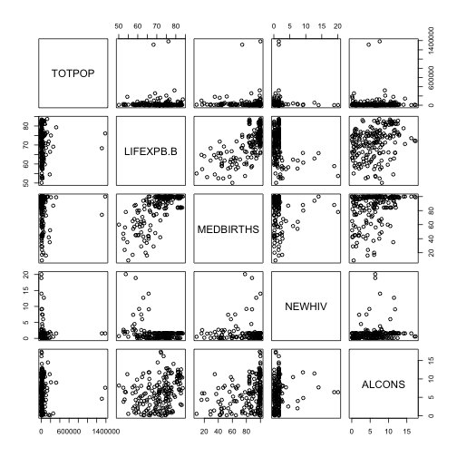
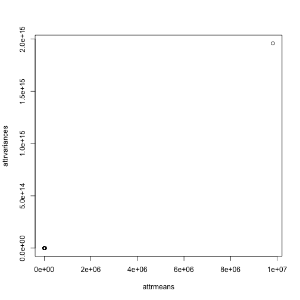
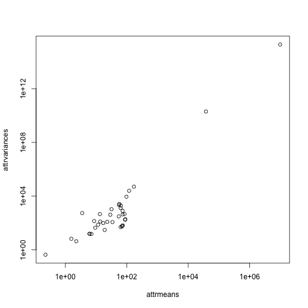
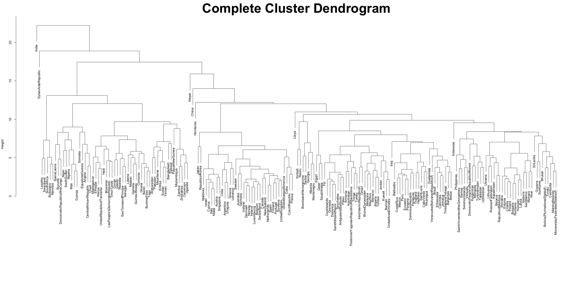
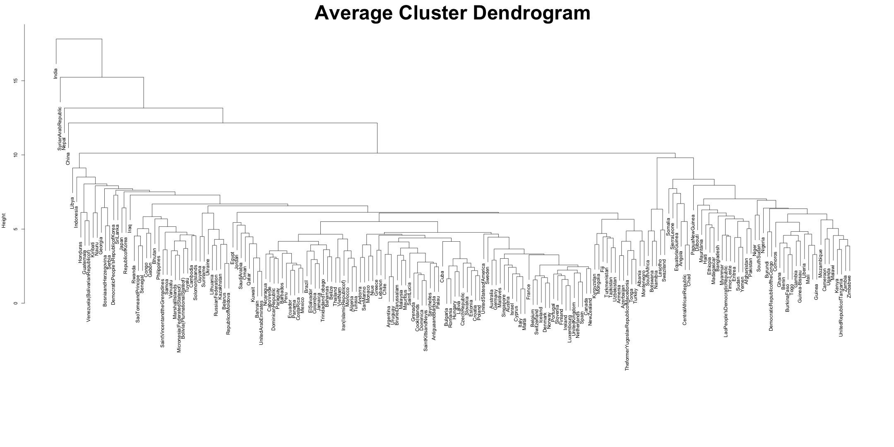
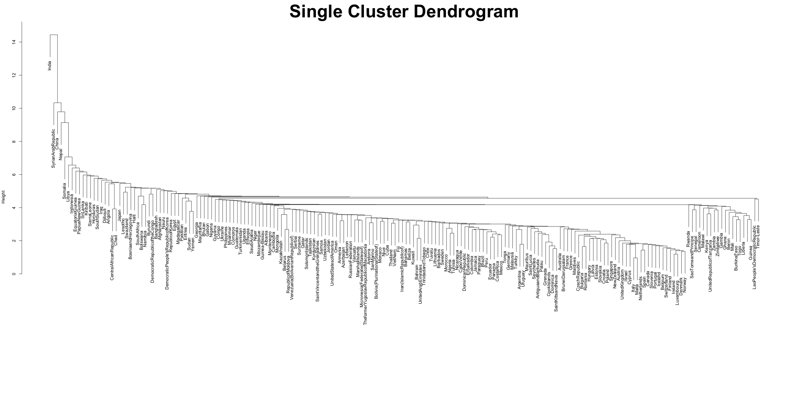
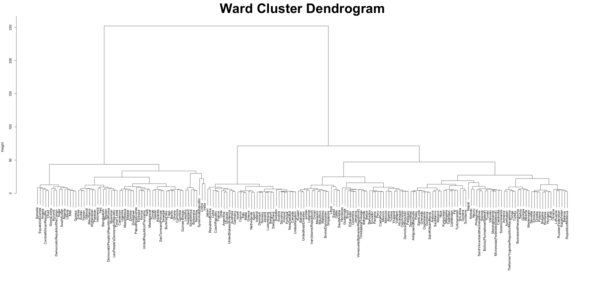
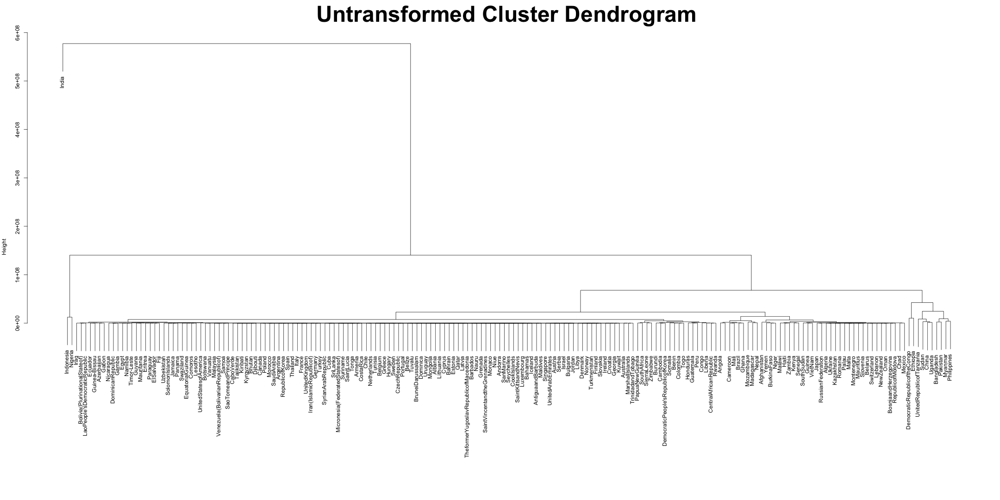
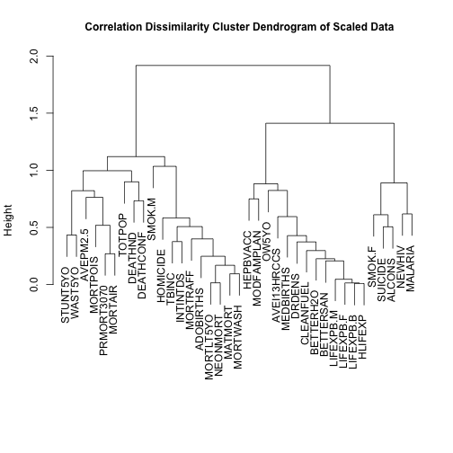
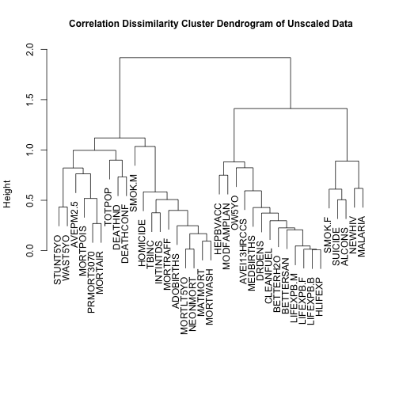

# Preface

In this assignment we will exercise some of the unsupervised learning approaches on [2016 Global Health Observatory data](http://www.who.int/gho/publications/world_health_statistics/2016/en/).  It is available at that website in the form of [Excel file](http://www.who.int/entity/gho/publications/world_health_statistics/2016/whs2016_AnnexB.xls?ua=1), but its cleaned up version ready for import into R for further analyses is available at CSCI E-63C canvas course web site [whs2016_AnnexB-data-wo-NAs.txt](https://canvas.harvard.edu/files/3707370/download?download_frd=1).  The cleaning and reformatting included: merging data from the two parts of Annex B, reducing column headers to one line with short tags, removal of ">", "<" and whitespaces, conversion to numeric format and replacement of undefined values (as indicated by en-dash'es in the Excel) with corresponding averages of those attributes.  The code that was used to format merged data is shown at the end of this document for your reference only.  You are advised to save yourself that trouble and start from preformatted text file available at the course website as shown above.  The explicit mapping of short variable names to their full description as provided in the original file is available in Excel file [whs2016_AnnexB-reformatted.xls](https://canvas.harvard.edu/files/3707368/download?download_frd=1) also available on the course canvas page.  Lastly, you are advised to download a local copy of this text file to your computer and access it there (as opposed to relying on R ability to establish URL connection to canvas that potentially requires login etc.)

Short example of code shown below illustrates reading this data from a local copy on your computer (assuming it has been copied into current working directory of your R session -- `getwd()` and `setwd()` commands are helpful to find out what is it currently and change it to desired location) and displaying summaries and pairs plot of five (out of almost 40) arbitrary chosen variables.  This is done for illustration purposes only -- the problems in the assignment expect use of all variables in this dataset.


```r
whsAnnBdatNum <- read.table("whs2016_AnnexB-data-wo-NAs.txt",sep="\t",header=TRUE,quote="")
summary(whsAnnBdatNum[,c(1,4,7,10,17)])
```

```
##      TOTPOP          LIFEXPB.B       MEDBIRTHS          NEWHIV      
##  Min.   :      2   Min.   :50.10   Min.   :  9.00   Min.   : 0.100  
##  1st Qu.:   1876   1st Qu.:66.03   1st Qu.: 78.50   1st Qu.: 0.300  
##  Median :   8070   Median :72.50   Median : 96.00   Median : 1.563  
##  Mean   :  37696   Mean   :71.29   Mean   : 84.28   Mean   : 1.563  
##  3rd Qu.:  26413   3rd Qu.:76.38   3rd Qu.: 99.00   3rd Qu.: 1.563  
##  Max.   :1383925   Max.   :83.70   Max.   :100.00   Max.   :20.100  
##      ALCONS      
##  Min.   : 0.000  
##  1st Qu.: 2.900  
##  Median : 6.085  
##  Mean   : 6.085  
##  3rd Qu.: 8.700  
##  Max.   :17.400
```

```r
pairs(whsAnnBdatNum[,c(1,4,7,10,17)])
```



In some way this dataset is somewhat similar to the `USArrests` dataset extensively used in ISLR labs and exercises -- it collects various continuous statistics characterizing human population across different territories.  It is several folds larger though -- instead of 50 US states and 4 attributes in `USArrests`, world health statistics (WHS) data characterizes 194 WHO member states by 37 variables.  Have fun!

The following problems are largely modeled after labs and exercises from Chapter 10 ISLR.  If anything presents a challenge, besides asking questions on piazza (that is always a good idea!), you are also encouraged to review corresponding lab sections in ISLR Chapter 10.

# Problem 1: Principal components analysis (PCA) (25 points)

## Sub-problem 1a: means and variances of WHS attributes (5 points)

Compare means and variances of the attributes in the world health statisics dataset -- plot of variance vs. mean is probably the best given number of attributes in the dataset.  Function `apply` allows to apply desired function (e.g. `mean` or `var`) to each row or column in the table.  Do you see all 37 attributes in the plot, or at least most of them?  (Remember that you can use `plot(inpX,inpY,log="xy")` to use log-scale on both horizontal and vertical axes.)  What is the range of means and variances when calculated on untransformed data?  Which are the top two attributes with highest mean or variance?  What are the implications for PCA rendition of this dataset (in two dimensions) if applied to untransformed data?


```r
attrmeans <- apply(whsAnnBdatNum, 2, mean)
attrvariances <- apply(whsAnnBdatNum, 2, var)
plot(attrmeans,attrvariances)
```



```r
plot(attrmeans,attrvariances,log="xy")
```



```r
attrmeans
```

```
##       TOTPOP    LIFEXPB.M    LIFEXPB.F    LIFEXPB.B      HLIFEXP 
## 3.769596e+04 6.887650e+01 7.373497e+01 7.128798e+01 6.280437e+01 
##      MATMORT    MEDBIRTHS    MORTLT5YO     NEONMORT       NEWHIV 
## 1.702376e+02 8.427624e+01 3.183505e+01 1.361598e+01 1.563303e+00 
##        TBINC      MALARIA     HEPBVACC     INTINTDS   PRMORT3070 
## 1.187371e+02 9.696442e+01 8.772283e+01 9.817345e+06 1.901628e+01 
##      SUICIDE       ALCONS     MORTRAFF   MODFAMPLAN    ADOBIRTHS 
## 9.387719e+00 6.085484e+00 1.708942e+01 5.470656e+01 5.554032e+01 
##      MORTAIR     MORTWASH     MORTPOIS       SMOK.M       SMOK.F 
## 6.392500e+01 1.328140e+01 2.261628e+00 3.409766e+01 1.164922e+01 
##       DRDENS  AVEI13HRCCS     STUNT5YO      WAST5YO        OW5YO 
## 5.714431e+01 7.318229e+01 2.315188e+01 6.132824e+00 7.057480e+00 
##    BETTERH2O    BETTERSAN    CLEANFUEL     AVEPM2.5      DEATHND 
## 8.925137e+01 7.307143e+01 6.294271e+01 2.891833e+01 2.245902e-01 
##     HOMICIDE    DEATHCONF 
## 8.659794e+00 3.509302e+00
```

```r
min(attrmeans)
```

```
## [1] 0.2245902
```

```r
max(attrmeans)
```

```
## [1] 9817345
```

```r
min(attrvariances)
```

```
## [1] 0.4330536
```

```r
max(attrvariances)
```

```
## [1] 1.958163e+15
```

```r
names(which.max(attrmeans))
```

```
## [1] "INTINTDS"
```

```r
names(which.max(attrvariances))
```

```
## [1] "INTINTDS"
```

Because the means and variances of different attributes are of different orders of magnitude, their means and variances are as well.  Therefore, only in the plot of transformed means and variances is it possible to make out a majority of them.  The means range from 0.22 to about 9 million, and the variances range from 0.43 to about $2*10^(15)$.

The consequences of this enormous variation in attribute means and variaces for a PCA of the untransformed data is that the principal component loading vectors will be unecessarily orinted toward the attributes with the highest variances.  In this case, this is INTINTDS, which stands for reported number of people requiring interventions against NTDs.


## Sub-problem 1b: PCA on untransformed data (10 points)

Perform PCA on *untransformed* data in WHS dataset (remember, you can use R function `prcomp` for that).  Generate scree plot of PCA results (by calling `plot` on the result of `prcomp`) and plot of the two first principal components using `biplot`.  Which variables seem to predominantly drive the results of PCA when applied to untransformed data?


```r
pr.out <- prcomp(whsAnnBdatNum, scale = FALSE)
plot(pr.out)
biplot(pr.out, scale = 0)
```


Please note that in this case you should expect `biplot` to generate substantial number of warnings.  Usually in R we should pay attention to these and understand whether they indicate that something went wrong in our analyses.  In this particular case they are expected -- why do you think that is?

The reasons that these warnings arise is that the arrows that do not correspond to the first two principal components are comparatively so small that they are computed as zeroes.  Arrows of length zero cannot have direction, leading to the warnings.


The field `rotation` in the output of `prcomp` contains *loadings* of the 1st, 2nd, etc. principal components (PCs) -- that can interpreted as contributions of each of the attributes in the input data to each of the PCs.  What attributes have the largest (by their absolute value) loadings for the first and second principal component?  How does it compare to what you have observed when comparing means and variances of all attributes in the world health statistics dataset?


```r
rownames(pr.out$rotation)[which.max(abs(pr.out$rotation[,1]))]
```

```
## Error in rownames(pr.out$rotation): object 'pr.out' not found
```

```r
rownames(pr.out$rotation)[which.max(abs(pr.out$rotation[,2]))]
```

```
## Error in rownames(pr.out$rotation): object 'pr.out' not found
```

As shown above, the INTINTDS variable has the highest value in the loading vectors of the first principal component of the untranformed attributes, and the TOTALPOP, or total population, has the highest value in the second principal components.  This is consistent with our conclusions from Part 1a because as those variables contributes disproportionately to total variation in the model, the loading vector is most strongly influnced by those variables.

Calculate percentage of variance explained (PVE) by the first five principal components (PCs).  You can find an example of doing this in ISLR Chapter 10.4 (Lab 1 on PCA).


```r
pr.var <- pr.out$sdev^2
```

```
## Error in eval(expr, envir, enclos): object 'pr.out' not found
```

```r
pve <- pr.var/sum(pr.var)
```

```
## Error in eval(expr, envir, enclos): object 'pr.var' not found
```

```r
pve[1:5]
```

```
## Error in eval(expr, envir, enclos): object 'pve' not found
```

Lastly, perform PCA on *transposed* (but still *untransformed*) WHS dataset -- remember that in R `t(x)` returns transpose of `x`:


```r
matrix(1:6,ncol=3)
```

```
##      [,1] [,2] [,3]
## [1,]    1    3    5
## [2,]    2    4    6
```

```r
t(matrix(1:6,ncol=3))
```

```
##      [,1] [,2]
## [1,]    1    2
## [2,]    3    4
## [3,]    5    6
```

Present results of PCA on transposed world health statistics dataset in the form of scree and biplot, describe the results.


```r
pr.out2 <- prcomp(t(whsAnnBdatNum), scale = FALSE)
plot(pr.out2)
biplot(pr.out2, scale = 0)
```

The scree plot continues to show that the first principal component, the one influenced most by INTINTDS, has the largest variance.  The biplot shows that only China has a high score on the second principal component.  This is because China has a large total population and TOTALPOP value, and the second principal component is strongly influenced by TOTALPOP.

## Sub-problem 1c: PCA on scaled WHS data (10 points)

Perform PCA on scaled world health statistics data.  To do that you can either use as input to `prcomp` the output of`scale` as applied to the WHS data matrix or call `prcomp` with parameter `scale` set to `TRUE`.  Present results of PCA in the form of scree plot and plot of the first two principal components.  How do they compare to those generated on the results of PCA of *untransformed* data?  What dataset attributes contribute the most (by absolute value) to the top two PCs?  What are the signs of those contributions?  How would you interpret that?


```r
pr.out3 <- (prcomp(whsAnnBdatNum, scale = TRUE))
pr.out3$rotation[1:2]
plot(pr.out3)
plot(pr.out3$x[,1:2])
biplot(pr.out3, scale = 0)
```

The scree plot is much more balanced.  Although the first principal component still dominates in terms of the proportion of variance explained, the other principle components explain an amount of variance that is now in the same order of magnitude, and therefore are visible in the scree plot.  The biplot shows much more variance along the second princpal component as compared to the first.  This is expected because the process of scaling reduces the discrepancy between the scales upon which the values of different predictors reside.

The output of `biplot` with almost 200 text labels on it is pretty busy and could be tough to read.  You can achieve better control when plotting PCA results if instead you plot the first two columns of the `x` attribute in the output of `prcomp` -- e.g. `plot(prcomp(USArrests,scale=T)$x[,1:2])`.  Use this to label a subset of countries on the plot -- you can use `text` function in R to add labels at specified positions on the plot -- please feel free to choose several countries of your preference and discuss the results.  Alternatively, indicate US, UK, China, India, Mexico, Australia, Israel, Italy, Ireland and Sweden and discuss the results.  Where do the countries you have plotted fall in the graph?  Considering what you found out about contributions of different attributes to the first two PCs, what do their positions tell us about their (dis-)similarities in terms of associated health statistics?


```r
plot(pr.out3$x[c("UnitedStatesofAmerica", "UnitedKingdom", "China", "India", "Mexico", "Australia", "Israel", "Italy", "Ireland", "Sweden"), 1:2])
```

```
## Error in plot(pr.out3$x[c("UnitedStatesofAmerica", "UnitedKingdom", "China", : object 'pr.out3' not found
```

```r
text(pr.out3$x[c("UnitedStatesofAmerica", "UnitedKingdom", "China", "India", "Mexico", "Australia", "Israel", "Italy", "Ireland", "Sweden"), 1:2], labels = c("UnitedStatesofAmerica", "UnitedKingdom", "China", "India", "Mexico", "Australia", "Israel", "Italy", "Ireland", "Sweden"))
```

```
## Error in text(pr.out3$x[c("UnitedStatesofAmerica", "UnitedKingdom", "China", : object 'pr.out3' not found
```

```r
points(pr.out3$x[,1:2])
```

```
## Error in points(pr.out3$x[, 1:2]): object 'pr.out3' not found
```

Most of the countries fall near the principal component two axis.  We can look at the loading vectors for the meaning of these scores in terms of the predictors.  These scores indicate that for most of these countries, we can expect a high life expectancy, low neonatal and under-5 mortality, low levels of adolescent birth, high-quality water, high-quality sanitation, and high clean fuel reliance.  However, India has a very high principal component one score, indicating the opposite patterns.  In addition, Mexico has a very high principal component two score.  Using similar reasoning, we can expect Mexico to have low rates of suicide, low rates of alcohol consumption, high levels of mortality from road traffic, high levels of women receiving family planning, low levels of female smoking, few skilled health professionals, and high homicide rates.

Finally, perform PCA on *transposed* scaled WHS dataset -- present results in the form of scree plot and biplot and discuss these presentations.


```r
pr.out4 <- (prcomp(t(whsAnnBdatNum), scale = TRUE))
plot(pr.out4)
plot(pr.out4$x[,1:2])
biplot(pr.out4, scale = 0)
plot(pr.out4$x[, 1:2])
text(pr.out4$x[, 1:2], labels = rownames(pr.out4$x))
```

The transposed scree plot shows that the first two principal components explain much of the variance in the data.  This is to be expected as the INTINTDS and TOTALPOP, even scaled, vary significantly more than other measured variables.  The biplots confirm this, with the points representing those two variables falling far from the origin and the other points falling very close to it.  


### For *extra 8 points*

Try the following:

* Instead of scaling (or prior to scaling) perform log-transform of the data before passing it on to `prcomp`.  Given that some of the attributes have zero values, you will have to decide how to handle those to avoid negative infinity upon log-transformation.  Usually, a small positive (often a fraction of smallest non-zero value for that attribute) value is added to all (or just zero) values of the attribute that contains zeroes.  Present and describe the results.
* Demonstrate equivalence of the results as obtained by `prcomp(x)` and `cmdscale(dist(x))` where `x` represents scaled WHS dataset.
* Explore use of multidimensional scaling (MDS) tools available in library `MASS` such as `sammon` and `isoMDS`.  Present their results and discuss the differences between them and PCA output.  No, there was nothing on that in the lecture -- thus it is for extra points and to broaden your horizons.


# Problem 2: K-means clustering (15 points)

## Sub-problem 2a: k-means clusters of different size (5 points)

Using function `kmeans` perform K-means clustering on *explicitly scaled* (e.g. `kmeans(scale(x),2)`) world health statistics data for 2, 3 and 4 clusters.  Use `cluster` attribute in the output of `kmeans` to indicate cluster membership by color and/or shape of the corresponding symbols in the plot of the first two principal components generated independently on the same (scaled WHS) data.  E.g. `plot(prcomp(xyz)$x[,1:2],col=kmeans(xyz,4)$cluster)` where `xyz` is input data.  Describe the results.  Which countries are clustered together for each of these choices of $K$?


```r
## for all PCA in this problem, pr.out3 is the PCA that uses scaled, not transposed data.

kmeansset <- list()
for (K in 2:4) {
        kmeansset[[K]] <- kmeans(scale(whsAnnBdatNum), K, nstart = 20)
        plot(pr.out3$x[,1:2], col=kmeansset[[K]]$cluster)
        plot(pr.out3$x[,1:2], col=kmeansset[[K]]$cluster)
        for(i in 1:K) {
                print(paste("Cluster ", i,":", sep = ""))
                print(paste(rownames(pr.out3$x[which(kmeansset[[K]]$cluster == i),]), collapse = ", "))
        }
}
```

```
## Error in plot(pr.out3$x[, 1:2], col = kmeansset[[K]]$cluster): object 'pr.out3' not found
```

## Sub-problem 2b: variability of k-means clustering (5 points)

By default, k-means clustering uses random set of centers as initial guesses of cluster centers.  Here we will explore variability of k-means cluster membership across several such initial random guesses.  To make such choices of random centers reproducible, we will use function `set.seed` to reset random number generator (RNG) used in R to make those initial guesses to known/controlled initial state.

Using the approach defined above, repeat k-means clustering with four clusters three times resetting RNG each time with `set.seed` using seeds of 1, 2 and 3 respectively.  Indicate cluster membership in each of these three trials on the plot of the first two principal components using color and/or shape as described above.  Two fields in the output of `kmeans` -- `tot.withinss` and `betweenss` -- characterize within and between clusters sum-of-squares.  Tighter clustering results are those which have smaller ratio of within to between sum-of-squares.  What are the resulting ratios of within to between sum-of-squares for each of these three k-means clustering results (with random seeds of 1, 2 and 3)?

Please bear in mind that the actual cluster identity is assigned randomly and does not matter -- i.e. if cluster 1 from the first run of `kmeans` (with random seed of 1) and cluster 4 from the run with the random seed of 2 contain the same observations (country/states in case of WHS dataset), they are *the same* clusters.


```r
for (n in c(1, 20)) {
        for (i in 1:3) {
                set.seed(i)
                kmeans.object <- kmeans(scale(whsAnnBdatNum), 4, nstart = n)
                title <- paste("RNG seed is:", i, "and Nstart is", n)
                plot(pr.out3$x[,1:2], col=kmeans.object$cluster, main = title)
                print("Ratio of within to between sum of squares:")
                print(kmeans.object$tot.withinss/kmeans.object$betweenss)
        }
}
```

```
## Error in plot(pr.out3$x[, 1:2], col = kmeans.object$cluster, main = title): object 'pr.out3' not found
```

The effect on increasing nstart to 20 is to make all the plots the same as the first one in which nstart is 1.  This is because each time, the random number generator (RNG) is reset and the K-means algorith is run 20 times.  It happens that the first of these twenty is the reaches an optimal local extremum of the function within the algorithm, which is why it is seen as the first plot in which nstart is 1.  After many iterations of the K-means algorithm, the chances become minute that any other local extrema will be reached.  Equivalence of plots can also be identified by equal within to between sums of squares below equivalent plots.

## Sub-problem 2c: effect of `nstarts` parameter (5 points)

Repeat the procedure implemented for the previous sub-problem (k-means with four clusters for RNG seeds of 1, 2 and 3) now using 100 as `nstart` parameter in the call to `kmeans`.  Represent results graphically as before.  How does cluster membership compare between those three runs now?  What is the ratio of within to between sum-of-squares in each of these three cases?  What is the impact of using higher than 1 (default) value of `nstart`?  What is the ISLR recommendation on this offered in Ch. 10.5.1?


```r
for (i in 1:3) {
        set.seed(i)
        kmeans.object <- kmeans(scale(whsAnnBdatNum), 4, nstart = 100)
        plot(pr.out3$x[,1:2], col=kmeans.object$cluster, main = paste("RNG seed is", i))
        print("Ratio of within to between sum of squares:")
        print(kmeans.object$tot.withinss/kmeans.object$betweenss)
}
```

```
## Error in plot(pr.out3$x[, 1:2], col = kmeans.object$cluster, main = paste("RNG seed is", : object 'pr.out3' not found
```


As already shown in my response to part 2B, a reasonably high number (>20) of nstart results in the correct local extremum being reached, namely the one where the within-between sum of squares ratio is 1.398089.  ISLR recommends an nstart of 20 or 50, or another arbitrarily high number.

### For *extra 8 points*

Try the following:

* evaluate dependency between the stability of k-means clustering and the number of clusters and values of `nstarts`; to make this more quantitative consider using contingency table (i.e. `table`) to quantify concordance of two different clustering results (E.g. how many non-zero cells would be in the output of `table` for two perfectly concordant clustering assignments?)
* Try using `silhouette` from the library `cluster` as another tool for assessing cluster strength for some of the clusters obtained here and describe the results


# Problem 3: Hierarchical clustering (20 points)

## Sub-problem 3a: hierachical clustering by different linkages (10 points)

Cluster country states in (scaled) world health statistics data using default (Euclidean) distance and "complete", "average", "single" and "ward" linkages in the call to `hclust`.  Plot each clustering hierarchy, describe the differences.  For comparison, plot results of clustering *untransformed* WHS data using default parameters (Euclidean distance, "complete" linkage) -- discuss the impact of the scaling on the outcome of hierarchical clustering.


```r
simpleCap <- function(x) {
  s <- strsplit(x, " ")[[1]]
  paste(toupper(substring(s, 1,1)), substring(s, 2),
      sep="", collapse=" ")
}
for (linkage in c("complete", "average", "single", "ward")) {
        plot(hclust(dist(scale(whsAnnBdatNum), method = "euclidean"), method = linkage), main = (paste(simpleCap(linkage), "Cluster Dendrogram", collapse = "")), sub = "", xlab = "", cex.main = 4)
}
```



```
## The "ward" method has been renamed to "ward.D"; note new "ward.D2"
```



```r
UCD <- hclust(dist(whsAnnBdatNum, method = "euclidean"), method = "complete")
plot(UCD, main = "Untransformed Cluster Dendrogram", sub = "", xlab = "", cex.main = 4)
```



The complete hierarchical cluster is the most balanced.  This is because a complete cluster evalutes the disimilarity of clusters based on the dissimiliarty of the most dissimilar two points within the cluster.  The average is somewhat balanced, as it uses the average dissimilarity between points in the two clusters.  The single adds each country on in a nearly stepwise fashion because it uses the dissimilarity between nearest points.  In the untransformed cluster dendrogram, the bottom of the dendrogram is too dense to see the branches clearly because nearly all the variation comes from the most distant point, that of India.  The other variance is much smaller.

## Sub-problem 3b: compare k-means and hierarchical clustering (5 points)

Using function `cutree` on the output of `hclust` determine assignment of the countries in WHS dataset into top four clusters when using Euclidean distance and "complete" linkage.  Use function `table` to compare membership of these clusters to those produced by k-means clustering with four clusters in the Problem 2(c) above.  Discuss the results.


```r
hier4 <- cutree(hclust(dist(scale(whsAnnBdatNum), method = "euclidean"), method = "complete"), 4)
for(i in 1:4) {
        print(paste("Cluster ", i,":", sep = ""))
        print(paste(rownames(whsAnnBdatNum[which(hier4 == i),])), collapse = ", ")
}
```

```
## [1] "Cluster 1:"
##  [1] "Afghanistan"                   "Angola"                       
##  [3] "Bangladesh"                    "Benin"                        
##  [5] "Botswana"                      "BurkinaFaso"                  
##  [7] "Burundi"                       "Cameroon"                     
##  [9] "CentralAfricanRepublic"        "Chad"                         
## [11] "Comoros"                       "Congo"                        
## [13] "C\xf4ted'Ivoire"               "DemocraticRepublicoftheCongo" 
## [15] "Djibouti"                      "EquatorialGuinea"             
## [17] "Eritrea"                       "Ethiopia"                     
## [19] "Gabon"                         "Gambia"                       
## [21] "Ghana"                         "Guinea"                       
## [23] "Guinea-Bissau"                 "Haiti"                        
## [25] "Kenya"                         "LaoPeople'sDemocraticRepublic"
## [27] "Lesotho"                       "Liberia"                      
## [29] "Madagascar"                    "Malawi"                       
## [31] "Mali"                          "Mauritania"                   
## [33] "Mozambique"                    "Myanmar"                      
## [35] "Namibia"                       "Niger"                        
## [37] "Nigeria"                       "Pakistan"                     
## [39] "PapuaNewGuinea"                "Rwanda"                       
## [41] "SaoTomeandPrincipe"            "Senegal"                      
## [43] "SierraLeone"                   "Somalia"                      
## [45] "SouthAfrica"                   "SouthSudan"                   
## [47] "Sudan"                         "Swaziland"                    
## [49] "Timor-Leste"                   "Togo"                         
## [51] "Uganda"                        "UnitedRepublicofTanzania"     
## [53] "Yemen"                         "Zambia"                       
## [55] "Zimbabwe"                     
## [1] "Cluster 2:"
##   [1] "Albania"                             
##   [2] "Algeria"                             
##   [3] "Andorra"                             
##   [4] "AntiguaandBarbuda"                   
##   [5] "Argentina"                           
##   [6] "Armenia"                             
##   [7] "Australia"                           
##   [8] "Austria"                             
##   [9] "Azerbaijan"                          
##  [10] "Bahamas"                             
##  [11] "Bahrain"                             
##  [12] "Barbados"                            
##  [13] "Belarus"                             
##  [14] "Belgium"                             
##  [15] "Belize"                              
##  [16] "Bhutan"                              
##  [17] "Bolivia(PlurinationalStateof)"       
##  [18] "BosniaandHerzegovina"                
##  [19] "Brazil"                              
##  [20] "BruneiDarussalam"                    
##  [21] "Bulgaria"                            
##  [22] "CaboVerde"                           
##  [23] "Cambodia"                            
##  [24] "Canada"                              
##  [25] "Chile"                               
##  [26] "China"                               
##  [27] "Colombia"                            
##  [28] "CookIslands"                         
##  [29] "CostaRica"                           
##  [30] "Croatia"                             
##  [31] "Cuba"                                
##  [32] "Cyprus"                              
##  [33] "CzechRepublic"                       
##  [34] "DemocraticPeople'sRepublicofKorea"   
##  [35] "Denmark"                             
##  [36] "Dominica"                            
##  [37] "DominicanRepublic"                   
##  [38] "Ecuador"                             
##  [39] "Egypt"                               
##  [40] "ElSalvador"                          
##  [41] "Estonia"                             
##  [42] "Fiji"                                
##  [43] "Finland"                             
##  [44] "France"                              
##  [45] "Georgia"                             
##  [46] "Germany"                             
##  [47] "Greece"                              
##  [48] "Grenada"                             
##  [49] "Guatemala"                           
##  [50] "Guyana"                              
##  [51] "Honduras"                            
##  [52] "Hungary"                             
##  [53] "Iceland"                             
##  [54] "Indonesia"                           
##  [55] "Iran(IslamicRepublicof)"             
##  [56] "Iraq"                                
##  [57] "Ireland"                             
##  [58] "Israel"                              
##  [59] "Italy"                               
##  [60] "Jamaica"                             
##  [61] "Japan"                               
##  [62] "Jordan"                              
##  [63] "Kazakhstan"                          
##  [64] "Kiribati"                            
##  [65] "Kuwait"                              
##  [66] "Kyrgyzstan"                          
##  [67] "Latvia"                              
##  [68] "Lebanon"                             
##  [69] "Libya"                               
##  [70] "Lithuania"                           
##  [71] "Luxembourg"                          
##  [72] "Malaysia"                            
##  [73] "Maldives"                            
##  [74] "Malta"                               
##  [75] "MarshallIslands"                     
##  [76] "Mauritius"                           
##  [77] "Mexico"                              
##  [78] "Micronesia(FederatedStatesof)"       
##  [79] "Monaco"                              
##  [80] "Mongolia"                            
##  [81] "Montenegro"                          
##  [82] "Morocco"                             
##  [83] "Nauru"                               
##  [84] "Nepal"                               
##  [85] "Netherlands"                         
##  [86] "NewZealand"                          
##  [87] "Nicaragua"                           
##  [88] "Niue"                                
##  [89] "Norway"                              
##  [90] "Oman"                                
##  [91] "Palau"                               
##  [92] "Panama"                              
##  [93] "Paraguay"                            
##  [94] "Peru"                                
##  [95] "Philippines"                         
##  [96] "Poland"                              
##  [97] "Portugal"                            
##  [98] "Qatar"                               
##  [99] "RepublicofKorea"                     
## [100] "RepublicofMoldova"                   
## [101] "Romania"                             
## [102] "RussianFederation"                   
## [103] "SaintKittsandNevis"                  
## [104] "SaintLucia"                          
## [105] "SaintVincentandtheGrenadines"        
## [106] "Samoa"                               
## [107] "SanMarino"                           
## [108] "SaudiArabia"                         
## [109] "Serbia"                              
## [110] "Seychelles"                          
## [111] "Singapore"                           
## [112] "Slovakia"                            
## [113] "Slovenia"                            
## [114] "SolomonIslands"                      
## [115] "Spain"                               
## [116] "SriLanka"                            
## [117] "Suriname"                            
## [118] "Sweden"                              
## [119] "Switzerland"                         
## [120] "Tajikistan"                          
## [121] "Thailand"                            
## [122] "TheformerYugoslavRepublicofMacedonia"
## [123] "Tonga"                               
## [124] "TrinidadandTobago"                   
## [125] "Tunisia"                             
## [126] "Turkey"                              
## [127] "Turkmenistan"                        
## [128] "Tuvalu"                              
## [129] "Ukraine"                             
## [130] "UnitedArabEmirates"                  
## [131] "UnitedKingdom"                       
## [132] "UnitedStatesofAmerica"               
## [133] "Uruguay"                             
## [134] "Uzbekistan"                          
## [135] "Vanuatu"                             
## [136] "Venezuela(BolivarianRepublicof)"     
## [137] "VietNam"                             
## [1] "Cluster 3:"
## [1] "India"
## [1] "Cluster 4:"
## [1] "SyrianArabRepublic"
```

```r
table(hier4, kmeans.object$cluster)
```

```
##      
## hier4  1  2  3  4
##     1  0 21  0 34
##     2 87  0 46  4
##     3  0  0  0  1
##     4  1  0  0  0
```
As expected, the hierarchical clustering into four subgroups creates two subgroups with only one country each (India and Syria) and two subgroups that together contain the rest of the countries.  This can be seen on the dendrogram, where the highest two merging groups contain only one country each.  The two groups that contain the rest of the countries each contain two of the groups generated by the K-means clustering algorithm, with only 4 countries as exceptions.  To this extent, the results of the two clustering algorithms are in accord.

## Sub-problem 3c: cluster variables by correlation (5 points)

Use (casted as distance) one-complement of Spearman correlation between *attributes* in world health statistics dataset to cluster *attributes* of WHS dataset.  E.g. `hclust(as.dist(1-cor(xyz,method="spearman")))` would cluster columns (as opposed to rows) in the matrix `xyz`.  Plot the results -- which variables tend to cluster together, why do you think that is?  Compare results obtained by this approach for scaled and untransformed WHS dataset?  How do they compare? What do you think is the explanation?


```r
hierCorrel <- hclust(as.dist(1-cor(scale(whsAnnBdatNum),method="spearman")))
plot(hierCorrel, sub = "", cex.main = 1, xlab = "", main = "Correlation Dissimilarity Cluster Dendrogram of Scaled Data")
```



```r
hierCorrelUS <- hclust(as.dist(1-cor(whsAnnBdatNum,method="spearman")))
plot(hierCorrel, sub = "", cex.main = 1, xlab = "", main = "Correlation Dissimilarity Cluster Dendrogram of Unscaled Data")
```



Variables that are of similar attributes, espeically those that have similar units, tend to group together.  The plots are identical because the scale of the measurements does not affect their relative correlations.  Correlation is a relationship that depends on how observations with similar values of variables have similar values of other variables.  It does not depend on the scale of those variables.

### For *extra 4 points*

Use contingency tables to compare cluster memberships for several top clusters across different choices of linkage (e.g. "complete","ward","single") and distance (Euclidean, Manhattan, one-complement of correlation coefficient).  Discuss the results.


# Appendix: pre-processing of WHS data

For your reference only -- the file it generated is already available on course website


```r
whsAnnBdat <- read.table("../data/whs2016_AnnexB-data.txt",sep="\t",header=T,as.is=T,quote="")
dim(whsAnnBdat)
whsAnnBdat <- apply(whsAnnBdat,2,function(x)gsub(">","",gsub("<","",gsub(" ","",x))))
whsAnnBdat <- apply(whsAnnBdat,2,function(x){x[x==rawToChar(as.raw(150))]<-"";x})
rownames(whsAnnBdat) <- whsAnnBdat[,1]
whsAnnBdat <- whsAnnBdat[,-1]
whsAnnBdatNum <- apply(whsAnnBdat,2,as.numeric)
whsAnnBdatNum <- apply(whsAnnBdatNum,2,function(x){x[is.na(x)] <- mean(x,na.rm = TRUE);x})
rownames(whsAnnBdatNum) <- rownames(whsAnnBdat)
write.table(whsAnnBdatNum,"../data/whs2016_AnnexB-data-wo-NAs.txt",quote=F,sep="\t")
```
