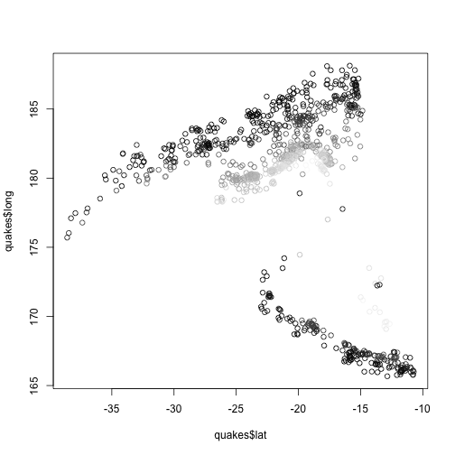
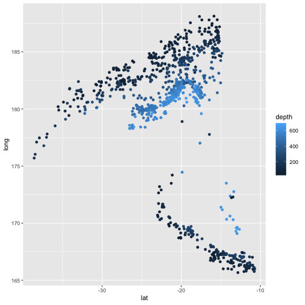
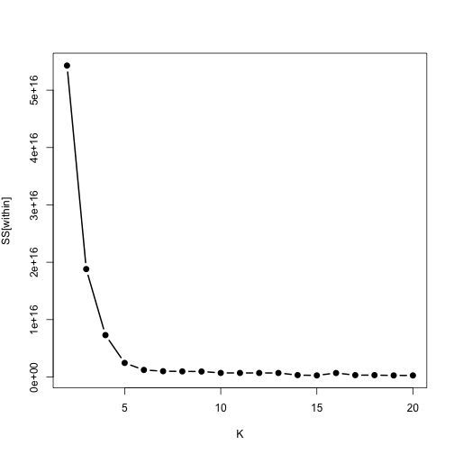
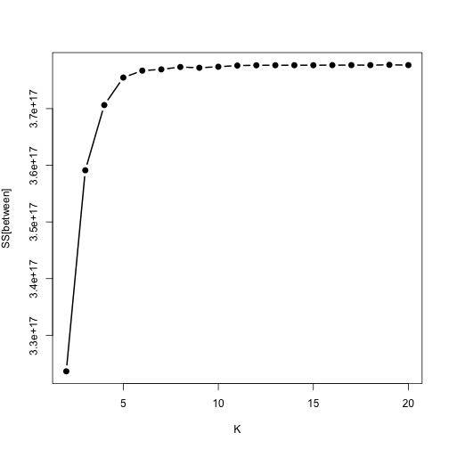
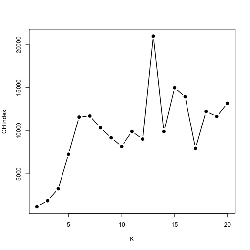
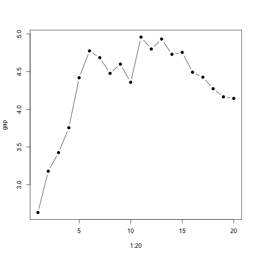
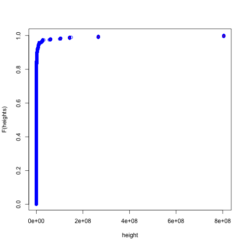

# Preface

In this assignment we will exercise some of the measures for evaluating "goodness of clustering" presented in the lecture this week on the clusters obtained for the World Health Statistics (WHS) dataset from week 6.  Please feel free to adapt/reuse code presented in lecture slides as necessary or implementations already available in R.  All problems in this assignment are expected to be performed on *scaled* WHS data -- if somewhere it does not mention it explicitly, please assume that it is scaled data that should be used. 

Lastly, as a dose of reality check: WHS is a dataset capturing variability of population health measures across more or less the entire diversity of societies in the world -- please be prepared to face the fact that resulting clustering structures are far from textbook perfect, may not be very clearly defined, etc.

## Note on quakes data (and *3 extra points per problem*) 

As you will notice, WHS dataset does not have the most striking cluster structure to it - at least as far as formal measurements of cluster strength that we are working with in this assignment are concerned (or the notion that there is well defined "optimal" number of clusters when split of observations into larger or smaller groups results in "worse" metrics). Not an uncommon situation for the data we have to work with at all.

As an opportunity to see the output of the code that you are using/developing for this assignment when applied to a dataset with more distinct substructure (and earn extra points by doing that)  for each of the five problems there are in this assignment (four required, one for extra points) once you generated required plots for WHS dataset, adding the same kinds of plots but for a standard R dataset "quakes" will be earning *3 extra points* for each problem.  So that if everything works perfectly this could add 15 extra points to the total to this assignment (5 problems including an extra point problem times 3 extra points each) so that along with the extra 5 points problem below, this assignment has potential of adding up to 20 extra points to your homework total.

Dataset "quakes" is routinely available in R upon log in - to "see" it, the following should just work without any further steps for a standard R installation:


```r
clr <- gray((quakes$depth-min(quakes$depth))/range(quakes$depth)%*%c(-1,1))
```

```
## Warning in (quakes$depth - min(quakes$depth))/range(quakes$depth) %*% c(-1, : Recycling array of length 1 in vector-array arithmetic is deprecated.
##   Use c() or as.vector() instead.
```

```r
plot(quakes$lat,quakes$long,col=clr)
```


 
or, similarly, if you are a ggplot fan (in which case you will know to load ggplot2 library first):


```r
ggplot(quakes,aes(x=lat,y=long,colour=depth))+geom_point()
```


 
If you write your code with reusability in mind, applying it to "quakes" should be just a straightforward drop in replacement of WHS data frame with that of "quakes".  You will see that the subclasses of observations are so well defined in "quakes" that is almost boring in its own way.  Nothing is perfect in this world, but you should see more interesting behavior of CH index in this case, for example.


```r
whsAnnBdatNum <- read.table("whs2016_AnnexB-data-wo-NAs.txt",sep="\t",header=TRUE,quote="")
```

# Problem 1: within/between cluster variation and CH-index (15 points)

Present plots of (total) within and between cluster variance provided by K-means clustering on scaled WHS data for 2 through 20 clusters.  Choose large enough value of `nstart` for better stability of the results across multiple trials and evaluate stability of those results across several runs.  Discuss the results and whether the shape of the curves suggest specific number of clusters in the data.


```r
w <- numeric(20)
for (k in 2:20) {
        kf <- kmeans(whsAnnBdatNum, k, nstart = 20)
        w[k] = kf$tot.withinss
}

plot(2:20, w[-1], type = "b", lwd = 2, pch = 19, xlab = "K", ylab = expression("SS[within]"))
```



```r
w <- numeric(20)
for (k in 2:20) {
        kf <- kmeans(whsAnnBdatNum, k, nstart = 500)
        w[k] <- kf$betweenss
}

plot(2:20, w[-1], type = "b", lwd = 2, pch = 19, xlab = "K", ylab = expression("SS[between]"))
```



```r
w <- numeric(20)
for (k in 2:20) {
        kf <- kmeans(whsAnnBdatNum, k, nstart = 20)
        w[k] <- (kf$betweenss/(k-1))/(kf$tot.withinss/(nrow(whsAnnBdatNum)-k))
}

plot(2:20, w[-1], type = "b", lwd = 2, pch = 19, xlab = "K", ylab = "CH index")
```



The within-cluster variance plot and the between-cluster variance plot suggest 3-6 clusters, as it is at those points that the cluster variances appear to level out for increasing values of K.

The CH index plot suggests 6 or 7 clusters, or 17 or 18, as those values show local maxima of the CH index.  It is possible that there are 6 or 7 clusters, each split into about 3 subclusters.  That would explain why there is another local maximum at 17 or 18.


# Problem 2: gap statistics (15 points)

Using code provided in the lecture slides for calculating gap statistics or one of its implementations available in R (e.g. `clusGap` from library `cluster`) compute and plot gap statistics for K-means clustering of scaled WHS data for 2 through 20 clusters.  Discuss whether it indicates presence of clearly defined cluster structure in this data.


```r
lw.unif <- function(m, K, N = 20) {
        w <- numeric(N)
        for (i in 1:N) {
                m.new <- apply(whsAnnBdatNum, 2, function(x) {runif(length(x), min <- min(x), max = max(x))})
                kf <- kmeans(m.new,K)
                w[i] <- kf$tot.withinss
        }
        return(list(LW = mean(log(w)), SE = sd(log(w))/sqrt(N)))
}

gap <- numeric(20)
se <- numeric(20)
for (K in 1:20) {
        kf <- kmeans(whsAnnBdatNum, K, nstart = 500)
        sim <- lw.unif(whsAnnBdatNum, K)
        gap[K] <- sim$LW - log(kf$tot.withinss)
        se[K] <- sim$SE
}
plot(1:20, gap, pch = 19, type = "b")
```



The gap statistic plot shows evidence that there are about 6 clusters, as the gap statistic levels off at this K value.

# Problem 3: stability of hierarchical clustering (15 points)

For top 2, 3 and 4 clusters (as obtained by `cutree` at corresponding levels of `k`) found by Ward method in `hclust` and by K-means when applied to the scaled WHS data compare cluster memberships between these two methods and describe their concordance.  This problem is similar to the one in 6th week assignment, but this time it is *required* to: 1) use two dimensional contingency tables implemented by `table` to compare membership between two assignments of observations to clusters, and 2) programmatically re-order rows and columns in the `table` outcome in the increasing order of observations shared between two clusters (please see examples in lecture slides).


```r
matrix.sort <- function(m) {
        if(nrow(m) != ncol(m)) { stop("Not diagonal")}
        if(is.null(rownames(m))) {rownames(m) <- 1:nrow(matrix)}
        row.max <- apply(m, 1, which.max)
        if(any(table(row.max) != 1)) {
                col.max <- apply(m, 2, which.max)
                if(any(table(col.max) != 1)) {
                        warning("Ties cannot be resolved")
                }
                return(m[, order(col.max)])
        }
        m[order(row.max),]
}

for(i in 2:4) {
        hier <- cutree(hclust(dist(scale(whsAnnBdatNum), method = "euclidean"), method = "ward"), i)
        for(j in 1:i) {
                print(paste("Cluster ",j," of ",i," Clusters:", sep = ""))
                print(paste(rownames(whsAnnBdatNum[which(hier == j),]), collapse = ", "))
        }
        print(matrix.sort(table(Hier = hier, KMeans = kmeans(scale(whsAnnBdatNum), i, nstart = 100)[["cluster"]])))
}
```

```
## The "ward" method has been renamed to "ward.D"; note new "ward.D2"
```

```
## [1] "Cluster 1 of 2 Clusters:"
## [1] "Afghanistan, Angola, Bangladesh, Benin, Bhutan, Botswana, BurkinaFaso, Burundi, Cameroon, CentralAfricanRepublic, Chad, China, Comoros, Congo, C\xf4ted'Ivoire, DemocraticPeople'sRepublicofKorea, DemocraticRepublicoftheCongo, Djibouti, EquatorialGuinea, Eritrea, Ethiopia, Gabon, Gambia, Ghana, Guinea, Guinea-Bissau, Haiti, India, Indonesia, Iraq, Kenya, LaoPeople'sDemocraticRepublic, Lesotho, Liberia, Madagascar, Malawi, Mali, Mauritania, Mozambique, Myanmar, Namibia, Niger, Nigeria, Pakistan, PapuaNewGuinea, Rwanda, SaoTomeandPrincipe, Senegal, SierraLeone, Somalia, SouthAfrica, SouthSudan, Sudan, Swaziland, SyrianArabRepublic, Timor-Leste, Togo, Uganda, UnitedRepublicofTanzania, Yemen, Zambia, Zimbabwe"
## [1] "Cluster 2 of 2 Clusters:"
## [1] "Albania, Algeria, Andorra, AntiguaandBarbuda, Argentina, Armenia, Australia, Austria, Azerbaijan, Bahamas, Bahrain, Barbados, Belarus, Belgium, Belize, Bolivia(PlurinationalStateof), BosniaandHerzegovina, Brazil, BruneiDarussalam, Bulgaria, CaboVerde, Cambodia, Canada, Chile, Colombia, CookIslands, CostaRica, Croatia, Cuba, Cyprus, CzechRepublic, Denmark, Dominica, DominicanRepublic, Ecuador, Egypt, ElSalvador, Estonia, Fiji, Finland, France, Georgia, Germany, Greece, Grenada, Guatemala, Guyana, Honduras, Hungary, Iceland, Iran(IslamicRepublicof), Ireland, Israel, Italy, Jamaica, Japan, Jordan, Kazakhstan, Kiribati, Kuwait, Kyrgyzstan, Latvia, Lebanon, Libya, Lithuania, Luxembourg, Malaysia, Maldives, Malta, MarshallIslands, Mauritius, Mexico, Micronesia(FederatedStatesof), Monaco, Mongolia, Montenegro, Morocco, Nauru, Nepal, Netherlands, NewZealand, Nicaragua, Niue, Norway, Oman, Palau, Panama, Paraguay, Peru, Philippines, Poland, Portugal, Qatar, RepublicofKorea, RepublicofMoldova, Romania, RussianFederation, SaintKittsandNevis, SaintLucia, SaintVincentandtheGrenadines, Samoa, SanMarino, SaudiArabia, Serbia, Seychelles, Singapore, Slovakia, Slovenia, SolomonIslands, Spain, SriLanka, Suriname, Sweden, Switzerland, Tajikistan, Thailand, TheformerYugoslavRepublicofMacedonia, Tonga, TrinidadandTobago, Tunisia, Turkey, Turkmenistan, Tuvalu, Ukraine, UnitedArabEmirates, UnitedKingdom, UnitedStatesofAmerica, Uruguay, Uzbekistan, Vanuatu, Venezuela(BolivarianRepublicof), VietNam"
##     KMeans
## Hier   1   2
##    2 128   4
##    1   7  55
```

```
## The "ward" method has been renamed to "ward.D"; note new "ward.D2"
```

```
## [1] "Cluster 1 of 3 Clusters:"
## [1] "Afghanistan, Angola, Bangladesh, Benin, Bhutan, Botswana, BurkinaFaso, Burundi, Cameroon, CentralAfricanRepublic, Chad, China, Comoros, Congo, C\xf4ted'Ivoire, DemocraticPeople'sRepublicofKorea, DemocraticRepublicoftheCongo, Djibouti, EquatorialGuinea, Eritrea, Ethiopia, Gabon, Gambia, Ghana, Guinea, Guinea-Bissau, Haiti, India, Indonesia, Iraq, Kenya, LaoPeople'sDemocraticRepublic, Lesotho, Liberia, Madagascar, Malawi, Mali, Mauritania, Mozambique, Myanmar, Namibia, Niger, Nigeria, Pakistan, PapuaNewGuinea, Rwanda, SaoTomeandPrincipe, Senegal, SierraLeone, Somalia, SouthAfrica, SouthSudan, Sudan, Swaziland, SyrianArabRepublic, Timor-Leste, Togo, Uganda, UnitedRepublicofTanzania, Yemen, Zambia, Zimbabwe"
## [1] "Cluster 2 of 3 Clusters:"
## [1] "Albania, Algeria, Andorra, AntiguaandBarbuda, Armenia, Azerbaijan, Bahamas, Bahrain, Barbados, Belarus, Belize, Bolivia(PlurinationalStateof), BosniaandHerzegovina, Brazil, BruneiDarussalam, Bulgaria, CaboVerde, Cambodia, Colombia, CookIslands, CostaRica, Croatia, Dominica, DominicanRepublic, Ecuador, Egypt, ElSalvador, Estonia, Fiji, Georgia, Grenada, Guatemala, Guyana, Honduras, Hungary, Iran(IslamicRepublicof), Jamaica, Jordan, Kazakhstan, Kiribati, Kuwait, Kyrgyzstan, Latvia, Lebanon, Libya, Lithuania, Malaysia, Maldives, MarshallIslands, Mauritius, Mexico, Micronesia(FederatedStatesof), Monaco, Mongolia, Montenegro, Morocco, Nauru, Nepal, Nicaragua, Niue, Oman, Palau, Panama, Paraguay, Peru, Philippines, Poland, Qatar, RepublicofMoldova, Romania, RussianFederation, SaintKittsandNevis, SaintLucia, SaintVincentandtheGrenadines, Samoa, SanMarino, SaudiArabia, Serbia, Seychelles, Singapore, Slovakia, SolomonIslands, SriLanka, Suriname, Tajikistan, Thailand, TheformerYugoslavRepublicofMacedonia, Tonga, TrinidadandTobago, Tunisia, Turkey, Turkmenistan, Tuvalu, Ukraine, UnitedArabEmirates, Uzbekistan, Vanuatu, Venezuela(BolivarianRepublicof), VietNam"
## [1] "Cluster 3 of 3 Clusters:"
## [1] "Argentina, Australia, Austria, Belgium, Canada, Chile, Cuba, Cyprus, CzechRepublic, Denmark, Finland, France, Germany, Greece, Iceland, Ireland, Israel, Italy, Japan, Luxembourg, Malta, Netherlands, NewZealand, Norway, Portugal, RepublicofKorea, Slovenia, Spain, Sweden, Switzerland, UnitedKingdom, UnitedStatesofAmerica, Uruguay"
##     KMeans
## Hier  1  2  3
##    1 51  0 11
##    3  0 33  0
##    2  2 18 79
```

```
## The "ward" method has been renamed to "ward.D"; note new "ward.D2"
```

```
## [1] "Cluster 1 of 4 Clusters:"
## [1] "Afghanistan, Angola, Bangladesh, Benin, Bhutan, Botswana, BurkinaFaso, Burundi, Cameroon, CentralAfricanRepublic, Chad, China, Comoros, Congo, C\xf4ted'Ivoire, DemocraticPeople'sRepublicofKorea, DemocraticRepublicoftheCongo, Djibouti, EquatorialGuinea, Eritrea, Ethiopia, Gabon, Gambia, Ghana, Guinea, Guinea-Bissau, Haiti, India, Indonesia, Iraq, Kenya, LaoPeople'sDemocraticRepublic, Lesotho, Liberia, Madagascar, Malawi, Mali, Mauritania, Mozambique, Myanmar, Namibia, Niger, Nigeria, Pakistan, PapuaNewGuinea, Rwanda, SaoTomeandPrincipe, Senegal, SierraLeone, Somalia, SouthAfrica, SouthSudan, Sudan, Swaziland, SyrianArabRepublic, Timor-Leste, Togo, Uganda, UnitedRepublicofTanzania, Yemen, Zambia, Zimbabwe"
## [1] "Cluster 2 of 4 Clusters:"
## [1] "Albania, Andorra, AntiguaandBarbuda, Armenia, Azerbaijan, Belarus, Bolivia(PlurinationalStateof), BosniaandHerzegovina, Bulgaria, Cambodia, CookIslands, Croatia, Dominica, Estonia, Fiji, Georgia, Grenada, Guyana, Hungary, Kazakhstan, Kiribati, Kyrgyzstan, Latvia, Lithuania, MarshallIslands, Micronesia(FederatedStatesof), Monaco, Mongolia, Montenegro, Nauru, Nepal, Niue, Palau, Philippines, Poland, RepublicofMoldova, Romania, RussianFederation, SaintKittsandNevis, SaintLucia, SaintVincentandtheGrenadines, Samoa, SanMarino, Serbia, Seychelles, Slovakia, SolomonIslands, SriLanka, Suriname, Tajikistan, TheformerYugoslavRepublicofMacedonia, Tonga, Turkey, Turkmenistan, Tuvalu, Ukraine, Uzbekistan, Vanuatu"
## [1] "Cluster 3 of 4 Clusters:"
## [1] "Algeria, Bahamas, Bahrain, Barbados, Belize, Brazil, BruneiDarussalam, CaboVerde, Colombia, CostaRica, DominicanRepublic, Ecuador, Egypt, ElSalvador, Guatemala, Honduras, Iran(IslamicRepublicof), Jamaica, Jordan, Kuwait, Lebanon, Libya, Malaysia, Maldives, Mauritius, Mexico, Morocco, Nicaragua, Oman, Panama, Paraguay, Peru, Qatar, SaudiArabia, Singapore, Thailand, TrinidadandTobago, Tunisia, UnitedArabEmirates, Venezuela(BolivarianRepublicof), VietNam"
## [1] "Cluster 4 of 4 Clusters:"
## [1] "Argentina, Australia, Austria, Belgium, Canada, Chile, Cuba, Cyprus, CzechRepublic, Denmark, Finland, France, Germany, Greece, Iceland, Ireland, Israel, Italy, Japan, Luxembourg, Malta, Netherlands, NewZealand, Norway, Portugal, RepublicofKorea, Slovenia, Spain, Sweden, Switzerland, UnitedKingdom, UnitedStatesofAmerica, Uruguay"
```

```
## Warning in matrix.sort(table(Hier = hier, KMeans =
## kmeans(scale(whsAnnBdatNum), : Ties cannot be resolved
```

```
##     KMeans
## Hier  1  3  2  4
##    1 35 21  6  0
##    2  4  0 41 13
##    3  0  0 40  1
##    4  0  0  1 32
```

For K = 2, the two clusters are largely the same, as shown by the fact that most of the observations lie on the diagonal of the contingency table

For K = 3 and K = 4, the clusters are not the same.  However, they are related, as certain clusters using both methods fall entirely within a cluster of the other method.


## For *extra* 5 points: between/within variance in hierarchical clusters

Using functions `between` and `within` provided in the lecture slides calculate between and (total) within cluster variances for top 2 through 20 clusters defined by Ward's hierarchical clustering when applied to scaled WHS data.  Plot the results.  Compare their behavior to that of the same statistics when obtained for K-means clustering above.


# Problem 4: Brute force randomization in hierarchical clustering (15 points)

Compare distribution of the heights of the clusters defined by `hclust` with Ward's clustering of Euclidean distance between countries in scaled WHS dataset and those obtained by applying the same approach to the distances calculated on randomly permuted WHS dataset as illustrated in the lecture slides.  Discuss whether results of such brute force randomization are supportive of presence of unusually close or distant sets of observations within WHS data.


```r
hier <- hclust(dist(whsAnnBdatNum), method = "ward.D2")
ori.heights <- hier$height
rnd.heights <- numeric()
for(i in 1:100) {
        data.rnd <- apply(whsAnnBdatNum, 2, sample)
        hier.rnd <- hclust(dist(data.rnd), method = "ward.D2")
        rnd.heights <- c(rnd.heights, hier.rnd$height)
}
plot(ori.heights, rank(ori.heights)/length(ori.heights), col = "red", xlab = "height", ylab = "F(heights)", pch = 19)
points(rnd.heights, rank(rnd.heights)/length(rnd.heights), col = "blue")
```



As shown by the number of points that deviate substantially from the continuous line on the left, the number of clusters shown by hierarchical clustering is likely to be 5 or 6.
