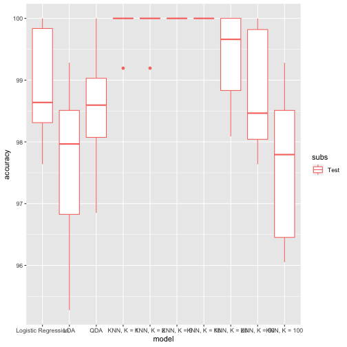
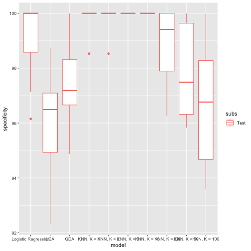
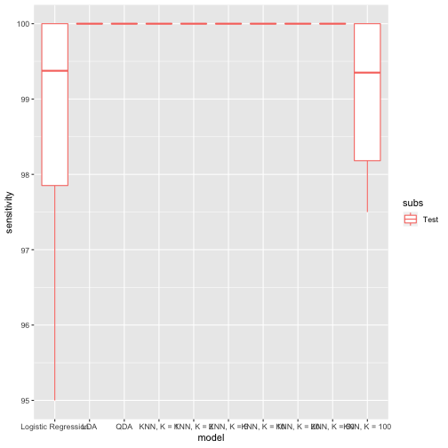

# Preface

For this assignment we will use banknote authentication data (the one we worked with in week 2 assignment) to fit logistics regression model and evaluate performance of LDA, QDA and KNN classifiers.  As we have seen earlier this dataset should allow to predict which banknotes are authentic and which ones are forged fairly well, so we should expect to see low error rates for our classifiers.  Let's see whether some of those tools perform better than others on this data.

# Problem 1 (10 points): logistic regression

Fit logistic regression model of the class attribute using remaining four attributes as predictors in the model.  Produce summary of the model, describe which attributes appear to be significantly associated with the categorical outcome in this model.  Use this model to make predictions on the entire dataset and compare these predictions and corresponding true values of the class attribute using confusion matrix (i.e. contingency table).  Calculate error rate (would this be training or test error in this case?), sensitivity and specificity (assuming that we are predicting class "1").  Describe the results.


```r
banknote.data <- read.table("data_banknote_authentication.txt", sep = ",")
names(banknote.data) <- c("Variance", "Skewness", "Curtosis", "Entropy", "Counterfeit")

glm.fit <- glm(Counterfeit ~ Variance + Skewness + Curtosis + Entropy, data = banknote.data, family = binomial)
```

```
## Warning: glm.fit: fitted probabilities numerically 0 or 1 occurred
```

```r
summary(glm.fit)
```

```
## 
## Call:
## glm(formula = Counterfeit ~ Variance + Skewness + Curtosis + 
##     Entropy, family = binomial, data = banknote.data)
## 
## Deviance Residuals: 
##      Min        1Q    Median        3Q       Max  
## -1.70001   0.00000   0.00000   0.00029   2.24614  
## 
## Coefficients:
##             Estimate Std. Error z value Pr(>|z|)    
## (Intercept)   7.3218     1.5589   4.697 2.64e-06 ***
## Variance     -7.8593     1.7383  -4.521 6.15e-06 ***
## Skewness     -4.1910     0.9041  -4.635 3.56e-06 ***
## Curtosis     -5.2874     1.1612  -4.553 5.28e-06 ***
## Entropy      -0.6053     0.3307  -1.830   0.0672 .  
## ---
## Signif. codes:  0 '***' 0.001 '**' 0.01 '*' 0.05 '.' 0.1 ' ' 1
## 
## (Dispersion parameter for binomial family taken to be 1)
## 
##     Null deviance: 1885.122  on 1371  degrees of freedom
## Residual deviance:   49.891  on 1367  degrees of freedom
## AIC: 59.891
## 
## Number of Fisher Scoring iterations: 12
```

From this fit, it seems that variance, skewness, and curtosis seem to be associated with counterfeit status.


```r
glm.probs <- predict(glm.fit, type = "response")
contrasts(as.factor(banknote.data$Counterfeit))
```

```
##   1
## 0 0
## 1 1
```

```r
## 0 is not counterfeit, 1 is counterfeit
glm.pred <- rep("Not Counterfeit", nrow(banknote.data))
glm.pred[glm.probs > 0.5] <- "Counterfeit"
table(glm.pred, ifelse(banknote.data$Counterfeit == 0, "Not Counterfeit", "Counterfeit"))
```

```
##                  
## glm.pred          Counterfeit Not Counterfeit
##   Counterfeit             604               5
##   Not Counterfeit           6             757
```


```r
sum(is.na(glm.pred), is.na(banknote.data$Counterfeit))
```

```
## [1] 0
```

```r
## There are no NA's - see above

correct <- (glm.pred == ifelse(banknote.data$Counterfeit == 0, "Not Counterfeit", "Counterfeit"))
accuracy <- signif(sum(correct)*100/length(banknote.data$Counterfeit), 3)
cat("Correct predictions (accuracy): ", sum(correct), "(", accuracy, "%)\n", sep = "")
```

```
## Correct predictions (accuracy): 1361(99.2%)
```

```r
## This is training error because we are both training and predicting based on the entire dataset

## TP/FP true/false positives (predicted counterfeit)
## TN/FN true/false positives (predicted not counterfeit)

TP <- sum(banknote.data$Counterfeit == 1 & glm.pred == "Counterfeit")
TN <- sum(banknote.data$Counterfeit == 0 & glm.pred == "Not Counterfeit")
FP <- sum(banknote.data$Counterfeit == 0 & glm.pred == "Counterfeit")
FN <- sum(banknote.data$Counterfeit == 1 & glm.pred == "Not Counterfeit")
P <- TP + FN
N <- TN + FP

cat("TPR (sensitivity) = TP/P: ", signif(100*TP/P, 3), "%\n", sep = "")
```

```
## TPR (sensitivity) = TP/P: 99%
```

```r
cat("TNR (specificity) = TN/N: ", signif(100*TN/N, 3), "%\n", sep = "")
```

```
## TNR (specificity) = TN/N: 99.3%
```

```r
cat("PPV (precision) = TP/(TP+FP): ", signif(100*TP/(TP+FP), 3), "%\n", sep = "")
```

```
## PPV (precision) = TP/(TP+FP): 99.2%
```

```r
cat("FDR (false discovery) = FP/(TP+FP): ", signif(100*FP/(TP+FP), 3), "%\n", sep = "")
```

```
## FDR (false discovery) = FP/(TP+FP): 0.821%
```

```r
cat("FPR = FP/N = 1-TNR: ", signif(100*FP/N, 3), "%\n", sep = "")
```

```
## FPR = FP/N = 1-TNR: 0.656%
```

The logistic regression accurately classifies the banknotes by all the methods of model comparison.  The results of all methods are at or above 99% or below 1%.

# Problem 2 (10 points): LDA and QDA

Using LDA and QDA implementations available in the package `MASS`, calculate confusion matrix, (training) error rate, sensitivity and specificity for each of them.  Compare them to those of logistic regression.


```r
library(MASS)
x <- as.matrix(banknote.data[names(banknote.data) != "Counterfeit"])
y <- banknote.data$Counterfeit
lda.fit <- lda(x,y)
lda.pred <- predict(lda.fit)$class
table(lda.pred, y)
```

```
##         y
## lda.pred   0   1
##        0 730   0
##        1  32 610
```

```r
correct <- (lda.pred == banknote.data$Counterfeit)
accuracy <- signif(sum(correct)*100/length(banknote.data$Counterfeit), 3)
cat("Correct predictions (accuracy): ", sum(correct), "(", accuracy, "%)\n", sep = "")
```

```
## Correct predictions (accuracy): 1340(97.7%)
```

```r
## TP/FP true/false positives (predicted counterfeit)
## TN/FN true/false positives (predicted not counterfeit)

TP <- sum(banknote.data$Counterfeit == 1 & lda.pred == 1)
TN <- sum(banknote.data$Counterfeit == 0 & lda.pred == 0)
FP <- sum(banknote.data$Counterfeit == 0 & lda.pred == 1)
FN <- sum(banknote.data$Counterfeit == 1 & lda.pred == 0)
P <- TP + FN
N <- TN + FP

cat("TPR (sensitivity) = TP/P: ", signif(100*TP/P, 3), "%\n", sep = "")
```

```
## TPR (sensitivity) = TP/P: 100%
```

```r
cat("TNR (specificity) = TN/N: ", signif(100*TN/N, 3), "%\n", sep = "")
```

```
## TNR (specificity) = TN/N: 95.8%
```

```r
cat("PPV (precision) = TP/(TP+FP): ", signif(100*TP/(TP+FP), 3), "%\n", sep = "")
```

```
## PPV (precision) = TP/(TP+FP): 95%
```

```r
cat("FDR (false discovery) = FP/(TP+FP): ", signif(100*FP/(TP+FP), 3), "%\n", sep = "")
```

```
## FDR (false discovery) = FP/(TP+FP): 4.98%
```

```r
cat("FPR = FP/N = 1-TNR: ", signif(100*FP/N, 3), "%\n", sep = "")
```

```
## FPR = FP/N = 1-TNR: 4.2%
```

As shown by the above, the sensitivity is much greater for LDA than logistic, but the specificity and precision suffer.  This means that the model is very uhlikely to miss a counterfeit banknote, but it may count too many as counterfeit.


```r
x <- as.matrix(banknote.data[names(banknote.data) != "Counterfeit"])
y <- banknote.data$Counterfeit
qda.fit <- qda(x,y)
qda.pred <- predict(qda.fit)$class
table(qda.pred, y)
```

```
##         y
## qda.pred   0   1
##        0 742   0
##        1  20 610
```

```r
correct <- (qda.pred == banknote.data$Counterfeit)
accuracy <- signif(sum(correct)*100/length(banknote.data$Counterfeit), 3)
cat("Correct predictions (accuracy): ", sum(correct), "(", accuracy, "%)\n", sep = "")
```

```
## Correct predictions (accuracy): 1352(98.5%)
```

```r
## TP/FP true/false positives (predicted counterfeit)
## TN/FN true/false positives (predicted not counterfeit)

TP <- sum(banknote.data$Counterfeit == 1 & qda.pred == 1)
TN <- sum(banknote.data$Counterfeit == 0 & qda.pred == 0)
FP <- sum(banknote.data$Counterfeit == 0 & qda.pred == 1)
FN <- sum(banknote.data$Counterfeit == 1 & qda.pred == 0)
P <- TP + FN
N <- TN + FP

cat("TPR (sensitivity) = TP/P: ", signif(100*TP/P, 3), "%\n", sep = "")
```

```
## TPR (sensitivity) = TP/P: 100%
```

```r
cat("TNR (specificity) = TN/N: ", signif(100*TN/N, 3), "%\n", sep = "")
```

```
## TNR (specificity) = TN/N: 97.4%
```

```r
cat("PPV (precision) = TP/(TP+FP): ", signif(100*TP/(TP+FP), 3), "%\n", sep = "")
```

```
## PPV (precision) = TP/(TP+FP): 96.8%
```

```r
cat("FDR (false discovery) = FP/(TP+FP): ", signif(100*FP/(TP+FP), 3), "%\n", sep = "")
```

```
## FDR (false discovery) = FP/(TP+FP): 3.17%
```

```r
cat("FPR = FP/N = 1-TNR: ", signif(100*FP/N, 3), "%\n", sep = "")
```

```
## FPR = FP/N = 1-TNR: 2.62%
```

QDA is a better model, as it is more specific and more precise, and its sensitivity does not suffer.  This means that the banknote data boundary is likely not linear, as can be confirmed by the pairwise plots in Homework 2.

# Problem 3 (10 points): KNN


Using `knn` from library `class`, calculate confusion matrix, (training) error rate, sensitivity/specificity for  one and ten nearest neighbors models.  Compare them to corresponding results from LDA, QDA and logistic regression. Describe results of this comparison -- discuss whether it is surprising to see low *training* error for KNN classifier with $k=1$.


```r
library(FNN)

x <- banknote.data[names(banknote.data) != "Counterfeit"]
y <- ifelse(banknote.data$Counterfeit == 0, "Not Counterfeit", "Counterfeit")
knn.preds <- matrix(nrow = length(banknote.data$Counterfeit), ncol = 10)
##print(knn(train = x, test = x, cl = y, k = 5))
for(k in 1:10) {
        knn.preds[,k] <- knn(train = x, test = x, cl = y, k = k)
}
##print(knn.preds)
for(k in 1:10) {
        print(paste("K = ", k, sep = ""))
        predicted <- knn.preds[,k]
        true <- y
        print(table(predicted, true))
}
```

```
## [1] "K = 1"
##          true
## predicted Counterfeit Not Counterfeit
##         1         610               0
##         2           0             762
## [1] "K = 2"
##          true
## predicted Counterfeit Not Counterfeit
##         1         610               1
##         2           0             761
## [1] "K = 3"
##          true
## predicted Counterfeit Not Counterfeit
##         1         610               1
##         2           0             761
## [1] "K = 4"
##          true
## predicted Counterfeit Not Counterfeit
##         1         610               1
##         2           0             761
## [1] "K = 5"
##          true
## predicted Counterfeit Not Counterfeit
##         1         610               0
##         2           0             762
## [1] "K = 6"
##          true
## predicted Counterfeit Not Counterfeit
##         1         610               0
##         2           0             762
## [1] "K = 7"
##          true
## predicted Counterfeit Not Counterfeit
##         1         610               0
##         2           0             762
## [1] "K = 8"
##          true
## predicted Counterfeit Not Counterfeit
##         1         610               0
##         2           0             762
## [1] "K = 9"
##          true
## predicted Counterfeit Not Counterfeit
##         1         610               0
##         2           0             762
## [1] "K = 10"
##          true
## predicted Counterfeit Not Counterfeit
##         1         610               0
##         2           0             762
```

```r
for(k in 1:10) {
        correct <- (knn.preds[,k] == 2 - banknote.data$Counterfeit)
        accuracy <- signif(sum(correct)*100/length(banknote.data$Counterfeit), 3)
        print(paste("Correct predictions with K = ", k, " (accuracy): ", sum(correct), "(", accuracy, "%)\n", sep = ""))
}
```

```
## [1] "Correct predictions with K = 1 (accuracy): 1372(100%)\n"
## [1] "Correct predictions with K = 2 (accuracy): 1371(99.9%)\n"
## [1] "Correct predictions with K = 3 (accuracy): 1371(99.9%)\n"
## [1] "Correct predictions with K = 4 (accuracy): 1371(99.9%)\n"
## [1] "Correct predictions with K = 5 (accuracy): 1372(100%)\n"
## [1] "Correct predictions with K = 6 (accuracy): 1372(100%)\n"
## [1] "Correct predictions with K = 7 (accuracy): 1372(100%)\n"
## [1] "Correct predictions with K = 8 (accuracy): 1372(100%)\n"
## [1] "Correct predictions with K = 9 (accuracy): 1372(100%)\n"
## [1] "Correct predictions with K = 10 (accuracy): 1372(100%)\n"
```

```r
## TP/FP true/false positives (predicted counterfeit)
## TN/FN true/false positives (predicted not counterfeit)

for(k in 1:10) {
        TP <- sum(banknote.data$Counterfeit == 1 & knn.preds[,k] == 1)
        TN <- sum(banknote.data$Counterfeit == 0 & knn.preds[,k] == 2)
        FP <- sum(banknote.data$Counterfeit == 0 & knn.preds[,k] == 1)
        FN <- sum(banknote.data$Counterfeit == 1 & knn.preds[,k] == 2)
        P <- TP + FN
        N <- TN + FP
        
        print(paste("KNN, K = ", k, sep = ""))
        print(paste("TPR (sensitivity) = TP/P, K = ", k, ": ", signif(100*TP/P, 3), "%", sep = ""))
        print(paste("TNR (specificity) = TN/N, K = ", k, ": ", signif(100*TN/N, 3), "%", sep = ""))
        print(paste("PPV (precision) = TP/(TP+FP), K = ", k, ": ", signif(100*TP/(TP+FP), 3), "%", sep = ""))
        print(paste("FDR (false discovery) = FP/(TP+FP), K = ", k, ": ", signif(100*FP/(TP+FP), 3), "%", sep = ""))
        print(paste("FPR = FP/N = 1-TNR, K = ", k, ": ", signif(100*FP/N, 3), "%\n", sep = ""))
        print("")
}
```

```
## [1] "KNN, K = 1"
## [1] "TPR (sensitivity) = TP/P, K = 1: 100%"
## [1] "TNR (specificity) = TN/N, K = 1: 100%"
## [1] "PPV (precision) = TP/(TP+FP), K = 1: 100%"
## [1] "FDR (false discovery) = FP/(TP+FP), K = 1: 0%"
## [1] "FPR = FP/N = 1-TNR, K = 1: 0%\n"
## [1] ""
## [1] "KNN, K = 2"
## [1] "TPR (sensitivity) = TP/P, K = 2: 100%"
## [1] "TNR (specificity) = TN/N, K = 2: 99.9%"
## [1] "PPV (precision) = TP/(TP+FP), K = 2: 99.8%"
## [1] "FDR (false discovery) = FP/(TP+FP), K = 2: 0.164%"
## [1] "FPR = FP/N = 1-TNR, K = 2: 0.131%\n"
## [1] ""
## [1] "KNN, K = 3"
## [1] "TPR (sensitivity) = TP/P, K = 3: 100%"
## [1] "TNR (specificity) = TN/N, K = 3: 99.9%"
## [1] "PPV (precision) = TP/(TP+FP), K = 3: 99.8%"
## [1] "FDR (false discovery) = FP/(TP+FP), K = 3: 0.164%"
## [1] "FPR = FP/N = 1-TNR, K = 3: 0.131%\n"
## [1] ""
## [1] "KNN, K = 4"
## [1] "TPR (sensitivity) = TP/P, K = 4: 100%"
## [1] "TNR (specificity) = TN/N, K = 4: 99.9%"
## [1] "PPV (precision) = TP/(TP+FP), K = 4: 99.8%"
## [1] "FDR (false discovery) = FP/(TP+FP), K = 4: 0.164%"
## [1] "FPR = FP/N = 1-TNR, K = 4: 0.131%\n"
## [1] ""
## [1] "KNN, K = 5"
## [1] "TPR (sensitivity) = TP/P, K = 5: 100%"
## [1] "TNR (specificity) = TN/N, K = 5: 100%"
## [1] "PPV (precision) = TP/(TP+FP), K = 5: 100%"
## [1] "FDR (false discovery) = FP/(TP+FP), K = 5: 0%"
## [1] "FPR = FP/N = 1-TNR, K = 5: 0%\n"
## [1] ""
## [1] "KNN, K = 6"
## [1] "TPR (sensitivity) = TP/P, K = 6: 100%"
## [1] "TNR (specificity) = TN/N, K = 6: 100%"
## [1] "PPV (precision) = TP/(TP+FP), K = 6: 100%"
## [1] "FDR (false discovery) = FP/(TP+FP), K = 6: 0%"
## [1] "FPR = FP/N = 1-TNR, K = 6: 0%\n"
## [1] ""
## [1] "KNN, K = 7"
## [1] "TPR (sensitivity) = TP/P, K = 7: 100%"
## [1] "TNR (specificity) = TN/N, K = 7: 100%"
## [1] "PPV (precision) = TP/(TP+FP), K = 7: 100%"
## [1] "FDR (false discovery) = FP/(TP+FP), K = 7: 0%"
## [1] "FPR = FP/N = 1-TNR, K = 7: 0%\n"
## [1] ""
## [1] "KNN, K = 8"
## [1] "TPR (sensitivity) = TP/P, K = 8: 100%"
## [1] "TNR (specificity) = TN/N, K = 8: 100%"
## [1] "PPV (precision) = TP/(TP+FP), K = 8: 100%"
## [1] "FDR (false discovery) = FP/(TP+FP), K = 8: 0%"
## [1] "FPR = FP/N = 1-TNR, K = 8: 0%\n"
## [1] ""
## [1] "KNN, K = 9"
## [1] "TPR (sensitivity) = TP/P, K = 9: 100%"
## [1] "TNR (specificity) = TN/N, K = 9: 100%"
## [1] "PPV (precision) = TP/(TP+FP), K = 9: 100%"
## [1] "FDR (false discovery) = FP/(TP+FP), K = 9: 0%"
## [1] "FPR = FP/N = 1-TNR, K = 9: 0%\n"
## [1] ""
## [1] "KNN, K = 10"
## [1] "TPR (sensitivity) = TP/P, K = 10: 100%"
## [1] "TNR (specificity) = TN/N, K = 10: 100%"
## [1] "PPV (precision) = TP/(TP+FP), K = 10: 100%"
## [1] "FDR (false discovery) = FP/(TP+FP), K = 10: 0%"
## [1] "FPR = FP/N = 1-TNR, K = 10: 0%\n"
## [1] ""
```

KNN performs much better than the previously considered methods.  This is because it is non-parametric.  Especially for K = 1, the model is infinitely overfit because each training point only considers itself in its classification.


# Problem 4 (30 points): compare test errors of logistic regression, LDA, QDA and KNN

Using resampling approach of your choice (e.g. cross-validation, bootstrap, etc.) obtain test error as well as sensitivity and specificity for each of these methods (logistic regression, LDA, QDA, KNN with $k=1,2,5,10,20,50,100$).  Present results in the form of boxplots, compare test error/sensitivity/specificity across these methods and discuss their relative performance.

K-Fold Cross Validation

```r
set.seed(2)
iFolds <- 10
logit.accuracies <- numeric()
logit.sensitivities <- numeric()
logit.specificities <- numeric()
train <- sample(1:iFolds, nrow(banknote.data), replace = TRUE)
for (iFold in 1:iFolds) {
        glm.fit <- glm(Counterfeit ~ Variance + Skewness + Curtosis + Entropy, data = banknote.data[train != iFold,], family = binomial)
        glm.probs <- predict(glm.fit, newdata = banknote.data[train == iFold,], type = "response")
        glm.pred <- rep("Not Counterfeit", sum(train == iFold))
        glm.pred[glm.probs > 0.5] <- "Counterfeit"

        correct <- (glm.pred == ifelse(banknote.data[train == iFold, "Counterfeit"] == 0, "Not Counterfeit", "Counterfeit"))
        logit.accuracies[iFold] <- sum(correct)*100/length(banknote.data[train == iFold, "Counterfeit"])
        TP <- sum(banknote.data[train == iFold, "Counterfeit"] == 1 & glm.pred == "Counterfeit")
        TN <- sum(banknote.data[train == iFold, "Counterfeit"] == 0 & glm.pred == "Not Counterfeit")
        FP <- sum(banknote.data[train == iFold, "Counterfeit"] == 0 & glm.pred == "Counterfeit")
        FN <- sum(banknote.data[train == iFold, "Counterfeit"] == 1 & glm.pred == "Not Counterfeit")
        P <- TP + FN
        N <- TN + FP
## TP/FP true/false positives (predicted counterfeit)
## TN/FN true/false positives (predicted not counterfeit)

        logit.sensitivities[iFold] <- 100*TP/P
        logit.specificities[iFold] <- 100*TN/N
}
```

```
## Warning: glm.fit: fitted probabilities numerically 0 or 1 occurred

## Warning: glm.fit: fitted probabilities numerically 0 or 1 occurred

## Warning: glm.fit: fitted probabilities numerically 0 or 1 occurred

## Warning: glm.fit: fitted probabilities numerically 0 or 1 occurred

## Warning: glm.fit: fitted probabilities numerically 0 or 1 occurred

## Warning: glm.fit: fitted probabilities numerically 0 or 1 occurred

## Warning: glm.fit: fitted probabilities numerically 0 or 1 occurred

## Warning: glm.fit: fitted probabilities numerically 0 or 1 occurred

## Warning: glm.fit: fitted probabilities numerically 0 or 1 occurred

## Warning: glm.fit: fitted probabilities numerically 0 or 1 occurred
```


```r
set.seed(2)
iFolds <- 10
lda.accuracies <- numeric()
lda.sensitivities <- numeric()
lda.specificities <- numeric()
## same training data used as in logit
for (iFold in 1:iFolds) {

        x <- as.matrix(banknote.data[train != iFold, names(banknote.data) != "Counterfeit"])
        y <- banknote.data[train != iFold, "Counterfeit"]
        actual <- banknote.data[train == iFold, "Counterfeit"]
        lda.fit <- lda(x,y)
        lda.pred <- predict(lda.fit, newdata = banknote.data[train == iFold, names(banknote.data) != "Counterfeit"])$class
        correct <- lda.pred == actual
        lda.accuracies[iFold] <- sum(correct)*100/length(actual)
        TP <- sum(actual == 1 & lda.pred == 1)
        TN <- sum(actual == 0 & lda.pred == 0)
        FP <- sum(actual == 0 & lda.pred == 1)
        FN <- sum(actual == 1 & lda.pred == 0)
        P <- TP + FN
        N <- TN + FP
## TP/FP true/false positives (predicted counterfeit)
## TN/FN true/false positives (predicted not counterfeit)

        lda.sensitivities[iFold] <- 100*TP/P
        lda.specificities[iFold] <- 100*TN/N
}
```


```r
set.seed(2)
iFolds <- 10
qda.accuracies <- numeric()
qda.sensitivities <- numeric()
qda.specificities <- numeric()
## same training data used as in logit
for (iFold in 1:iFolds) {

        x <- as.matrix(banknote.data[train != iFold, names(banknote.data) != "Counterfeit"])
        y <- banknote.data[train != iFold, "Counterfeit"]
        actual <- banknote.data[train == iFold, "Counterfeit"]
        qda.fit <- qda(x,y)
        qda.pred <- predict(qda.fit, newdata = banknote.data[train == iFold, names(banknote.data) != "Counterfeit"])$class

        correct <- qda.pred == actual
        qda.accuracies[iFold] <- sum(correct)*100/length(actual)
        TP <- sum(actual == 1 & qda.pred == 1)
        TN <- sum(actual == 0 & qda.pred == 0)
        FP <- sum(actual == 0 & qda.pred == 1)
        FN <- sum(actual == 1 & qda.pred == 0)
        P <- TP + FN
        N <- TN + FP
## TP/FP true/false positives (predicted counterfeit)
## TN/FN true/false positives (predicted not counterfeit)

        qda.sensitivities[iFold] <- 100*TP/P
        qda.specificities[iFold] <- 100*TN/N
}
```


```r
set.seed(2)
iFolds <- 10
ks <- c(1, 2, 5, 10, 20, 50, 100)
klist <- list()
for (k in ks) {
        knn.accuracies <- numeric()
        knn.sensitivities <- numeric()
        knn.specificities <- numeric()
## same training data used as in logit
        for (iFold in 1:iFolds) {

                x <- banknote.data[train != iFold, names(banknote.data) != "Counterfeit"]
                y <- ifelse(banknote.data[train != iFold, "Counterfeit"] == 0, "Not Counterfeit", "Counterfeit")
                actual <- ifelse(banknote.data[train == iFold, "Counterfeit"] == 0, "Not Counterfeit", "Counterfeit")
                knn.pred <- knn(train = x, test = banknote.data[train == iFold, names(banknote.data) != "Counterfeit"], cl = y, k = k)
                correct <- knn.pred == actual
                knn.accuracies[iFold] <- sum(correct)*100/length(actual)
                TP <- sum(actual == "Counterfeit" & knn.pred == "Counterfeit")
                TN <- sum(actual == "Not Counterfeit" & knn.pred == "Not Counterfeit")
                FP <- sum(actual == "Not Counterfeit" & knn.pred == "Counterfeit")
                FN <- sum(actual == "Counterfeit" & knn.pred == "Not Counterfeit")
                P <- TP + FN
                N <- TN + FP
## TP/FP true/false positives (predicted counterfeit)
## TN/FN true/false positives (predicted not counterfeit)
                knn.sensitivities[iFold] <- 100*TP/P
                knn.specificities[iFold] <- 100*TN/N
             ##   print(knn.accuracies)
                
        
        }
      ##  print(knn.accuracies)
        klist[[as.character(k)]] <- data.frame(accuracy = knn.accuracies, sensitivity = knn.sensitivities, specificity = knn.specificities)
        
     ##   print(klist[["50"]])
}
```


```r
library(ggplot2)
dfTmp <- NULL
list.K.models <- list()
for(k in ks) {
        list.K.models <- c(list.K.models, paste("KNN, K = ", as.character(k), sep = ""))
}
list.models <- c("Logistic Regression", "LDA", "QDA", list.K.models)
for (model in list.models) {
        for(subs in c("Test")) {
                if(model == "Logistic Regression") {
                        accuracy.var <- logit.accuracies
                } else if (model == "LDA") {
                        accuracy.var <- lda.accuracies
                } else if (model == "QDA") {
                        accuracy.var <- qda.accuracies
                } else {
                        ##Extracts number from model
                        kstr <- substring(model, 10, nchar(model))
                        df <- klist[[kstr]]
            ##            print(klist)
                        accuracy.var <- df[["accuracy"]]
                        
                }
                dfTmp <- rbind(dfTmp, data.frame(model = rep(model, length(accuracy.var)), subs = rep(subs, length(accuracy.var)), accuracy = accuracy.var))
        }
}
ggplot(dfTmp,aes(x=model,y=accuracy,colour=subs)) + geom_boxplot()
```



```r
dfTmp <- NULL
for (model in list.models) {
        for(subs in c("Test")) {
                if(model == "Logistic Regression") {
                        specificity.var <- logit.specificities
                        } else if (model == "LDA") {
                        specificity.var <- lda.specificities
                } else if (model == "QDA") {
                        specificity.var <- qda.specificities
                } else {
                        ##Extracts number from model
                        kstr <- substring(model, 10, nchar(model))
                        df <- klist[[kstr]]
            ##            print(klist)
                        specificity.var <- df[["specificity"]]
                        
                }
                dfTmp <- rbind(dfTmp, data.frame(model = rep(model, length(specificity.var)), subs = rep(subs, length(specificity.var)), specificity = specificity.var))
        }
}
ggplot(dfTmp,aes(x=model,y=specificity,colour=subs)) + geom_boxplot()
```



```r
dfTmp <- NULL
for (model in list.models) {
        for(subs in c("Test")) {
                if(model == "Logistic Regression") {
                        sensitivity.var <- logit.sensitivities
                } else if (model == "LDA") {
                        sensitivity.var <- lda.sensitivities
                } else if (model == "QDA") {
                        sensitivity.var <- qda.sensitivities
                } else {
                        ##Extracts number from model
                        kstr <- substring(model, 10, nchar(model))
                        df <- klist[[kstr]]
            ##            print(klist)
                        sensitivity.var <- df[["sensitivity"]]
                        
                }
                dfTmp <- rbind(dfTmp, data.frame(model = rep(model, length(sensitivity.var)), subs = rep(subs, length(sensitivity.var)), sensitivity = sensitivity.var))
        }
}
ggplot(dfTmp,aes(x=model,y=sensitivity,colour=subs)) + geom_boxplot()
```




The QDA performs better than the LDA on multiple metrics, incidating that the true Bayes decision boundary is not straight.  This confirms what we found in part 2.  In addition, the higher values of K in KNN perform worse.  At these high values of K, the model likely has very high bias, and underfits the data.  As expected from theory, KNN at K = 1 performs perfectly.

# Extra 10 points problem: naive Bayes classifier

Fit naive Bayes classifier (see lecture slides for examples of using `naiveBayes` function from package `e1071`) on banknote authentication dataset and assess its performance on test data by resampling along with logistic regression, LDA, QDA and KNN in Problem 4 above.  In other words, add naive Bayes to the rest of the methods evaluated above. 
