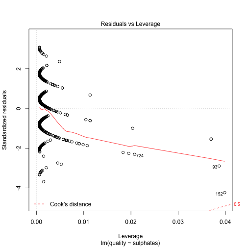
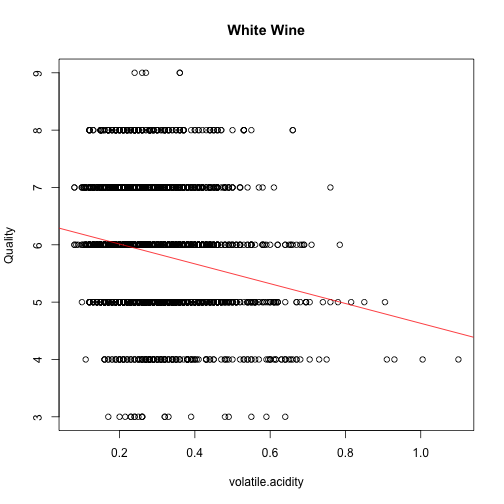
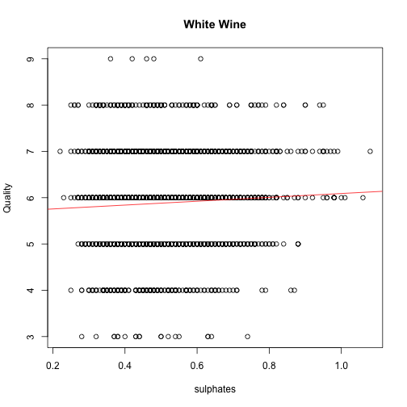
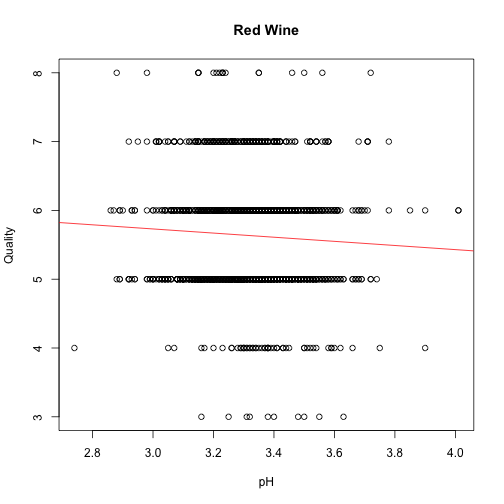

# Introduction

The goal of midterm is to apply some of the methods for supervised and unsupervised analysis to a new dataset.  We will work with data characterizing the relationship between wine quality and its analytical characteristics [available at UCI ML repository](https://archive.ics.uci.edu/ml/datasets/Wine+Quality) as well as in this course website on canvas.  The overall goal will be to use data modeling approaches to understand which wine properties influence the most wine quality as determined by expert evaluation.  The output variable in this case assigns wine to discrete categories between 0 (the worst) and 10 (the best), so that this problem can be formulated as classification or regression -- here we will stick to the latter and treat/model outcome as continuous variable.  For more details please see [dataset description available at UCI ML](https://archive.ics.uci.edu/ml/machine-learning-databases/wine-quality/winequality.names) or corresponding file in this course website on canvas.  Please note that there is another, much smaller, dataset on UCI ML also characterizing wine in terms of its analytical properties -- make sure to use correct URL as shown above, or, to eliminate possibility for ambiguity, the data available on the course website in canvas -- the correct dataset contains several thousand observations. For simplicity, clarity and to decrease your dependency on the network reliability and UCI ML availability you are advised to download data made available in this course website to your local folder and work with this local copy.

There are two compilations of data available under the URL shown above as well as in the course website in canvas -- separate for red and for white wine -- please develop models of wine quality for each of them, investigate attributes deemed important for wine quality in both and determine whether quality of red and white wine is influenced predominantly by the same or different analytical properties (i.e. predictors in these datasets).  Lastly, as an exercise in unsupervised learning you will be asked to combine analytical data for red and white wine and describe the structure of the resulting data -- whether there are any well defined clusters, what subsets of observations they appear to represent, which attributes seem to affect the most this structure in the data, etc.

Finally, as you will notice, the instructions here are terser than in the previous homework assignments. We expect that you use what you've learned in the class to complete the analysis and draw appropriate conclusions based on the data.  All approaches that you are expected to apply here have been exercised in the preceeding weekly assignments -- please feel free to consult your submissions and/or official solutions as to how they have applied to different datasets.  As always, if something appears to be unclear, please ask questions -- we may change to private mode those that in our opinion reveal too many details as we see fit.

# Sub-problem 1: load and summarize the data (20 points)

Download and read in the data, produce numerical and graphical summaries of the dataset attributes, decide whether they can be used
for modeling in untransformed form or any transformations are justified, comment on correlation structure and whether some of the predictors suggest relationship with the outcome.


```r
## White wine data - WW means White Wine
WWdata <- read.table("winequality-white.csv", sep=";", header = TRUE)
## Red wine data - RW means Red Wine
RWdata <- read.table("winequality-red.csv", sep=";", header = TRUE) 
```


```r
summary(WWdata)
```

```
##  fixed.acidity    volatile.acidity  citric.acid     residual.sugar  
##  Min.   : 3.800   Min.   :0.0800   Min.   :0.0000   Min.   : 0.600  
##  1st Qu.: 6.300   1st Qu.:0.2100   1st Qu.:0.2700   1st Qu.: 1.700  
##  Median : 6.800   Median :0.2600   Median :0.3200   Median : 5.200  
##  Mean   : 6.855   Mean   :0.2782   Mean   :0.3342   Mean   : 6.391  
##  3rd Qu.: 7.300   3rd Qu.:0.3200   3rd Qu.:0.3900   3rd Qu.: 9.900  
##  Max.   :14.200   Max.   :1.1000   Max.   :1.6600   Max.   :65.800  
##    chlorides       free.sulfur.dioxide total.sulfur.dioxide
##  Min.   :0.00900   Min.   :  2.00      Min.   :  9.0       
##  1st Qu.:0.03600   1st Qu.: 23.00      1st Qu.:108.0       
##  Median :0.04300   Median : 34.00      Median :134.0       
##  Mean   :0.04577   Mean   : 35.31      Mean   :138.4       
##  3rd Qu.:0.05000   3rd Qu.: 46.00      3rd Qu.:167.0       
##  Max.   :0.34600   Max.   :289.00      Max.   :440.0       
##     density             pH          sulphates         alcohol     
##  Min.   :0.9871   Min.   :2.720   Min.   :0.2200   Min.   : 8.00  
##  1st Qu.:0.9917   1st Qu.:3.090   1st Qu.:0.4100   1st Qu.: 9.50  
##  Median :0.9937   Median :3.180   Median :0.4700   Median :10.40  
##  Mean   :0.9940   Mean   :3.188   Mean   :0.4898   Mean   :10.51  
##  3rd Qu.:0.9961   3rd Qu.:3.280   3rd Qu.:0.5500   3rd Qu.:11.40  
##  Max.   :1.0390   Max.   :3.820   Max.   :1.0800   Max.   :14.20  
##     quality     
##  Min.   :3.000  
##  1st Qu.:5.000  
##  Median :6.000  
##  Mean   :5.878  
##  3rd Qu.:6.000  
##  Max.   :9.000
```

```r
summary(RWdata)
```

```
##  fixed.acidity   volatile.acidity  citric.acid    residual.sugar  
##  Min.   : 4.60   Min.   :0.1200   Min.   :0.000   Min.   : 0.900  
##  1st Qu.: 7.10   1st Qu.:0.3900   1st Qu.:0.090   1st Qu.: 1.900  
##  Median : 7.90   Median :0.5200   Median :0.260   Median : 2.200  
##  Mean   : 8.32   Mean   :0.5278   Mean   :0.271   Mean   : 2.539  
##  3rd Qu.: 9.20   3rd Qu.:0.6400   3rd Qu.:0.420   3rd Qu.: 2.600  
##  Max.   :15.90   Max.   :1.5800   Max.   :1.000   Max.   :15.500  
##    chlorides       free.sulfur.dioxide total.sulfur.dioxide
##  Min.   :0.01200   Min.   : 1.00       Min.   :  6.00      
##  1st Qu.:0.07000   1st Qu.: 7.00       1st Qu.: 22.00      
##  Median :0.07900   Median :14.00       Median : 38.00      
##  Mean   :0.08747   Mean   :15.87       Mean   : 46.47      
##  3rd Qu.:0.09000   3rd Qu.:21.00       3rd Qu.: 62.00      
##  Max.   :0.61100   Max.   :72.00       Max.   :289.00      
##     density             pH          sulphates         alcohol     
##  Min.   :0.9901   Min.   :2.740   Min.   :0.3300   Min.   : 8.40  
##  1st Qu.:0.9956   1st Qu.:3.210   1st Qu.:0.5500   1st Qu.: 9.50  
##  Median :0.9968   Median :3.310   Median :0.6200   Median :10.20  
##  Mean   :0.9967   Mean   :3.311   Mean   :0.6581   Mean   :10.42  
##  3rd Qu.:0.9978   3rd Qu.:3.400   3rd Qu.:0.7300   3rd Qu.:11.10  
##  Max.   :1.0037   Max.   :4.010   Max.   :2.0000   Max.   :14.90  
##     quality     
##  Min.   :3.000  
##  1st Qu.:5.000  
##  Median :6.000  
##  Mean   :5.636  
##  3rd Qu.:6.000  
##  Max.   :8.000
```

To determine whether a log transform is justified, we first observe which of the predictors are correlated with the response.


```r
cor(WWdata, y = WWdata$quality, method = "pearson")
```

```
##                              [,1]
## fixed.acidity        -0.113662831
## volatile.acidity     -0.194722969
## citric.acid          -0.009209091
## residual.sugar       -0.097576829
## chlorides            -0.209934411
## free.sulfur.dioxide   0.008158067
## total.sulfur.dioxide -0.174737218
## density              -0.307123313
## pH                    0.099427246
## sulphates             0.053677877
## alcohol               0.435574715
## quality               1.000000000
```

```r
cor(WWdata, y = WWdata$quality, method = "spearman")
```

```
##                             [,1]
## fixed.acidity        -0.08448545
## volatile.acidity     -0.19656168
## citric.acid           0.01833273
## residual.sugar       -0.08206979
## chlorides            -0.31448848
## free.sulfur.dioxide   0.02371338
## total.sulfur.dioxide -0.19668029
## density              -0.34835102
## pH                    0.10936208
## sulphates             0.03331897
## alcohol               0.44036918
## quality               1.00000000
```

```r
cor(RWdata, y = RWdata$quality, method = "pearson")
```

```
##                             [,1]
## fixed.acidity         0.12405165
## volatile.acidity     -0.39055778
## citric.acid           0.22637251
## residual.sugar        0.01373164
## chlorides            -0.12890656
## free.sulfur.dioxide  -0.05065606
## total.sulfur.dioxide -0.18510029
## density              -0.17491923
## pH                   -0.05773139
## sulphates             0.25139708
## alcohol               0.47616632
## quality               1.00000000
```

```r
cor(RWdata, y = RWdata$quality, method = "spearman")
```

```
##                             [,1]
## fixed.acidity         0.11408367
## volatile.acidity     -0.38064651
## citric.acid           0.21348091
## residual.sugar        0.03204817
## chlorides            -0.18992234
## free.sulfur.dioxide  -0.05690065
## total.sulfur.dioxide -0.19673508
## density              -0.17707407
## pH                   -0.04367193
## sulphates             0.37706020
## alcohol               0.47853169
## quality               1.00000000
```

According to the list of predictor-response correlations for white wine using Pearson and Spearman correlations, alcohol and density are the most correlated with quality.  According the the list of predictor-response correlations for red wine using Pearson and Spearman correlations, alcohol and volitile acidity, and sulphates in the Spearman correlation, are most correlated with quality.


```r
## White wine
lmWAlcohol <- lm(quality ~ alcohol, WWdata)
lmWDensity <- lm(quality ~ density, WWdata)
## Red wine
lmRAlcohol <- lm(quality ~ alcohol, RWdata)
lmRVA <- lm(quality ~ volatile.acidity, RWdata)
lmRSulphates <- lm(quality ~ sulphates, RWdata)
```

For reference and general inspection, the plots of the most relevant predictors are below:


```r
plot(WWdata$alcohol, WWdata$quality, ylab = "Quality", xlab = "Alcohol Content", main = "White Wine")
abline(lmWAlcohol, col = "red")
```


```r
plot(WWdata$density, WWdata$quality, ylab = "Quality", xlab = "Density", main = "White Wine")
abline(lmWDensity, col = "red")
```


```r
plot(RWdata$alcohol, RWdata$quality, ylab = "Quality", xlab = "Alcohol Content", main = "Red Wine")
abline(lmRAlcohol, col = "red")
```


```r
plot(RWdata$volatile.acidity, RWdata$quality, ylab = "Quality", xlab = "Volatile Acidity", main = "Red Wine")
abline(lmRVA, col = "red")
```


```r
plot(RWdata$sulphates, RWdata$quality, ylab = "Quality", xlab = "Sulphates", main = "Red Wine")
abline(lmRSulphates, col = "red")
```


In the plot of quality to density in white wine, there are two major outliers, which must be removed:


```r
WWdata <- WWdata[WWdata$density < 1.01,]
lmWDensity <- lm(quality ~ density, WWdata)

plot(WWdata$density, WWdata$quality, ylab = "Quality", xlab = "Density", main = "White Wine with Outliers Removed")
abline(lmWDensity, col = "red")
```


Also following is the plot of quality to alcohol in white wine with outliers previously removed:


```r
plot(WWdata$alcohol, WWdata$quality, ylab = "Quality", xlab = "Alcohol Content", main = "White Wine with Outliers Removed")
abline(lmWAlcohol, col = "red")
```


Now we must use diagnostic plots for each linear model to determine whether a log transformation is needed.  Note that quality does not need a log transformation because it is on a 1-10 scale.


```r
plot(lmWAlcohol)
```


```r
plot(lmWDensity)
```


```r
plot(lmRAlcohol)
```


```r
plot(lmRVA)
```


```r
plot(lmRSulphates)
```



From the residuals vs. fitted values plots for each linear model, there is no characteristic exponential curve that would be better modeled with a log transformation.  Further, looking at the nature of the predictors and what they represent, one might also hypothesize that their values fall within a small range.  This would make log models unnecessary, as logarithmic curves are approximately linear for small changes in the predictor far from the origin.  The small range can be confirmed by summaries of the relevant predictors:


```r
summary(WWdata$alcohol)
```

```
##    Min. 1st Qu.  Median    Mean 3rd Qu.    Max. 
##    8.00    9.50   10.40   10.51   11.40   14.20
```

```r
summary(WWdata$density)
```

```
##    Min. 1st Qu.  Median    Mean 3rd Qu.    Max. 
##  0.9871  0.9917  0.9937  0.9940  0.9961  1.0030
```

```r
summary(RWdata$alcohol)
```

```
##    Min. 1st Qu.  Median    Mean 3rd Qu.    Max. 
##    8.40    9.50   10.20   10.42   11.10   14.90
```

```r
summary(RWdata$volatile.acidity)
```

```
##    Min. 1st Qu.  Median    Mean 3rd Qu.    Max. 
##  0.1200  0.3900  0.5200  0.5278  0.6400  1.5800
```

```r
summary(RWdata$sulphates)
```

```
##    Min. 1st Qu.  Median    Mean 3rd Qu.    Max. 
##  0.3300  0.5500  0.6200  0.6581  0.7300  2.0000
```

Especially for density and sulphates, the range of values is small compared the values themselves, further providing evidence against transformation.

In order to determine whether certain predictors are correlated with each other, we use pairwise plots.  As there are too many predictors to create the plots in the same grid, we first use common sense to guess which ones might be correlated, and test those first.  Good candidates would be fixed acidity, volitile acidity, citric acid, and pH, because they are all related to acid.

To test that hypothesis, we create pairwise plots for those four predictors.


```r
pairs(WWdata[,c("fixed.acidity", "volatile.acidity", "citric.acid", "pH")])
```


```r
pairs(RWdata[,c("fixed.acidity", "volatile.acidity", "citric.acid", "pH")])
```


From these plots, it seems that all of the predictors related to acid except for volatile acid are very correlated.  This can be confirmed by the correlation matrix:


```r
cor(WWdata[,c("fixed.acidity", "volatile.acidity", "citric.acid", "pH")])
```

```
##                  fixed.acidity volatile.acidity citric.acid         pH
## fixed.acidity       1.00000000      -0.02464598   0.2891867 -0.4263074
## volatile.acidity   -0.02464598       1.00000000  -0.1532523 -0.0338908
## citric.acid         0.28918665      -0.15325232   1.0000000 -0.1645137
## pH                 -0.42630738      -0.03389080  -0.1645137  1.0000000
```

```r
cor(RWdata[,c("fixed.acidity", "volatile.acidity", "citric.acid", "pH")])
```

```
##                  fixed.acidity volatile.acidity citric.acid         pH
## fixed.acidity        1.0000000       -0.2561309   0.6717034 -0.6829782
## volatile.acidity    -0.2561309        1.0000000  -0.5524957  0.2349373
## citric.acid          0.6717034       -0.5524957   1.0000000 -0.5419041
## pH                  -0.6829782        0.2349373  -0.5419041  1.0000000
```

Since three of the acid-related predictors are strongly correlated, for the larger pairwise plot, we do not include fixed acidity or citric acid.


```r
pairs(WWdata[!(names(WWdata) %in% c("fixed.acidity", "citric.acid"))])
```


```r
pairs(RWdata[!(names(WWdata) %in% c("fixed.acidity", "citric.acid"))])
```


From this pairwise plot, we also see that density and residual sugars are highly correlated in white wine.

All of these correlations can be confirmed by a correlation matrix containing all the predictors and the response.


```r
cor(WWdata, method = "pearson")
```

```
##                      fixed.acidity volatile.acidity  citric.acid
## fixed.acidity           1.00000000     -0.024645976  0.289186651
## volatile.acidity       -0.02464598      1.000000000 -0.153252322
## citric.acid             0.28918665     -0.153252322  1.000000000
## residual.sugar          0.08550699      0.048092185  0.091678442
## chlorides               0.02263685      0.068988768  0.113928119
## free.sulfur.dioxide    -0.04905376     -0.095256364  0.094869786
## total.sulfur.dioxide    0.09056184      0.088808937  0.121151543
## density                 0.26714861      0.005231682  0.148212985
## pH                     -0.42630738     -0.033890797 -0.164513742
## sulphates              -0.01707335     -0.038168959  0.061432002
## alcohol                -0.12050898      0.067025016 -0.076493931
## quality                -0.11381510     -0.195886513 -0.009250724
##                      residual.sugar   chlorides free.sulfur.dioxide
## fixed.acidity            0.08550699  0.02263685       -0.0490537642
## volatile.acidity         0.04809218  0.06898877       -0.0952563642
## citric.acid              0.09167844  0.11392812        0.0948697860
## residual.sugar           1.00000000  0.08660424        0.3090044290
## chlorides                0.08660424  1.00000000        0.1018650447
## free.sulfur.dioxide      0.30900443  0.10186504        1.0000000000
## total.sulfur.dioxide     0.40631641  0.19873155        0.6159518920
## density                  0.83208877  0.26025050        0.3083750130
## pH                      -0.20071694 -0.09079301       -0.0001816423
## sulphates               -0.02948739  0.01644167        0.0598310348
## alcohol                 -0.45916539 -0.36050116       -0.2499870594
## quality                 -0.10011424 -0.21003118        0.0082065266
##                      total.sulfur.dioxide      density            pH
## fixed.acidity                 0.090561835  0.267148611 -0.4263073763
## volatile.acidity              0.088808937  0.005231682 -0.0338907970
## citric.acid                   0.121151543  0.148212985 -0.1645137419
## residual.sugar                0.406316408  0.832088774 -0.2007169380
## chlorides                     0.198731555  0.260250497 -0.0907930113
## free.sulfur.dioxide           0.615951892  0.308375013 -0.0001816423
## total.sulfur.dioxide          1.000000000  0.542482273  0.0022745160
## density                       0.542482273  1.000000000 -0.1001078135
## pH                            0.002274516 -0.100107813  1.0000000000
## sulphates                     0.134821217  0.073456645  0.1554820482
## alcohol                      -0.448792484 -0.804151757  0.1211082648
## quality                      -0.174835130 -0.317232428  0.0994238953
##                        sulphates     alcohol      quality
## fixed.acidity        -0.01707335 -0.12050898 -0.113815100
## volatile.acidity     -0.03816896  0.06702502 -0.195886513
## citric.acid           0.06143200 -0.07649393 -0.009250724
## residual.sugar       -0.02948739 -0.45916539 -0.100114240
## chlorides             0.01644167 -0.36050116 -0.210031177
## free.sulfur.dioxide   0.05983103 -0.24998706  0.008206527
## total.sulfur.dioxide  0.13482122 -0.44879248 -0.174835130
## density               0.07345665 -0.80415176 -0.317232428
## pH                    0.15548205  0.12110826  0.099423895
## sulphates             1.00000000 -0.01834369  0.053710048
## alcohol              -0.01834369  1.00000000  0.435842693
## quality               0.05371005  0.43584269  1.000000000
```

```r
cor(WWdata, method = "spearman")
```

```
##                      fixed.acidity volatile.acidity citric.acid
## fixed.acidity           1.00000000     -0.043906659  0.29803533
## volatile.acidity       -0.04390666      1.000000000 -0.15081676
## citric.acid             0.29803533     -0.150816764  1.00000000
## residual.sugar          0.10551030      0.107529157  0.02454761
## chlorides               0.09379970     -0.005970360  0.03248244
## free.sulfur.dioxide    -0.02412968     -0.080695631  0.08896484
## total.sulfur.dioxide    0.11201059      0.117065733  0.09332759
## density                 0.26903127      0.008879049  0.09145400
## pH                     -0.41888065     -0.045636964 -0.14684071
## sulphates              -0.01295423     -0.016990227  0.07900879
## alcohol                -0.10636932      0.034207161 -0.03000263
## quality                -0.08469467     -0.196846417  0.01827898
##                      residual.sugar   chlorides free.sulfur.dioxide
## fixed.acidity           0.105510304  0.09379970         -0.02412968
## volatile.acidity        0.107529157 -0.00597036         -0.08069563
## citric.acid             0.024547612  0.03248244          0.08896484
## residual.sugar          1.000000000  0.22684983          0.34702938
## chlorides               0.226849833  1.00000000          0.16770555
## free.sulfur.dioxide     0.347029379  0.16770555          1.00000000
## total.sulfur.dioxide    0.430776147  0.37487531          0.61916532
## density                 0.779960713  0.50772431          0.32871732
## pH                     -0.180540583 -0.05436273         -0.00580375
## sulphates              -0.003548665  0.09406345          0.05284845
## alcohol                -0.445200304 -0.57111559         -0.27239204
## quality                -0.082366760 -0.31483304          0.02380216
##                      total.sulfur.dioxide      density          pH
## fixed.acidity                  0.11201059  0.269031269 -0.41888065
## volatile.acidity               0.11706573  0.008879049 -0.04563696
## citric.acid                    0.09332759  0.091454004 -0.14684071
## residual.sugar                 0.43077615  0.779960713 -0.18054058
## chlorides                      0.37487531  0.507724308 -0.05436273
## free.sulfur.dioxide            0.61916532  0.328717322 -0.00580375
## total.sulfur.dioxide           1.00000000  0.563498983 -0.01189558
## density                        0.56349898  1.000000000 -0.11048858
## pH                            -0.01189558 -0.110488579  1.00000000
## sulphates                      0.15818801  0.095496602  0.13976828
## alcohol                       -0.47651079 -0.822370266  0.14850409
## quality                       -0.19679134 -0.348897246  0.10935461
##                         sulphates     alcohol     quality
## fixed.acidity        -0.012954234 -0.10636932 -0.08469467
## volatile.acidity     -0.016990227  0.03420716 -0.19684642
## citric.acid           0.079008794 -0.03000263  0.01827898
## residual.sugar       -0.003548665 -0.44520030 -0.08236676
## chlorides             0.094063447 -0.57111559 -0.31483304
## free.sulfur.dioxide   0.052848452 -0.27239204  0.02380216
## total.sulfur.dioxide  0.158188012 -0.47651079 -0.19679134
## density               0.095496602 -0.82237027 -0.34889725
## pH                    0.139768284  0.14850409  0.10935461
## sulphates             1.000000000 -0.04599553  0.03338556
## alcohol              -0.045995534  1.00000000  0.44073933
## quality               0.033385564  0.44073933  1.00000000
```

```r
cor(RWdata, method = "pearson")
```

```
##                      fixed.acidity volatile.acidity citric.acid
## fixed.acidity           1.00000000     -0.256130895  0.67170343
## volatile.acidity       -0.25613089      1.000000000 -0.55249568
## citric.acid             0.67170343     -0.552495685  1.00000000
## residual.sugar          0.11477672      0.001917882  0.14357716
## chlorides               0.09370519      0.061297772  0.20382291
## free.sulfur.dioxide    -0.15379419     -0.010503827 -0.06097813
## total.sulfur.dioxide   -0.11318144      0.076470005  0.03553302
## density                 0.66804729      0.022026232  0.36494718
## pH                     -0.68297819      0.234937294 -0.54190414
## sulphates               0.18300566     -0.260986685  0.31277004
## alcohol                -0.06166827     -0.202288027  0.10990325
## quality                 0.12405165     -0.390557780  0.22637251
##                      residual.sugar    chlorides free.sulfur.dioxide
## fixed.acidity           0.114776724  0.093705186        -0.153794193
## volatile.acidity        0.001917882  0.061297772        -0.010503827
## citric.acid             0.143577162  0.203822914        -0.060978129
## residual.sugar          1.000000000  0.055609535         0.187048995
## chlorides               0.055609535  1.000000000         0.005562147
## free.sulfur.dioxide     0.187048995  0.005562147         1.000000000
## total.sulfur.dioxide    0.203027882  0.047400468         0.667666450
## density                 0.355283371  0.200632327        -0.021945831
## pH                     -0.085652422 -0.265026131         0.070377499
## sulphates               0.005527121  0.371260481         0.051657572
## alcohol                 0.042075437 -0.221140545        -0.069408354
## quality                 0.013731637 -0.128906560        -0.050656057
##                      total.sulfur.dioxide     density          pH
## fixed.acidity                 -0.11318144  0.66804729 -0.68297819
## volatile.acidity               0.07647000  0.02202623  0.23493729
## citric.acid                    0.03553302  0.36494718 -0.54190414
## residual.sugar                 0.20302788  0.35528337 -0.08565242
## chlorides                      0.04740047  0.20063233 -0.26502613
## free.sulfur.dioxide            0.66766645 -0.02194583  0.07037750
## total.sulfur.dioxide           1.00000000  0.07126948 -0.06649456
## density                        0.07126948  1.00000000 -0.34169933
## pH                            -0.06649456 -0.34169933  1.00000000
## sulphates                      0.04294684  0.14850641 -0.19664760
## alcohol                       -0.20565394 -0.49617977  0.20563251
## quality                       -0.18510029 -0.17491923 -0.05773139
##                         sulphates     alcohol     quality
## fixed.acidity         0.183005664 -0.06166827  0.12405165
## volatile.acidity     -0.260986685 -0.20228803 -0.39055778
## citric.acid           0.312770044  0.10990325  0.22637251
## residual.sugar        0.005527121  0.04207544  0.01373164
## chlorides             0.371260481 -0.22114054 -0.12890656
## free.sulfur.dioxide   0.051657572 -0.06940835 -0.05065606
## total.sulfur.dioxide  0.042946836 -0.20565394 -0.18510029
## density               0.148506412 -0.49617977 -0.17491923
## pH                   -0.196647602  0.20563251 -0.05773139
## sulphates             1.000000000  0.09359475  0.25139708
## alcohol               0.093594750  1.00000000  0.47616632
## quality               0.251397079  0.47616632  1.00000000
```

```r
cor(RWdata, method = "spearman")
```

```
##                      fixed.acidity volatile.acidity  citric.acid
## fixed.acidity           1.00000000      -0.27828222  0.661708417
## volatile.acidity       -0.27828222       1.00000000 -0.610259467
## citric.acid             0.66170842      -0.61025947  1.000000000
## residual.sugar          0.22070086       0.03238560  0.176417306
## chlorides               0.25090411       0.15877025  0.112576508
## free.sulfur.dioxide    -0.17513656       0.02116264 -0.076451575
## total.sulfur.dioxide   -0.08841741       0.09411014  0.009399602
## density                 0.62307076       0.02501412  0.352285261
## pH                     -0.70667359       0.23357152 -0.548026276
## sulphates               0.21265375      -0.32558398  0.331074404
## alcohol                -0.06657566      -0.22493168  0.096455544
## quality                 0.11408367      -0.38064651  0.213480914
##                      residual.sugar     chlorides free.sulfur.dioxide
## fixed.acidity            0.22070086  0.2509041064       -0.1751365613
## volatile.acidity         0.03238560  0.1587702548        0.0211626414
## citric.acid              0.17641731  0.1125765077       -0.0764515753
## residual.sugar           1.00000000  0.2129592419        0.0746178640
## chlorides                0.21295924  1.0000000000        0.0008051686
## free.sulfur.dioxide      0.07461786  0.0008051686        1.0000000000
## total.sulfur.dioxide     0.14537506  0.1300333418        0.7896978767
## density                  0.42226586  0.4113896972       -0.0411776800
## pH                      -0.08997095 -0.2343612736        0.1156791779
## sulphates                0.03833200  0.0208254792        0.0458623500
## alcohol                  0.11654813 -0.2845039422       -0.0813673063
## quality                  0.03204817 -0.1899223356       -0.0569006455
##                      total.sulfur.dioxide     density           pH
## fixed.acidity               -0.0884174083  0.62307076 -0.706673595
## volatile.acidity             0.0941101376  0.02501412  0.233571519
## citric.acid                  0.0093996024  0.35228526 -0.548026276
## residual.sugar               0.1453750584  0.42226586 -0.089970954
## chlorides                    0.1300333418  0.41138970 -0.234361274
## free.sulfur.dioxide          0.7896978767 -0.04117768  0.115679178
## total.sulfur.dioxide         1.0000000000  0.12933210 -0.009841438
## density                      0.1293321018  1.00000000 -0.312055078
## pH                          -0.0098414382 -0.31205508  1.000000000
## sulphates                   -0.0005038194  0.16147823 -0.080306038
## alcohol                     -0.2578060251 -0.46244458  0.179932427
## quality                     -0.1967350754 -0.17707407 -0.043671935
##                          sulphates     alcohol     quality
## fixed.acidity         0.2126537506 -0.06657566  0.11408367
## volatile.acidity     -0.3255839818 -0.22493168 -0.38064651
## citric.acid           0.3310744040  0.09645554  0.21348091
## residual.sugar        0.0383320002  0.11654813  0.03204817
## chlorides             0.0208254792 -0.28450394 -0.18992234
## free.sulfur.dioxide   0.0458623500 -0.08136731 -0.05690065
## total.sulfur.dioxide -0.0005038194 -0.25780603 -0.19673508
## density               0.1614782344 -0.46244458 -0.17707407
## pH                   -0.0803060380  0.17993243 -0.04367193
## sulphates             1.0000000000  0.20732955  0.37706020
## alcohol               0.2073295535  1.00000000  0.47853169
## quality               0.3770601991  0.47853169  1.00000000
```

Other significant correlations also appear in this matrix, where correlation is greater than about 0.6.  The remaining plots of predictors to response are below:


```r
nameToPlotWW <- function(x) {
        plot(WWdata[[x]], WWdata$quality, xlab = x, ylab = "Quality", main = "White Wine")
        abline(lm(WWdata$quality ~ WWdata[[x]]), col = "red")
}
nameToPlotRW <- function(x) {
        plot(RWdata[[x]], RWdata$quality, xlab = x, ylab = "Quality", main = "Red Wine")
        abline(lm(RWdata$quality ~ RWdata[[x]]), col = "red")
}

sapply(names(WWdata)[!(names(WWdata) %in% c("alcohol", "density", "quality"))], nameToPlotWW)
```



```
## $fixed.acidity
## NULL
## 
## $volatile.acidity
## NULL
## 
## $citric.acid
## NULL
## 
## $residual.sugar
## NULL
## 
## $chlorides
## NULL
## 
## $free.sulfur.dioxide
## NULL
## 
## $total.sulfur.dioxide
## NULL
## 
## $pH
## NULL
## 
## $sulphates
## NULL
```

```r
sapply(names(WWdata)[!(names(WWdata) %in% c("alcohol", "volatile.acidity", "sulphates", "quality"))], nameToPlotRW)
```



```
## $fixed.acidity
## NULL
## 
## $citric.acid
## NULL
## 
## $residual.sugar
## NULL
## 
## $chlorides
## NULL
## 
## $free.sulfur.dioxide
## NULL
## 
## $total.sulfur.dioxide
## NULL
## 
## $density
## NULL
## 
## $pH
## NULL
```

The plots immediately above contain predictors that did not correlate well with quality.

We can confirm that at least some of these predictors are related by looking at the RSE, *R^2*, and F-statistic of a linear model containing all of the predictors.


```r
WWlm <- lm(quality~., WWdata)
RWlm <- lm(quality~., RWdata)
summary(WWlm)
```

```
## 
## Call:
## lm(formula = quality ~ ., data = WWdata)
## 
## Residuals:
##     Min      1Q  Median      3Q     Max 
## -3.8799 -0.4957 -0.0420  0.4630  3.1111 
## 
## Coefficients:
##                        Estimate Std. Error t value Pr(>|t|)    
## (Intercept)           2.234e+02  2.321e+01   9.628  < 2e-16 ***
## fixed.acidity         1.188e-01  2.309e-02   5.145 2.79e-07 ***
## volatile.acidity     -1.870e+00  1.135e-01 -16.475  < 2e-16 ***
## citric.acid           3.313e-02  9.557e-02   0.347 0.728848    
## residual.sugar        1.050e-01  8.707e-03  12.061  < 2e-16 ***
## chlorides            -4.799e-02  5.463e-01  -0.088 0.930014    
## free.sulfur.dioxide   3.430e-03  8.439e-04   4.064 4.90e-05 ***
## total.sulfur.dioxide  8.363e-05  3.833e-04   0.218 0.827303    
## density              -2.243e+02  2.351e+01  -9.540  < 2e-16 ***
## pH                    9.032e-01  1.127e-01   8.017 1.35e-15 ***
## sulphates             7.215e-01  1.015e-01   7.109 1.34e-12 ***
## alcohol               1.041e-01  2.936e-02   3.545 0.000396 ***
## ---
## Signif. codes:  0 '***' 0.001 '**' 0.01 '*' 0.05 '.' 0.1 ' ' 1
## 
## Residual standard error: 0.7493 on 4883 degrees of freedom
## Multiple R-squared:  0.2861,	Adjusted R-squared:  0.2845 
## F-statistic: 177.9 on 11 and 4883 DF,  p-value: < 2.2e-16
```

```r
summary(RWlm)
```

```
## 
## Call:
## lm(formula = quality ~ ., data = RWdata)
## 
## Residuals:
##      Min       1Q   Median       3Q      Max 
## -2.68911 -0.36652 -0.04699  0.45202  2.02498 
## 
## Coefficients:
##                        Estimate Std. Error t value Pr(>|t|)    
## (Intercept)           2.197e+01  2.119e+01   1.036   0.3002    
## fixed.acidity         2.499e-02  2.595e-02   0.963   0.3357    
## volatile.acidity     -1.084e+00  1.211e-01  -8.948  < 2e-16 ***
## citric.acid          -1.826e-01  1.472e-01  -1.240   0.2150    
## residual.sugar        1.633e-02  1.500e-02   1.089   0.2765    
## chlorides            -1.874e+00  4.193e-01  -4.470 8.37e-06 ***
## free.sulfur.dioxide   4.361e-03  2.171e-03   2.009   0.0447 *  
## total.sulfur.dioxide -3.265e-03  7.287e-04  -4.480 8.00e-06 ***
## density              -1.788e+01  2.163e+01  -0.827   0.4086    
## pH                   -4.137e-01  1.916e-01  -2.159   0.0310 *  
## sulphates             9.163e-01  1.143e-01   8.014 2.13e-15 ***
## alcohol               2.762e-01  2.648e-02  10.429  < 2e-16 ***
## ---
## Signif. codes:  0 '***' 0.001 '**' 0.01 '*' 0.05 '.' 0.1 ' ' 1
## 
## Residual standard error: 0.648 on 1587 degrees of freedom
## Multiple R-squared:  0.3606,	Adjusted R-squared:  0.3561 
## F-statistic: 81.35 on 11 and 1587 DF,  p-value: < 2.2e-16
```

The RSE is small in comparison to the 1-10 scale on which quality is measured.  The $R^2$, however, is low, indicating that there is still considerable variance not explained by the model.  Finally, the p-value of the F-stastic is very low, indicating that there is at least one predictor that is related to the response.

To summarize, it looks like alcohol content and density are relevant in predicting quality in white wine, and alcohol content, volatile acidity, and sulphates are relevant in predicting quality in red wine.

# Sub-problem 2: choose optimal models by exhaustive, forward and backward selection (20 points)

Use `regsubsets` from library `leaps` to choose optimal set of variables for modeling wine quality for red and white wine (separately), describe differences and similarities between attributes deemed important in each case.


```r
library(leaps)
library(ggplot2)
```


```r
summaryMetrics <- NULL
whichAllWW <- list()
for ( myMthd in c("exhaustive", "backward", "forward", "seqrep")) {
  rsRes <- regsubsets(quality~.,WWdata,method=myMthd,nvmax=11)
  summRes <- summary(rsRes)
  whichAllWW[[myMthd]] <- summRes$which
  for ( metricName in c("rsq","rss","adjr2","cp","bic") ) {
    summaryMetrics <- rbind(summaryMetrics,
    data.frame(method=myMthd,metric=metricName,
              nvars=1:length(summRes[[metricName]]),
              value=summRes[[metricName]]))
  }
}

ggplot(summaryMetrics,aes(x=nvars,y=value,shape=method,colour=method)) + geom_path() + geom_point() + facet_wrap(~metric,scales="free") +   theme(legend.position="top")
```


```r
summaryMetrics <- NULL
whichAllRW <- list()
for ( myMthd in c("exhaustive", "backward", "forward", "seqrep")) {
  rsRes <- regsubsets(quality~.,RWdata,method=myMthd,nvmax=11)
  summRes <- summary(rsRes)
  whichAllRW[[myMthd]] <- summRes$which
  for ( metricName in c("rsq","rss","adjr2","cp","bic") ) {
    summaryMetrics <- rbind(summaryMetrics,
    data.frame(method=myMthd,metric=metricName,
              nvars=1:length(summRes[[metricName]]),
              value=summRes[[metricName]]))
  }
}
ggplot(summaryMetrics,aes(x=nvars,y=value,shape=method,colour=method)) + geom_path() + geom_point() + facet_wrap(~metric,scales="free") +   theme(legend.position="top")
```


In all model selection methods for both types of wine, there is no sharp flattening on any given number of predictors.  Therefore, using those model selection methods is not enough to conclusively select a proper number of variables.  However, both graphs start to level out at about three variables, and this is a possible optimal number of variables for both models.


```r
old.par <- par(mfrow=c(2,2),ps=16,mar=c(5,7,2,1))
for ( myMthd in names(whichAllWW) ) {
  image(1:nrow(whichAllWW[[myMthd]]),
        1:ncol(whichAllWW[[myMthd]]),
        whichAllWW[[myMthd]],xlab="N(vars)",ylab="",
        xaxt="n",yaxt="n",breaks=c(-0.5,0.5,1.5),
        col=c("white","gray"),main=paste("White Wine", myMthd))
  axis(1,1:nrow(whichAllWW[[myMthd]]),rownames(whichAllWW[[myMthd]]))
  axis(2,1:ncol(whichAllWW[[myMthd]]),colnames(whichAllWW[[myMthd]]),las=2)
}
```


```r
old.par <- par(mfrow=c(2,2),ps=16,mar=c(5,7,2,1))
for ( myMthd in names(whichAllRW) ) {
  image(1:nrow(whichAllRW[[myMthd]]),
        1:ncol(whichAllRW[[myMthd]]),
        whichAllRW[[myMthd]],xlab="N(vars)",ylab="",
        xaxt="n",yaxt="n",breaks=c(-0.5,0.5,1.5),
        col=c("white","gray"),main=paste("Red Wine", myMthd))
  axis(1,1:nrow(whichAllRW[[myMthd]]),rownames(whichAllRW[[myMthd]]))
  axis(2,1:ncol(whichAllRW[[myMthd]]),colnames(whichAllRW[[myMthd]]),las=2)
}
```


Of note is that for white wine, backward selection performs by all metrics worse with fewer than 8 predictors.  This is because it prematurely chooses alcohol, clearly a very important predictor based on the correlation matrix from the previous sub-problem, as not important for fewer than 8 variables, as is shown by the predictor selection grids.  In addition, sequence replacement clearly selects 8 variables to predict white wine quality and 10 variables to predict red wine quality.

In addition, one can see that when variables are highly correlated, for example the four acid ones, that only one is selected in models that select fewer variables.  This is sensible because when one variable is selected, it renders correlated variables redundant.  Such redundant variables add little new information to the model, and so are added after many more variables are present.  For example, particularly in the red wine data, the volatile acidity is chosen early, but fixed acidity, pH, and citric acid are chosen considerably later.

For both types of wine, the first few variables chosen by all methods (except for backwards selection in white wine) are generally unrelated, which is sensible because the methods used tend to maximize the explained variance in the data using the minumum number of variables.  For example, in white wine, the first four variables, alcohol, volatile acidity, residual sugar, and density are all conceptually unrelated.

To summarize sub-problem 2, it is possible but not clear that the best model for quality in both white and red wine has three predictors.

# Sub-problem 3: optimal model by cross-validation (25 points)

Use cross-validation (or any other resampling strategy of your choice) to estimate test error for models with different numbers of variables.  Compare and comment on the number of variables deemed optimal by resampling versus those selected by `regsubsets` in the previous task.  Compare resulting models built separately for red and white wine data.


```r
predict.regsubsets <- function (object, newdata, id, ...){
  form=as.formula(object$call [[2]])
  mat=model.matrix(form,newdata)
  coefi=coef(object,id=id)
  xvars=names (coefi)
  mat[,xvars] %*% coefi
}
```


```r
## White wine

dfTmp <- NULL
whichSum <- array(0,dim=c(11,12,4),
  dimnames=list(NULL,colnames(model.matrix(quality~.,WWdata)),
      c("exhaustive", "backward", "forward", "seqrep")))
# Split data into training and test 30 times:
iFolds <- 10
bTrain <- sample(1:iFolds, nrow(WWdata), replace = TRUE)
for ( iFold in 1:iFolds ) {
  # Try each method available in regsubsets
  # to select best model of each size:
  for ( jSelect in c("exhaustive", "backward", "forward", "seqrep") ) {
    rsTrain <- regsubsets(quality~.,WWdata[bTrain != iFold,],nvmax=11,method=jSelect)
    # Add up variable selections:
    whichSum[,,jSelect] <- whichSum[,,jSelect] + summary(rsTrain)$which
    # Calculate test error for each set of variables
    # using predict.regsubsets implemented above:
    for ( kVarSet in 1:11 ) {
      # make predictions:
      testPred <- predict(rsTrain,WWdata[bTrain == iFold,],id=kVarSet)
      # calculate MSE:
      mseTest <- mean((testPred-WWdata[bTrain == iFold,"quality"])^2)
      mseTrain <- summary(rsTrain)$rss[kVarSet]/nrow(WWdata[bTrain != iFold,])
      # add to data.frame for future plotting:
      dfTmp <- rbind(dfTmp,data.frame(fold=iFold,sel=jSelect,vars=kVarSet,
      mse=c(mseTest,mseTrain), trainTest=c("test (in fold)","train (out of fold)")))
    }
  }
}

## Exhaustive used because it seems representative of all metrics 
mse3WW <- mean(dfTmp[which(dfTmp$sel == "exhaustive" & dfTmp$vars == 3 & dfTmp$trainTest == "test (in fold)"),"mse"])

# plot MSEs by training/test, number of 
# variables and selection method:
ggplot(dfTmp,aes(x=factor(vars),y=mse,colour=sel), xlab = "Number of variables", ylab = "MSE") + geom_boxplot()+facet_wrap(~trainTest)
```


```r
## Red wine

dfTmp <- NULL
whichSum <- array(0,dim=c(11,12,4),
  dimnames=list(NULL,colnames(model.matrix(quality~.,RWdata)),
      c("exhaustive", "backward", "forward", "seqrep")))
# Split data into training and test 30 times:
iFolds <- 10
bTrain <- sample(1:iFolds, nrow(RWdata), replace = TRUE)
for ( iFold in 1:iFolds ) {
  # Try each method available in regsubsets
  # to select best model of each size:
  for ( jSelect in c("exhaustive", "backward", "forward", "seqrep") ) {
    rsTrain <- regsubsets(quality~.,RWdata[bTrain != iFold,],nvmax=11,method=jSelect)
    # Add up variable selections:
    whichSum[,,jSelect] <- whichSum[,,jSelect] + summary(rsTrain)$which
    # Calculate test error for each set of variables
    # using predict.regsubsets implemented above:
    for ( kVarSet in 1:11 ) {
      # make predictions:
      testPred <- predict(rsTrain,RWdata[bTrain == iFold,],id=kVarSet)
      # calculate MSE:
      mseTest <- mean((testPred-RWdata[bTrain == iFold,"quality"])^2)
      mseTrain <- summary(rsTrain)$rss[kVarSet]/nrow(RWdata[bTrain != iFold,])
      # add to data.frame for future plotting:
      dfTmp <- rbind(dfTmp,data.frame(fold=iFold,sel=jSelect,vars=kVarSet,
      mse=c(mseTest,mseTrain), trainTest=c("test (in fold)","train (out of fold)")))
    }
  }
}

mse3RW <- mean(dfTmp[which(dfTmp$sel == "exhaustive" & dfTmp$vars == 3 & dfTmp$trainTest == "test (in fold)"),"mse"])

# plot MSEs by training/test, number of 
# variables and selection method:
ggplot(dfTmp,aes(x=factor(vars),y=mse,colour=sel), xlab = "Number of variables", ylab = "MSE", main = "Red Wine") + geom_boxplot()+facet_wrap(~trainTest)
```


The precision of the test data is markedly less than the precision of the training data in both graphs, because the data within the fold consists of much fewer observations than the data outside.  Fewer observations leads to more variability in the MSE bewteen folds.  In addition, the same patterns can be see as in the previous sub-problem in the results of using different selection metrics, i.e. backwards selection with white wine has higher MSE for the first six variables than the other metrics.

The graphs do not suggest any particular number of variables, since the MSE steadly decreases without a sharp leveling out until a model with six variables is reached in both graphs.  The graphs suggest that no more than six variables are needed for the white wine modelx, as the MSE levels out past that number.

The test error for three predictors on exhaustive selection, which I found to be representative by looking at the boxplots, when MSE starts to come close to leveling out, is the following:


```r
mse3WW
```

```
## [1] 0.5825816
```

```r
mse3RW
```

```
## [1] 0.4364916
```

# Sub-problem 4: lasso/ridge (25 points)

Use regularized approaches (i.e. lasso and ridge) to model quality of red and white wine (separately).  Compare resulting models (in terms of number of variables and their effects) to those selected in the previous two tasks (by `regsubsets` and resampling), comment on differences and similarities among them.


```r
# -1 to get rid of intercept that glmnet knows to include:
x <- model.matrix(quality~.,WWdata)[,-1]
head(WWdata)
```

```
##   fixed.acidity volatile.acidity citric.acid residual.sugar chlorides
## 1           7.0             0.27        0.36           20.7     0.045
## 2           6.3             0.30        0.34            1.6     0.049
## 3           8.1             0.28        0.40            6.9     0.050
## 4           7.2             0.23        0.32            8.5     0.058
## 5           7.2             0.23        0.32            8.5     0.058
## 6           8.1             0.28        0.40            6.9     0.050
##   free.sulfur.dioxide total.sulfur.dioxide density   pH sulphates alcohol
## 1                  45                  170  1.0010 3.00      0.45     8.8
## 2                  14                  132  0.9940 3.30      0.49     9.5
## 3                  30                   97  0.9951 3.26      0.44    10.1
## 4                  47                  186  0.9956 3.19      0.40     9.9
## 5                  47                  186  0.9956 3.19      0.40     9.9
## 6                  30                   97  0.9951 3.26      0.44    10.1
##   quality
## 1       6
## 2       6
## 3       6
## 4       6
## 5       6
## 6       6
```

```r
head(x)
```

```
##   fixed.acidity volatile.acidity citric.acid residual.sugar chlorides
## 1           7.0             0.27        0.36           20.7     0.045
## 2           6.3             0.30        0.34            1.6     0.049
## 3           8.1             0.28        0.40            6.9     0.050
## 4           7.2             0.23        0.32            8.5     0.058
## 5           7.2             0.23        0.32            8.5     0.058
## 6           8.1             0.28        0.40            6.9     0.050
##   free.sulfur.dioxide total.sulfur.dioxide density   pH sulphates alcohol
## 1                  45                  170  1.0010 3.00      0.45     8.8
## 2                  14                  132  0.9940 3.30      0.49     9.5
## 3                  30                   97  0.9951 3.26      0.44    10.1
## 4                  47                  186  0.9956 3.19      0.40     9.9
## 5                  47                  186  0.9956 3.19      0.40     9.9
## 6                  30                   97  0.9951 3.26      0.44    10.1
```

```r
y <- WWdata[,"quality"]
ridgeRes <- glmnet(scale(x),y,alpha=0)
plot(ridgeRes)
```


The ridge regression for white wine suggests that a model with three variables is best. Although for high L1 norms four variables are not near zero, the dark blue one approaches zero quite quickly as the L1 norm decreases.


```r
cvRidgeRes <- cv.glmnet(scale(x),y,alpha=0)
plot(cvRidgeRes)
```


```r
cvRidgeRes$lambda.min
```

```
## [1] 0.04237176
```

```r
cvRidgeRes$lambda.1se
```

```
## [1] 0.2723688
```

```r
predict(ridgeRes,type="coefficients",s=cvRidgeRes$lambda.min)
```

```
## 12 x 1 sparse Matrix of class "dgCMatrix"
##                                 1
## (Intercept)           5.877834525
## fixed.acidity         0.001164637
## volatile.acidity     -0.180510123
## citric.acid           0.002866783
## residual.sugar        0.235350216
## chlorides            -0.023312096
## free.sulfur.dioxide   0.072227804
## total.sulfur.dioxide -0.023934387
## density              -0.220122918
## pH                    0.057189202
## sulphates             0.056967298
## alcohol               0.307925997
```

```r
predict(ridgeRes,type="coefficients",s=cvRidgeRes$lambda.1se)
```

```
## 12 x 1 sparse Matrix of class "dgCMatrix"
##                                 1
## (Intercept)           5.877834525
## fixed.acidity        -0.025862076
## volatile.acidity     -0.137178930
## citric.acid           0.008456116
## residual.sugar        0.102439545
## chlorides            -0.048388651
## free.sulfur.dioxide   0.061808438
## total.sulfur.dioxide -0.033210871
## density              -0.110662503
## pH                    0.032073874
## sulphates             0.041120491
## alcohol               0.253051434
```

The ridge regression on white wine suggests a lambda of about 0.25 using the 1-standard-error approach.  At this lambda, the predicted coefficients suggest four predictors, volatile acidity, residual sugar, density, and alcohol, as they have coefficients relatively distant from zero.  This is still consistent with the right half of the L1 norm to coefficients graph, where four coefficients are close to zero.  This implies that the optimal ridge regression has a higher L1 norm.

Now we perform the same analysis on the red wine data:


```r
# -1 to get rid of intercept that glmnet knows to include:
x <- model.matrix(quality~.,RWdata)[,-1]
head(RWdata)
```

```
##   fixed.acidity volatile.acidity citric.acid residual.sugar chlorides
## 1           7.4             0.70        0.00            1.9     0.076
## 2           7.8             0.88        0.00            2.6     0.098
## 3           7.8             0.76        0.04            2.3     0.092
## 4          11.2             0.28        0.56            1.9     0.075
## 5           7.4             0.70        0.00            1.9     0.076
## 6           7.4             0.66        0.00            1.8     0.075
##   free.sulfur.dioxide total.sulfur.dioxide density   pH sulphates alcohol
## 1                  11                   34  0.9978 3.51      0.56     9.4
## 2                  25                   67  0.9968 3.20      0.68     9.8
## 3                  15                   54  0.9970 3.26      0.65     9.8
## 4                  17                   60  0.9980 3.16      0.58     9.8
## 5                  11                   34  0.9978 3.51      0.56     9.4
## 6                  13                   40  0.9978 3.51      0.56     9.4
##   quality
## 1       5
## 2       5
## 3       5
## 4       6
## 5       5
## 6       5
```

```r
head(x)
```

```
##   fixed.acidity volatile.acidity citric.acid residual.sugar chlorides
## 1           7.4             0.70        0.00            1.9     0.076
## 2           7.8             0.88        0.00            2.6     0.098
## 3           7.8             0.76        0.04            2.3     0.092
## 4          11.2             0.28        0.56            1.9     0.075
## 5           7.4             0.70        0.00            1.9     0.076
## 6           7.4             0.66        0.00            1.8     0.075
##   free.sulfur.dioxide total.sulfur.dioxide density   pH sulphates alcohol
## 1                  11                   34  0.9978 3.51      0.56     9.4
## 2                  25                   67  0.9968 3.20      0.68     9.8
## 3                  15                   54  0.9970 3.26      0.65     9.8
## 4                  17                   60  0.9980 3.16      0.58     9.8
## 5                  11                   34  0.9978 3.51      0.56     9.4
## 6                  13                   40  0.9978 3.51      0.56     9.4
```

```r
y <- RWdata[,"quality"]
ridgeRes <- glmnet(scale(x),y,alpha=0)
plot(ridgeRes)
```


The red wine ridge regression L1 to coefficients plot does not clearly suggest any number of predictors, as the coefficients are a range of distances from zero.


```r
cvRidgeRes <- cv.glmnet(scale(x),y,alpha=0)
plot(cvRidgeRes)
```


```r
cvRidgeRes$lambda.min
```

```
## [1] 0.04218973
```

```r
cvRidgeRes$lambda.1se
```

```
## [1] 0.4739274
```

```r
predict(ridgeRes,type="coefficients",s=cvRidgeRes$lambda.min)
```

```
## 12 x 1 sparse Matrix of class "dgCMatrix"
##                                1
## (Intercept)           5.63602251
## fixed.acidity         0.05348478
## volatile.acidity     -0.18158331
## citric.acid          -0.01593318
## residual.sugar        0.02706594
## chlorides            -0.08511045
## free.sulfur.dioxide   0.03851676
## total.sulfur.dioxide -0.10117062
## density              -0.05352363
## pH                   -0.04748817
## sulphates             0.15014626
## alcohol               0.26981622
```

```r
predict(ridgeRes,type="coefficients",s=cvRidgeRes$lambda.1se)
```

```
## 12 x 1 sparse Matrix of class "dgCMatrix"
##                                 1
## (Intercept)           5.636022514
## fixed.acidity         0.038279242
## volatile.acidity     -0.130354570
## citric.acid           0.036364917
## residual.sugar        0.018047684
## chlorides            -0.059750709
## free.sulfur.dioxide   0.009582469
## total.sulfur.dioxide -0.067403206
## density              -0.060666161
## pH                   -0.017693835
## sulphates             0.102920452
## alcohol               0.184788768
```

The red wine ridge regression 1 standard error coefficients still do not clearly recommend any number of predictors, as there is no sharp cutoff in the distance from zero of different numbers of predictors.

We can also use lasso regression to more explicitly eliminate variables, as the lasso regression can set coefficients equal to zero.


```r
# -1 to get rid of intercept that glmnet knows to include:
x <- model.matrix(quality~.,WWdata)[,-1]
y <- WWdata[,"quality"]
lassoRes <- glmnet(scale(x),y,alpha=1)
plot(lassoRes)
```


```r
cvLassoRes <- cv.glmnet(scale(x),y,alpha=1)
plot(cvLassoRes)
```


```r
cvLassoRes$lambda.min
```

```
## [1] 0.0004336881
```

```r
cvLassoRes$lambda.1se
```

```
## [1] 0.01487754
```

```r
predict(lassoRes,type="coefficients",s=cvLassoRes$lambda.1se)
```

```
## 12 x 1 sparse Matrix of class "dgCMatrix"
##                                1
## (Intercept)           5.87783453
## fixed.acidity        -0.02884041
## volatile.acidity     -0.18445913
## citric.acid           .         
## residual.sugar        0.12099170
## chlorides            -0.01443069
## free.sulfur.dioxide   0.05050490
## total.sulfur.dioxide  .         
## density              -0.04370217
## pH                    0.01880060
## sulphates             0.03369667
## alcohol               0.40630046
```

```r
predict(lassoRes,type="coefficients",s=cvLassoRes$lambda.min)
```

```
## 12 x 1 sparse Matrix of class "dgCMatrix"
##                                  1
## (Intercept)           5.8778345250
## fixed.acidity         0.0914601353
## volatile.acidity     -0.1876958934
## citric.acid           0.0033979476
## residual.sugar        0.4994917608
## chlorides            -0.0019851724
## free.sulfur.dioxide   0.0593656105
## total.sulfur.dioxide  0.0009516742
## density              -0.6147567842
## pH                    0.1293547998
## sulphates             0.0801249811
## alcohol               0.1448909364
```

The lasso regression on white wine suggests three or four predictors, three being more likely.  This is because those predictors remain nonzero even for small value of L1 Norm.

The lambda to MSE plot using the 1 standard error metric suggests a lambda of 0.014.  In the lasso regression lambda can explcitly eliminate predictors by setting them to zero.  However, in the L1 norm to coefficients plot, all but two of the predictors reach zero at the same value of the L1 norm, so we cannot conclude from that alone the optimal number of coefficients.

We perform the same analysis on the red wine data:


```r
# -1 to get rid of intercept that glmnet knows to include:
x <- model.matrix(quality~.,RWdata)[,-1]
y <- RWdata[,"quality"]
lassoRes <- glmnet(scale(x),y,alpha=1)
plot(lassoRes)
```


```r
cvLassoRes <- cv.glmnet(scale(x),y,alpha=1)
plot(cvLassoRes)
```


```r
cvLassoRes$lambda.min
```

```
## [1] 0.007037671
```

```r
cvLassoRes$lambda.1se
```

```
## [1] 0.04964938
```

```r
predict(lassoRes,type="coefficients",s=cvLassoRes$lambda.1se)
```

```
## 12 x 1 sparse Matrix of class "dgCMatrix"
##                                 1
## (Intercept)           5.636022514
## fixed.acidity         0.003161064
## volatile.acidity     -0.183030456
## citric.acid           .          
## residual.sugar        .          
## chlorides            -0.011063769
## free.sulfur.dioxide   .          
## total.sulfur.dioxide -0.030684181
## density               .          
## pH                    .          
## sulphates             0.084098609
## alcohol               0.281414368
```

```r
predict(lassoRes,type="coefficients",s=cvLassoRes$lambda.min)
```

```
## 12 x 1 sparse Matrix of class "dgCMatrix"
##                                 1
## (Intercept)           5.636022514
## fixed.acidity         .          
## volatile.acidity     -0.183542038
## citric.acid          -0.001070163
## residual.sugar        0.003491325
## chlorides            -0.082920591
## free.sulfur.dioxide   0.029967274
## total.sulfur.dioxide -0.092687441
## density               .          
## pH                   -0.061897718
## sulphates             0.140936384
## alcohol               0.304558471
```

In the red wine lasso regression, the L1 Norm to coefficients plot suggests three variables, whereas the list of coefficients suggests more.  While five coefficients are nonzero, chlorides and sulphates are close to zero, suggesting that the remaining three predictors are relevant.

To conclude what we have learned from the first four sub-problems, it seems likely that three or four preidctors are needed to model the quality of both white and red wine.  In white wine, they would be alcohol, volatile acidity, residual sugar, and possibly density.  In red wine, the predictors would be alcohol, volatile acidity, sulphates, and possibly total sulphur dioxide.  It seems more likely based on the ridge regression that white wine is best modeled by all four predictors.  However, it also seems most likely based on the lasso regression that red wine is best modeled by only three predictors, thus leaving just alcohol, volatile acidity, and sulphates as the predictors that best model quality.

# Sub-problem 5: PCA (10 points)


```r
WWdata["color"] <- "white"
RWdata["color"] <- "red"
wineData <- rbind(WWdata, RWdata)
head(wineData)
```

```
##   fixed.acidity volatile.acidity citric.acid residual.sugar chlorides
## 1           7.0             0.27        0.36           20.7     0.045
## 2           6.3             0.30        0.34            1.6     0.049
## 3           8.1             0.28        0.40            6.9     0.050
## 4           7.2             0.23        0.32            8.5     0.058
## 5           7.2             0.23        0.32            8.5     0.058
## 6           8.1             0.28        0.40            6.9     0.050
##   free.sulfur.dioxide total.sulfur.dioxide density   pH sulphates alcohol
## 1                  45                  170  1.0010 3.00      0.45     8.8
## 2                  14                  132  0.9940 3.30      0.49     9.5
## 3                  30                   97  0.9951 3.26      0.44    10.1
## 4                  47                  186  0.9956 3.19      0.40     9.9
## 5                  47                  186  0.9956 3.19      0.40     9.9
## 6                  30                   97  0.9951 3.26      0.44    10.1
##   quality color
## 1       6 white
## 2       6 white
## 3       6 white
## 4       6 white
## 5       6 white
## 6       6 white
```

Merge data for red and white wine (function `rbind` allows merging of two matrices/data frames with the same number of columns) and plot data projection to the first two principal components (e.g. biplot or similar plots).  Does this representation suggest presence of clustering structure in the data?  Does wine type (i.e. red or white) or quality appear to be associated with different regions occupied by observations in the plot? Please remember *not* to include quality attribute or wine type (red or white) indicator in your merged data, otherwise, apparent association of quality or wine type with PCA layout will be influenced by presence of those indicators in your data.


```r
pr.out <- prcomp(wineData[!(names(wineData) %in% "color")], scale = TRUE)
```


```r
plot(pr.out)
```


The above plot shows that many principal components, especially the first three or four, are needed to explain most of the variance in the aggregate wine data.


```r
biplot(pr.out, scale = 0, col = c("grey", "black"))
```


```r
plot(pr.out$x[wineData$color == "white",1:2], col = "grey", xlim = c(-6, 10), ylim = c(-6, 6))
points(pr.out$x[wineData$color == "red",1:2], col = "red")
```


The plot above is the same as the biplot, except the wine color is shown and the loading vectors are not.  The points representing white wine are grey and the points representing red wine are red.  From visual inspection it is quite clear that there are two separate clusters with little overlap.  From this plot, it seems that red wine has a higher PC1 value than white wine.  According to the biplot, and the PCA loadings below, this means that red wine is likely to have lower free sulfur dioxide, total sulfur dioxide, and residual sugar levels and higher volatile acidity than white wine.


```r
pr.out$rotation
```

```
##                              PC1        PC2         PC3         PC4
## fixed.acidity         0.25712380 -0.2615234  0.46733128 -0.14531126
## volatile.acidity      0.39461692 -0.1016864 -0.27962867 -0.08516623
## citric.acid          -0.14590304 -0.1430730  0.58832762  0.05697368
## residual.sugar       -0.32333281 -0.3380436 -0.07460661  0.09911261
## chlorides             0.31303610 -0.2694164  0.04648623  0.17279332
## free.sulfur.dioxide  -0.42152481 -0.1135223 -0.09932722  0.30979371
## total.sulfur.dioxide -0.47305347 -0.1441955 -0.10122295  0.13625001
## density               0.09591420 -0.5551825 -0.05039913  0.14290600
## pH                    0.20766838  0.1537443 -0.40625317  0.47089141
## sulphates             0.29919304 -0.1194043  0.16865983  0.59267995
## alcohol               0.05777578  0.4955298  0.21351396  0.07246728
## quality              -0.08774097  0.2976325  0.29635238  0.46420516
##                               PC5         PC6         PC7          PC8
## fixed.acidity         0.172054929 -0.03396642  0.39990867  0.033645788
## volatile.acidity      0.141274498  0.38547923  0.44158856  0.307938985
## citric.acid          -0.251063247 -0.35461066  0.04091061  0.427910579
## residual.sugar        0.503036975  0.06499982 -0.10016139  0.062375903
## chlorides            -0.390327593  0.43146713 -0.48011424  0.360020875
## free.sulfur.dioxide  -0.235711094  0.28313702  0.36455528  0.136760819
## total.sulfur.dioxide -0.224454046  0.10907892  0.23440158  0.008538452
## density               0.327238494 -0.15892314  0.01707296  0.052265413
## pH                    0.000154201 -0.56009041  0.07976514  0.375259567
## sulphates            -0.174680422  0.02292425  0.16971695 -0.608859254
## alcohol               0.095825485  0.17412645  0.33044609  0.198087078
## quality               0.478835952  0.26878674 -0.26525434  0.123094969
##                               PC9        PC10         PC11         PC12
## fixed.acidity        -0.407894905  0.27277158  0.277965124  0.340758266
## volatile.acidity      0.153584978 -0.49011541 -0.140679406  0.080747360
## citric.acid           0.274763523 -0.32753782 -0.229169863 -0.003093049
## residual.sugar        0.511219165  0.21143563  0.001797380  0.434218202
## chlorides             0.048215777  0.23835341  0.194266677  0.043403387
## free.sulfur.dioxide  -0.294616438  0.30441939 -0.486578048  0.005737046
## total.sulfur.dioxide -0.007831824 -0.29854364  0.718282167 -0.064839690
## density              -0.067747486  0.07369283  0.002862808 -0.717089521
## pH                   -0.099893633  0.11469434  0.140883485  0.206375800
## sulphates             0.264581703 -0.08586807 -0.047416363  0.079581169
## alcohol               0.425941794  0.41692567  0.193911738 -0.345661074
## quality              -0.343525953 -0.30821895  0.017005952 -0.008037964
```


# Extra 10 points: model wine quality using principal components

Compute PCA representation of the data for one of the wine types (red or white) *excluding wine quality attribute* (of course!). Use resulting principal components (slot `x` in the output of `prcomp`) as new predictors to fit a linear model of wine quality as a function of these predictors.  Compare resulting fit (in terms of MSE, r-squared, etc.) to those obtained above.  Comment on the differences and similarities between these fits.
